# AIFeeders — Architecture

This document describes the production architecture of AIFeeders using Mermaid diagrams. It covers the complete system topology, the LangGraph agent workflow, all MCP servers and their tools, the 6-layer guardrail pipeline, data models, and deployment layout.

---

## 1. System Architecture — High Level

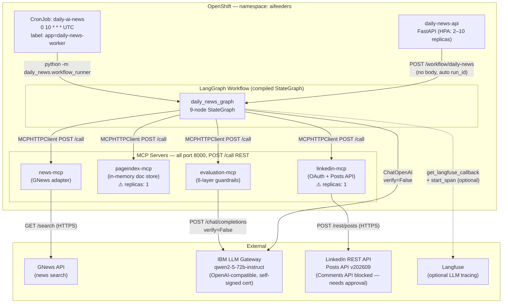

---

## 2. LangGraph Workflow — State Machine

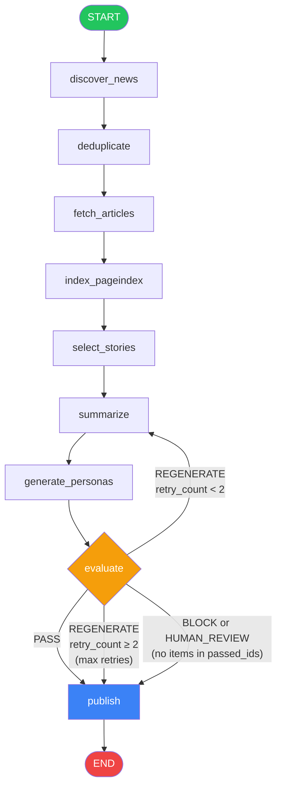

### Workflow State (`NewsWorkflowState`)

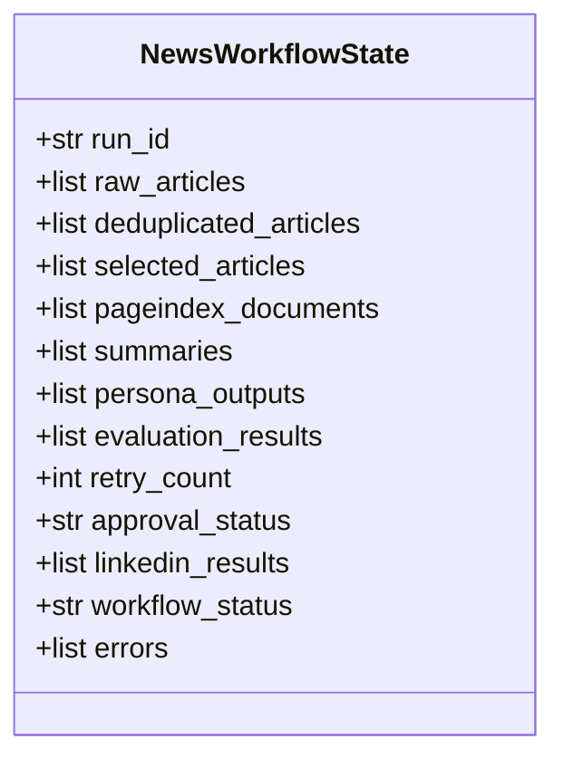

---

## 3. Agent Architecture

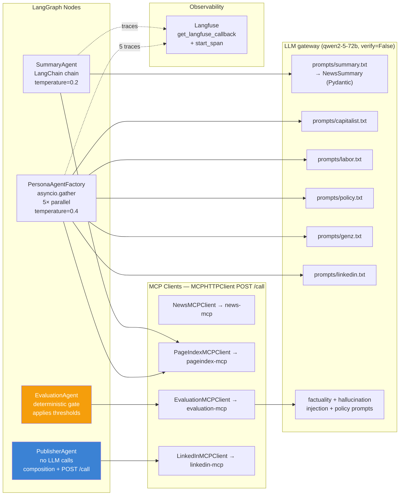

> **Key design point:** `PublisherAgent` makes **no LLM calls**. It is a deterministic composition layer — text is assembled from pre-evaluated model outputs then posted via `MCPHTTPClient`. The LLM never decides what to publish.

---

## 4. MCP Server Tools Map

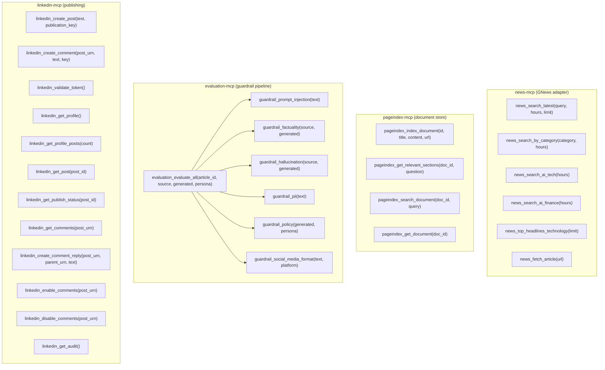

---

## 5. Guardrail Pipeline — Evaluation MCP

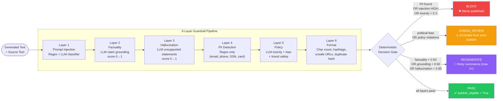

### Guardrail Thresholds (live production values)

| Layer | Metric | Threshold | Action on Fail |
|-------|--------|-----------|----------------|
| Prompt Injection | risk_level | `HIGH` or `MEDIUM` | BLOCK |
| Factuality | factuality_score | < 0.50 | REGENERATE |
| Factuality | grounding_score | < 0.50 | REGENERATE |
| Hallucination | hallucination_score | > 0.85 | REGENERATE |
| PII | pii_detected | `True` | BLOCK |
| Policy | toxicity_score | > 0.30 | BLOCK |
| Policy | political_bias_detected | `True` | HUMAN_REVIEW |
| Policy | policy_violations | non-empty | HUMAN_REVIEW |
| Format | char_count > 3000 | any violation | REGENERATE |

---

## 6. Data Models

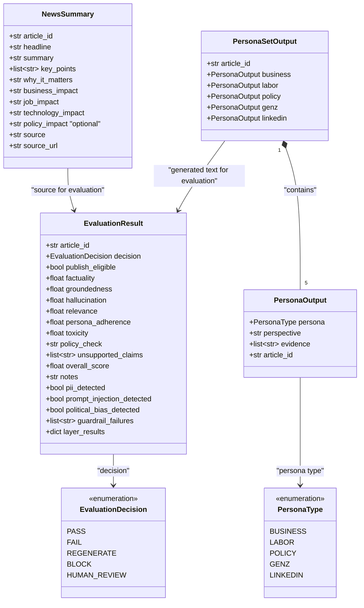

> **Note on `FAIL`:** The `EvaluationDecision.FAIL` enum value exists in `models/evaluation.py` but the current decision gate in `evaluation_agent.py` never emits it. The active set is PASS / REGENERATE / BLOCK / HUMAN_REVIEW.

---

## 7. LinkedIn Publishing Flow

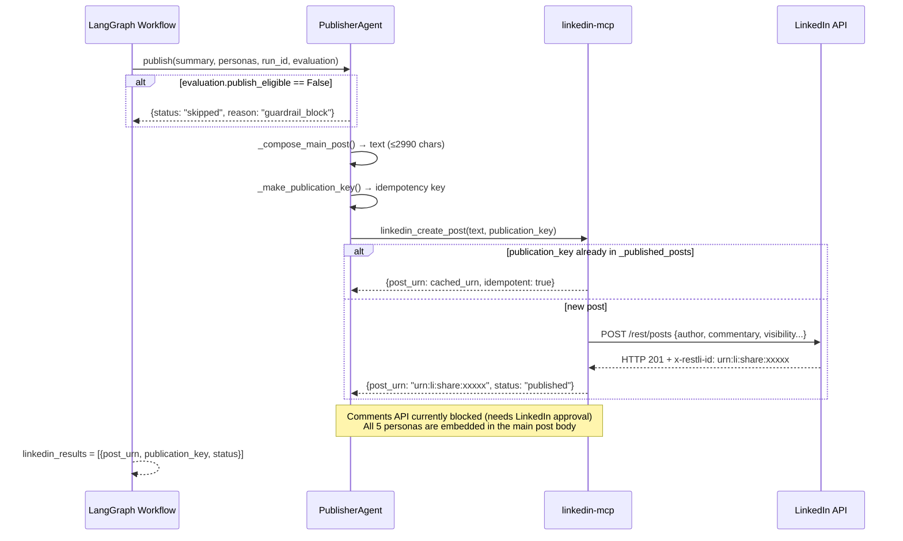

---

## 8. OpenShift Deployment Layout

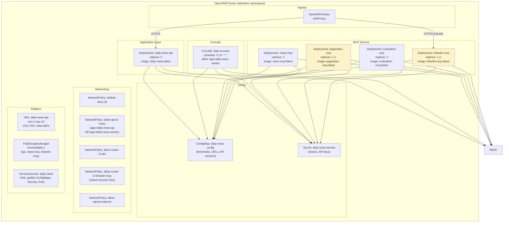

> ⚠️ `pageindex-mcp` and `linkedin-mcp` **must stay at replicas: 1** until backed by shared storage (Redis/PostgreSQL). Yellow = in-memory state constraint.
>
> **HPA applies only to `daily-news-api`** (stateless, CPU/memory-driven). MCP servers are not HPA'd — each has a fixed replica count.

---

## 9. Network Policy — Who Can Talk to Whom

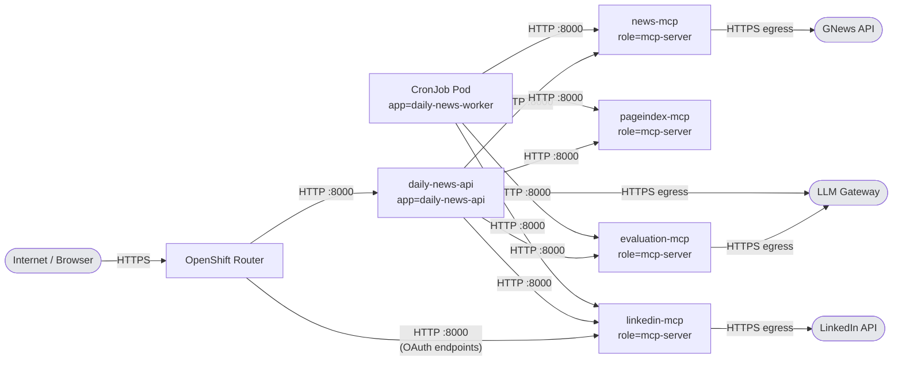

**Default-deny-all** is in place. Only the edges shown above are permitted.

---

## 10. LinkedIn Post Anatomy

```mermaid
graph TB
    POST["LinkedIn Post (≤ 3000 chars)"]

    POST --> B1["🤖 AI NEWS | headline"]
    POST --> B2["2-3 sentence summary"]
    POST --> B3["📌 KEY POINTS\n  • fact 1\n  • fact 2\n  • fact 3"]
    POST --> B4["📈 Business — impact\n👷 Jobs — impact\n🔬 Tech — impact\n🏛 Policy — impact (optional)"]
    POST --> B5["🔗 source URL"]
    POST --> B6["─────────────────────────────────\n🧵 PERSPECTIVES"]
    POST --> B7["1/5  💼  CAPITALIST MIND\nperspective + ▸ evidence"]
    POST --> B8["2/5  👷  WORKING PROFESSIONAL MIND\n..."]
    POST --> B9["3/5  🏛  GOVERNMENT MIND\n..."]
    POST --> B10["4/5  🎓  YOUNG / FRESHER MIND\n..."]
    POST --> B11["5/5  🧠  TECHIES MIND\n..."]
    POST --> B12["⚠️ DISCLAIMER: AI-simulated perspectives..."]
    POST --> B13["#AI #AgenticAI #ArtificialIntelligence ...<br/>(14 hashtags)"]

    style B1 fill:#dbeafe
    style B6 fill:#fef3c7
    style B12 fill:#fee2e2
    style B13 fill:#f0fdf4
```

---

## 11. Technology Stack

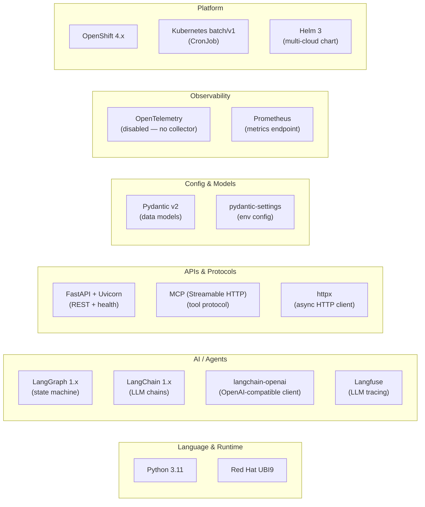

---

## 12. CI/CD and Image Build Flow

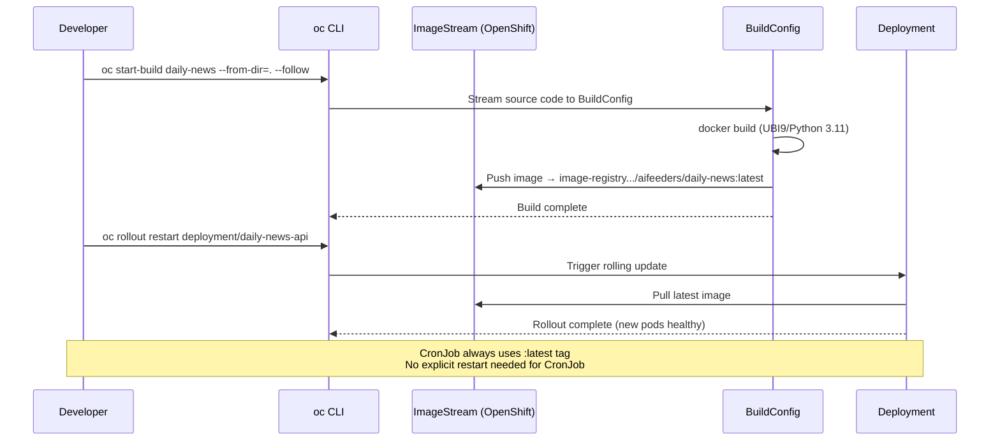

---

## 13. Summary: All Components at a Glance

| Component | Type | Replicas | State | Calls |
|-----------|------|----------|-------|-------|
| `daily-news-api` | Deployment | 2 (HPA: 2–10) | Stateless | LangGraph graph (BackgroundTask) |
| `daily-ai-news` | CronJob | 1 per run | Stateless | LangGraph graph (ainvoke) |
| `news-mcp` | Deployment | 2 | Stateless | GNews API |
| `pageindex-mcp` | Deployment | **1** | In-memory doc store | — |
| `evaluation-mcp` | Deployment | 2 | Stateless | LLM Gateway (verify=False) |
| `linkedin-mcp` | Deployment | **1** | In-memory token + idempotency registry | LinkedIn Posts API |
| `SummaryAgent` | LangGraph node | — | Stateless | pageindex-mcp (context), LLM via ChatOpenAI |
| `PersonaAgentFactory` | LangGraph node | — | Stateless | pageindex-mcp (evidence), LLM × 5 **parallel** |
| `EvaluationAgent` | LangGraph node | — | Stateless | evaluation-mcp (POST /call), deterministic gate |
| `PublisherAgent` | LangGraph node | — | Stateless | linkedin-mcp (POST /call), **no LLM** |

**Bold replicas = must stay at 1** due to in-memory state.

### Why this architecture? — Architect's Q&A

**Q: Why 4 separate MCP servers instead of one monolith?**
A: Each server owns one integration boundary and its own credentials. `linkedin-mcp` holds the LinkedIn token; no agent ever sees it. `evaluation-mcp` can be replaced or upgraded independently without touching the news pipeline. Each server is testable in isolation with a single `curl POST /call`.

**Q: Why MCP at all — why not direct Python function calls?**
A: The MCP boundary makes each service independently deployable, independently scalable (within its replica constraints), and independently testable. It also enforces the security principle: agents never hold external API keys.

**Q: Why `POST /call` REST instead of MCP streaming transport?**
A: The MCP SDK streaming transport (`/mcp` endpoint) is complex to debug and adds overhead for synchronous request-response tool calls. `MCPHTTPClient.call()` in `src/daily_news/mcp/client.py` is 15 lines of plain httpx — trivial to debug, trace, and test.

**Q: Why is `PublisherAgent` an agent at all if it makes no LLM calls?**
A: Because it is a workflow node that makes decisions (eligibility gate, character budgeting, composition logic) and has a side effect (POST to LinkedIn). "Agent" here means "autonomous unit with a specific responsibility" — not "LLM-calling agent". Keeping it separate from the LangGraph graph makes the publishing logic testable without running the full graph.

**Q: Why `pageindex-mcp` instead of a real vector database?**
A: Vector databases add operational complexity (deployment, embeddings model, indexing latency). For a single-article-per-run pipeline, keyword-overlap section scoring gives sufficient evidence retrieval. The MCP boundary means swapping to a vector DB later requires changing only `pageindex-mcp/server.py`.

**Q: Why run 5 persona LLM calls in parallel?**
A: Each persona call is stateless and independent. Parallelism reduces `generate_personas` latency from ~50s sequential to ~12s. The 5 traces all share the same `run_id`-seeded trace in Langfuse so they appear as siblings in the session view.

**Q: Why is the evaluation threshold calibration important?**
A: `qwen2-5-72b-instruct` self-evaluates news summaries conservatively — factuality scores cluster at 0.5–0.7, not 0.9+. Setting thresholds at 0.90 means every article fails and nothing publishes. Setting them at 0.50/0.50/0.85 allows content to pass while still blocking genuinely low-quality output.
