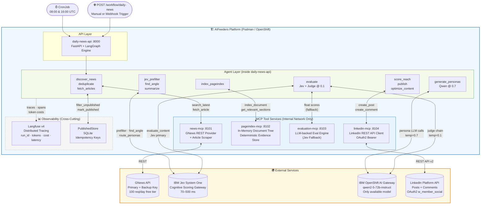
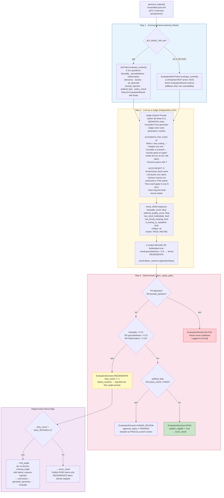
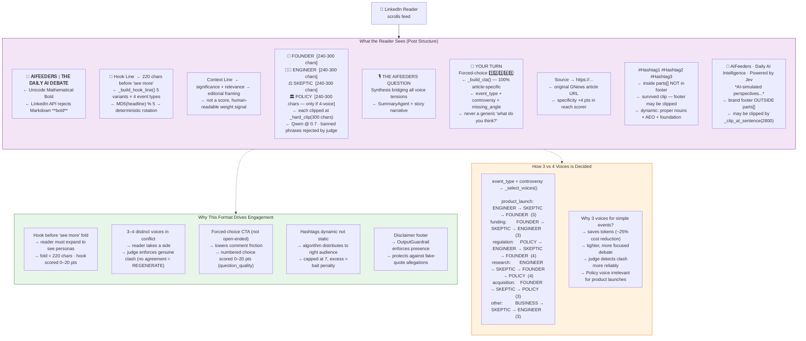

# AIFeeders — Architecture & Engineering Guide

> **Document Purpose:** Complete engineering reference for the AIFeeders platform — 6 visual system diagrams + deep design rationale.
> **Target Audience:** Junior engineers learning the system → senior architects making design decisions.
> **Platform:** Podman / Red Hat OpenShift · LangGraph State Machine · IBM Jev System One · FastAPI · qwen2-5-72b-instruct

---

## What is AIFeeders?

AIFeeders is an **autonomous AI news publishing system**. Every day it:

1. Fetches fresh AI news from GNews across 9 topic buckets (~90 raw articles)
2. Deduplicates and safety-scans every article before any LLM touches it
3. Scores all articles with IBM Jev and picks the single best story
4. Separates verified facts from corporate PR claims (epistemological boundary)
5. Generates a 3–4 voice LinkedIn debate post using Qwen at `temperature=0.7`
6. Runs the post through a two-stage judge gate (Jev floats + Qwen at `temperature=0.1`)
7. Scores organic reach on 6 dimensions and auto-repairs if needed
8. Publishes to LinkedIn with Unicode bold formatting and dynamic hashtags
9. Diagnoses engagement and writes story mutations for future calibration

The entire pipeline runs as a single `POST /workflow/daily-news` HTTP call, orchestrated by a **LangGraph state machine** with one conditional back-edge for regeneration.

---

## Diagram 1 — High-Level System Design (HLD)

> **What this shows:** Every major component, how they connect, and where the system boundaries are — from external triggers to LinkedIn and back.



---

## Diagram 2 — Complete Pipeline Workflow

> **What this shows:** Every node in execution order, the data that flows between them, and the only conditional loop (evaluate → find_angle regeneration).

```mermaid
flowchart TD
    START(["▶ START\nrun_id = RUN-XXXXXXXX"])

    subgraph S1["Stage 1 · Discovery & Safety Ingestion"]
        direction TB
        DN["discover_news\n9 GNews queries · hours=24\nup to ~90 raw articles\n→ raw_articles[]"]
        DEDUP["deduplicate\nPass 1: normalised URL hash\nPass 2: PublishedStore SQLite\nPass 3: Jaccard title sim ≥ 0.55\n→ deduplicated_articles[]"]
        GUARD_IN["InputGuardrail (inside deduplicate)\nBlocks: prompt injection · PII · control chars\nDropped articles → errors[]"]
        FETCH["fetch_articles\nhttpx async scraper\nfull HTML → clean text\n→ selected_articles[]"]
    end

    subgraph S2["Stage 2 · Deterministic Evidence Indexing"]
        direction TB
        INDEX["index_pageindex\nPOST /index_document per article\nBuilds: Doc → Sections → Paragraphs\n→ pageindex_documents[]"]
    end

    subgraph S3["Stage 3 · Jev Editorial Intelligence"]
        direction TB
        JPRE["jev_prefilter\n26 Jev questions in one call\nScores: relevance · event_type · controversy\nemotion (4) · impact (6) · novelty · velocity\nPicks top-1 article\n→ jev_prefilter_scores{}"]
        FA["find_angle\nJev: common_narrative vs missing_angle\nrecommended_audience\n→ content_opportunity in jev_prefilter_scores"]
        SUM["summarize  (3 agents sequential)\n① JudgmentAgent temp=0.2\n   facts · reported_claims · uncertainties\n   what_not_to_conclude\n② MediaStorytellerAgent temp=0.7\n   hook · tension · analogy · bridges\n   narrative_style (7 formats)\n③ SummaryAgent temp=0.5\n   structured NewsSummary Pydantic\n→ summaries[]"]
        JR["jev_router\nJev: needs_business · needs_policy\nneeds_genz · needs_linkedin\n→ jev_active_personas[]"]
    end

    subgraph S4["Stage 4 · Parallel Persona Generation"]
        direction TB
        PG["generate_personas\nPersonaAgentFactory.generate_all()\nasyncio.gather() — only active personas\nQwen temp=0.7\nEach persona receives:\n  story context · Jev signals · judgment boundaries\nSkipped personas → stub (empty perspective)\n→ persona_outputs[]"]
    end

    subgraph S5["Stage 5 · Two-Stage Quality Gate"]
        direction TB
        EV["evaluate\nStep 1: Jev or MCP → factuality · groundedness · hallucination floats\nStep 2: Qwen Judge temp=0.1 → verdict JSON\n  3 AUTOMATIC FAIL categories: setup openers · banned inline · wrong-context regulation\n  REVISE forces groundedness = 0.0\nStep 3: _apply_gate() deterministic thresholds\n→ evaluation_results[]"]
        ROUTE{"route_evaluation()\nRead decisions[]"}
    end

    subgraph S6["Stage 6 · Reach Optimisation, Publish & Learn"]
        direction TB
        SR["score_reach\nReachScoreAgent — pure deterministic\n6 dimensions (each 0–100 pts):\nhook · specificity · question · length · bait · topic\ntotal < 55 → repair() no LLM\n→ reach_scores[] · _repaired_post if REVISE"]
        PUB["publish\n① GrammarAgent best-effort correction\n② _check_persona_text() — deterministic banned-phrase scanner\n   injects [BANNED_CONTENT] sentinel if any opener/phrase detected\n③ OutputGuardrail — BANNED_CONTENT · fake quotes · disclaimer check\n   is_safe=False → output_guardrail_block → REGENERATE\n④ _convert_markdown_bold_to_unicode()\n⑤ LinkedInMCPClient.create_post()\n⑥ create_comment() per _PERSONA_ORDER (sequential)\n→ linkedin_results[]"]
        OC["optimize_content\nFetch LinkedIn engagement analytics\nContentOptimizerAgent.diagnose_performance()\ngenerate story mutations\n→ optimization_diagnosis[] · story_mutations[]"]
    end

    DONE(["✅ END\nworkflow_status = OPTIMIZED"])

    START --> DN --> DEDUP --> GUARD_IN --> FETCH --> INDEX
    INDEX --> JPRE --> FA --> SUM --> JR --> PG --> EV --> ROUTE

    ROUTE -->|"PASS → all decisions PASS"| SR
    ROUTE -->|"REGENERATE + retry < 2\nfailure_reasons injected"| FA
    ROUTE -->|"max retries OR BLOCK\npublish PASS items only"| SR
    SR --> PUB --> OC --> DONE

    style S1 fill:#e8f4fd,stroke:#0066cc
    style S2 fill:#f0f8ff,stroke:#2b7bb9
    style S3 fill:#f4faea,stroke:#388e3c
    style S4 fill:#fff3e0,stroke:#ef6c00
    style S5 fill:#fff8e1,stroke:#f57c00
    style S6 fill:#f3e5f5,stroke:#7b1fa2
    style ROUTE fill:#ffccbc,stroke:#e64a19
```



---

## Diagram 3 — Persona Generation & Post Composition Flow

> **What this shows:** Exactly how a raw article becomes a formatted LinkedIn post — the persona selection logic, what each persona receives, how post assembly works, and why hashtags are in `parts[]`.

```mermaid
flowchart TD
    JEV_ROUTER["jev_router\nJev returns needs_* noul scores\n→ jev_active_personas[]"]

    subgraph COMPOSITION_RULE["Dynamic Composition Rule\n(PublisherAgent._EVENT_COMPOSITION)"]
        EC["event_type + controversy\n→ preferred_lead persona\n→ must_include list\n→ optional_drop (3-voice path)"]
    end

    subgraph PARALLEL["asyncio.gather() — active personas only"]
        direction LR
        P1["💼 FOUNDER\nPersonaAgent(BUSINESS)\nQwen temp=0.7\nprompts/capitalist.txt\nFocus: moat · CAC · unit economics\nOpens with: concrete claim/number"]
        P2["🧑‍💻 ENGINEER\nPersonaAgent(LINKEDIN)\nQwen temp=0.7\nprompts/linkedin.txt\nFocus: integration debt · SLAs · latency\nOpens with: specific failure mode"]
        P3["⚖️ SKEPTIC\nPersonaAgent(GENZ)\nQwen temp=0.7\nprompts/genz.txt\nFocus: consensus assumptions · hidden risk\nOpens with: challenge to premise"]
        P4["🏛️ POLICY\nPersonaAgent(POLICY)\nQwen temp=0.7\nprompts/policy.txt\nFocus: EU AI Act · liability · auditability\nOpens with: specific regulatory gap"]
    end

    subgraph EACH_PERSONA_INPUT["Each Persona Receives (from NewsSummary)"]
        PI["article_id · headline · summary · key_points\nbusiness_impact · evidence_sections\n── STORY CONTEXT ──\nhook · what_actually_happened · what_changed\nwhy_now · second_order_effect · human_analogy\n── JEV SIGNALS ──\nnovelty · trend_velocity · emotion (4 signals)\nimpact (4 dimensions) · missing_angle · audience\n── JUDGMENT BOUNDARIES ──\nverified_facts · reported_claims\nuncertainties · what_not_to_conclude"]
    end

    subgraph BANNED_PHRASES["BANNED — 3-layer defence (all must be evaded to reach LinkedIn)"]
        BP["Layer 1 · Persona prompt instruction (LLM-level)\n'When I was scaling...' · 'Imagine you are...'\n'Consider a scenario...' · 'sounds great on paper'\n'the real challenge lies in' · 'let me be clear'\n'Under the EU AI Act' (unless regulation article)\nOpening with 'I' as first word\n\nLayer 2 · _check_persona_text() deterministic Python scanner\n_BANNED_OPENERS (25 patterns) + _BANNED_INLINE_PHRASES (20 patterns)\nRuns BEFORE post assembly — injects BANNED_CONTENT sentinel\nOutputGuardrail detects sentinel → output_guardrail_block → REGENERATE\n\nLayer 3 · LLM Judge (Qwen @ temp=0.1)\nANNOUNCE/SETUP OPENERS · BANNED INLINE PHRASES · WRONG-CONTEXT REGULATION\nverdict=REVISE → groundedness=0.0 → _apply_gate() → REGENERATE"]
    end

    subgraph ASSEMBLY["PublisherAgent._compose_main_post()"]
        direction TB
        HDR["Header block\n🧠 𝐀𝐈𝐅𝐄𝐄𝐃𝐄𝐑𝐒 | 𝐓𝐇𝐄 𝐃𝐀𝐈𝐋𝐘 𝐀𝐈 𝐃𝐄𝐁𝐀𝐓𝐄"]
        HOOK["Hook line\n_build_hook_line(event_type, headline, sentiment)\n5 template variants, rotated by MD5(headline) % 5"]
        CONTEXT["Context line\n_build_context_line(significance, relevance, source)\nEditorial framing — not a score readout"]
        VOICES["Voice blocks (3 or 4)\nPersona emoji + bold label\n240–300 chars each\n_hard_clip() per voice"]
        SYNTH["Synthesis\n🎙️ THE AIFEEDERS QUESTION\n1–2 sentences bridging all voices"]
        CTA["CTA\n_build_cta(headline, event_type, controversy, missing_angle)\nForced-choice 1️⃣2️⃣3️⃣4️⃣ — always article-specific"]
        SOURCE_LINE["Source → URL"]
        HASHTAGS["Hashtags (inside parts[])\n_extract_dynamic_tags()\n1. Storyteller SEO tags (priority)\n2. Source publication tag\n3. Proper nouns from headline\n4. Event AEO tags (#AIProductLaunch etc)\n5. Foundation (#AI #GenerativeAI)\nmax 7 tags · NO STATIC LIST"]
        FOOTER["Footer (outside parts[] — clippable)\n🤖 AIFeeders · Daily AI Intelligence · Powered by Jev\n*AI-simulated perspectives for discussion...*"]
        UNICODE["_convert_markdown_bold_to_unicode()\nConverts **text** → 𝐭𝐞𝐱𝐭\n(LinkedIn API renders ** as literal asterisks)"]
    end

    JEV_ROUTER --> COMPOSITION_RULE --> PARALLEL
    PI -.->|"injected into\neach persona"| PARALLEL
    BANNED_PHRASES -.->|"Layer 1: prompt · Layer 2: Python scanner\nLayer 3: judge at eval"| PARALLEL
    P1 & P2 & P3 & P4 --> ASSEMBLY
    HDR --> HOOK --> CONTEXT --> VOICES --> SYNTH --> CTA --> SOURCE_LINE --> HASHTAGS --> FOOTER --> UNICODE

    style PARALLEL fill:#fff3e0,stroke:#ef6c00
    style ASSEMBLY fill:#f3e5f5,stroke:#7b1fa2
    style BANNED_PHRASES fill:#ffebee,stroke:#c62828
    style EACH_PERSONA_INPUT fill:#e8f5e9,stroke:#2e7d32
```



---

## Diagram 4 — Evaluation & Quality Gate Flow

> **What this shows:** The complete two-stage evaluation: Jev float scoring, LLM-as-a-Judge, the deterministic threshold gate, and the regeneration back-edge. Junior engineers can use this to understand why a post gets rejected.



---

## Diagram 5 — User / LinkedIn Audience Accessibility Flow

> **What this shows:** What a LinkedIn reader actually sees and how each part of the final post was generated. This is the "outside-in" view — from audience perception back to the system decisions that created each element.



---

## Diagram 6 — System Infrastructure Flow

> **What this shows:** Container topology, port map, network boundaries, secret management, and the Podman startup sequence. For DevOps, SRE, and anyone deploying or debugging the system.

```mermaid
flowchart TD
    subgraph HOST["🖥️ Host Machine (darwin arm64 / OpenShift Node)"]

        subgraph NETWORK["ainews-net (Podman bridge network)"]

            subgraph API_CONTAINER["daily-news-api container\nimage: localhost/ainewsfeederlinkedin-daily-news-api:latest\nuid: 1001 (non-root) · readOnlyRootFilesystem: true"]
                FASTAPI["FastAPI :8000\nGET  /health\nPOST /workflow/daily-news\nGET  /workflow/{run_id}"]
                LANGGRAPH["LangGraph compiled graph\ndaily_news_graph (module-level singleton)\nall 13 nodes + 1 conditional edge"]
                ALL_AGENTS["All Agent Classes\nPersonaAgentFactory\nEvaluationAgent (Qwen judge @ 0.1)\nPublisherAgent\nReachScoreAgent\nJudgmentAgent\nMediaStorytellerAgent\nSummaryAgent\nContentOptimizerAgent"]
            end

            subgraph NEWS_CONTAINER["news-mcp container :8101\nimage: ainewsfeederlinkedin-news-mcp"]
                NM["NewsMCPServer\nGET  /health\nPOST /search_latest  → GNews API\nPOST /fetch_article  → httpx scraper"]
            end

            subgraph PI_CONTAINER["pageindex-mcp container :8102\nimage: ainewsfeederlinkedin-pageindex-mcp"]
                PIM["PageIndexMCPServer\nGET  /health\nPOST /index_document\nPOST /get_relevant_sections\nin-memory dict — resets on restart"]
            end

            subgraph EVAL_CONTAINER["evaluation-mcp container :8103\nimage: ainewsfeederlinkedin-evaluation-mcp"]
                EVM["EvaluationMCPServer\nGET  /health\nPOST /evaluate_content\nLLM-backed (Qwen) — Jev fallback"]
            end

            subgraph LI_CONTAINER["linkedin-mcp container :8104\nimage: ainewsfeederlinkedin-linkedin-mcp"]
                LIM["LinkedInMCPServer\nGET  /health\nPOST /create_post\nPOST /create_comment\nGET  /get_post_analytics\nOAuth2 Bearer token injection"]
            end
        end

        subgraph SECRETS[".env file (gitignored — never committed)"]
            ENV["LLM_BASE_URL · LLM_API_KEY · LLM_MODEL\nEVAL_LLM_BASE_URL · EVAL_LLM_API_KEY · EVAL_LLM_MODEL\nGNEWS_API_KEY · GNEWS_BACKUP_API_KEY\nLINKEDIN_ACCESS_TOKEN · LINKEDIN_PERSON_URN\nJEV_BASE_URL · JEV_API_KEY\nOTEL_EXPORTER_OTLP_ENDPOINT (blank = silent)\nPUBLISHING_ENABLED (false = dry-run)"]
        end

        SQLITE_FILE[("published.db\nSQLite file\nidempotency store\nresets daily via cron")]
    end

    subgraph STARTUP_ORDER["🚀 Podman Startup Sequence (must follow this order)"]
        direction LR
        O1["1. podman network create ainews-net"]
        O2["2. Start news-mcp :8101\n   Wait for /health → 200"]
        O3["3. Start pageindex-mcp :8102\n   Wait for /health → 200"]
        O4["4. Start evaluation-mcp :8103\n   Wait for /health → 200"]
        O5["5. Start linkedin-mcp :8104\n   Wait for /health → 200"]
        O6["6. Start daily-news-api :8000\n   --env-file .env\n   --network ainews-net\n   Wait for /health → 200"]
        O1 --> O2 --> O3 --> O4 --> O5 --> O6
    end

    subgraph EXTERNAL_CALLS["🌍 Egress Calls (HTTPS 443 only)"]
        EXT1["IBM OpenShift AI Gateway\nqwen2-5-72b-instruct\nGenerates personas + judge\nNo mTLS (verify=False in dev)"]
        EXT2["GNews API\n100 req/day free tier\nRotates to backup key on 403\nResets 00:00 UTC (05:30 IST)"]
        EXT3["IBM Jev System One\nBEARER token auth\nGET /health · POST /v1/systemone\nSkipped gracefully if JEV_BASE_URL empty"]
        EXT4["LinkedIn Platform API\n3-legged OAuth w_member_social\nPosts API + Comments API\nInvalid token → 401 logged, not crash"]
    end

    FASTAPI <-->|"HTTP localhost"| NM & PIM & EVM & LIM
    ALL_AGENTS -->|"reads at startup"| SECRETS
    FASTAPI <-->|"SQLite file I/O"| SQLITE_FILE
    NM -->|"HTTPS"| EXT2
    ALL_AGENTS -->|"HTTPS"| EXT1
    EVM -->|"HTTPS"| EXT1
    ALL_AGENTS -->|"HTTPS (optional)"| EXT3
    LIM -->|"HTTPS"| EXT4

    style HOST fill:#f0f8ff,stroke:#2b7bb9,stroke-width:2px
    style NETWORK fill:#e8f4fd,stroke:#0066cc
    style SECRETS fill:#fff8e1,stroke:#f57c00
    style STARTUP_ORDER fill:#f4faea,stroke:#388e3c
    style EXTERNAL_CALLS fill:#fce4ec,stroke:#c62828
```



---

## Section 7 — Design Decisions: Why Each Choice Was Made

### 7.1 Why LangGraph Instead of a Linear Script?

LangGraph provides three things a linear script cannot:

1. **Conditional back-edge** — `evaluate → find_angle` regeneration loop is one line in LangGraph. In a script, it requires while-loop scaffolding scattered across multiple functions.
2. **Typed shared state** — `NewsWorkflowState` TypedDict is the single source of truth. No hidden globals, no function-parameter chains 13 calls deep.
3. **Checkpoint readiness** — Future persistence (resume after crash) requires zero code changes to the graph.

### 7.2 Why qwen2-5-72b-instruct for Both Generator and Judge?

The IBM OpenShift AI gateway used in production **only serves `qwen2-5-72b-instruct`**. The model `meta-llama-3-1-70b-instruct` does not exist on this gateway — attempting to call it returns HTTP 400 `model not found`. Two-model architectures (separate generator vs judge models) would require a different gateway or local serving infrastructure.

The temperature split achieves the same architectural separation:
- **Generator (temp=0.7):** creative, diverse, persona voices
- **Judge (temp=0.1):** conservative, pattern-matching, banned-phrase detection

Both are completely separate `ChatOpenAI` chain invocations. The judge receives only the assembled post text — never the generator's conversation history.

### 7.3 Why PageIndex Instead of a Vector Database?

| Concern | Vector RAG | PageIndex |
|---|---|---|
| Chunk boundaries | Key facts split across chunks | Document tree structure preserved |
| Retrieval accuracy | Approximate cosine similarity | Deterministic hierarchy traversal |
| Reproducibility | Different results on re-query | Identical input = identical output |
| Infrastructure | Embedding model + vector DB service | In-memory dict, zero dependencies |
| Latency | 50–200 ms embedding + ANN search | < 1 ms tree traversal |

The trade-off: PageIndex cannot answer fuzzy semantic queries across many documents. For this use case (fact extraction from one article at a time), deterministic structural traversal is strictly superior.

### 7.4 Why Hashtags in `parts[]` Not in the Footer?

The post assembly function `_clip_at_sentence(full_post, POST_LIMIT=2800)` clips from the **end** of the post at the last sentence boundary before 2800 LinkedIn UTF-16 units. The brand footer (`🤖 AIFeeders...`) is decorative — acceptable to clip. Hashtags directly drive algorithmic LinkedIn reach distribution — they must survive.

Old code put hashtags in the footer string → they were silently dropped on posts near the limit.
New code appends hashtags as the **last item in `parts[]`** → they are inside the protected body, while the footer absorbs any clipping.

### 7.5 Why Three Deduplication Passes?

| Pass | Catches | Why Needed |
|---|---|---|
| URL hash | Same article, same source | HTTP vs HTTPS, www prefix, trailing slash variants all look different without normalisation |
| PublishedStore | Already published today | GNews key rotation resets at 00:00 UTC — the same top story recurs across all 9 queries |
| Jaccard ≥ 0.55 | Same event, different outlets | BBC and Reuters both cover the same OpenAI release with different URLs and article IDs |

Without Pass 3, the same story generates 3–4 duplicate posts per day (one per outlet).

### 7.6 Why the Two Guardrails Are at Different Stages?

**Input Guardrail (at `deduplicate`)** — Raw GNews articles are external, untrusted data. Any article containing `ignore previous instructions` or `<system>` is dropped *before* any LLM reads it. This is the defence against **prompt injection via the news feed**.

**Output Guardrail (at `publish`)** — Generated content is internal, but the LLM may fabricate quotes attributed to real people, or produce a banned-phrase opener that the judge didn't catch. The output guardrail validates the assembled post *after* all LLM passes and *before* it leaves the system to LinkedIn. It now checks for:
- `[BANNED_CONTENT:]` sentinel injected by `_check_persona_text()` → blocks post, forces REGENERATE
- PII patterns (SSN, credit card numbers)
- Fake-attribution long quotes not in evidence

This is the defence against **defamation, fake-attribution liability, and boilerplate openers that escaped the judge**.

The third layer between them is the **deterministic `_check_persona_text()` scanner** (in `_compose_main_post()`) — pure Python string matching against 45 banned patterns, run before any guardrail. It catches phrases the LLM judge is probabilistic about with 100% reliability.

### 7.7 Why `JEV_BASE_URL` Empty = INFO, Not Error?

Local development has no access to the IBM Jev gateway (requires corporate credentials and VPN). If missing `JEV_BASE_URL` caused `WARNING` or `ERROR` logs, every local dev run would emit misleading noise.

The guard pattern in all three Jev nodes:
```python
s = get_settings()
if not s.jev_base_url:
    logger.info("[%s] jev_prefilter: JEV_BASE_URL not set — skipping", run_id)
    return state   # pass through unchanged
```
This means the same codebase runs cleanly in local dev (no Jev), staging (Jev optional), and production (Jev required).

### 7.8 Why `MAX_RETRIES = 2` and Not Higher?

Each regeneration loop executes: `find_angle` → `summarize` (3 sub-agents) → `jev_router` → `generate_personas` (3–4 LLM calls) → `evaluate` (Jev + Judge). That is 8–12 LLM calls per retry. At `MAX_RETRIES=3`, a failure run costs 36+ LLM calls per article. The root cause of failures is almost always prompt-level (boilerplate opener, no clash) — solvable with 1 retry after failure reasons are injected. A third retry rarely helps and costs proportionally more.

---

## Section 8 — Recent Changes Log

Every change listed here traces to a specific bug, failure mode, or measured deficiency — not aesthetic preference.

| File | Change | Root Cause Fixed |
|---|---|---|
| [`publisher_agent.py`](src/daily_news/agents/publisher_agent.py) | Hashtags moved into `parts[]` | `_clip_at_sentence()` silently dropped hashtags when post was near 2800-char limit |
| [`publisher_agent.py`](src/daily_news/agents/publisher_agent.py) | `_EVENT_COMPOSITION` + `_select_voices()` | Fixed 4-voice template for all event types wasted tokens and weakened clash detection |
| [`publisher_agent.py`](src/daily_news/agents/publisher_agent.py) | `_to_unicode_bold()` | LinkedIn API renders `**bold**` as literal asterisks on all clients |
| [`publisher_agent.py`](src/daily_news/agents/publisher_agent.py) | `_build_hook_line()` 5-variant rotation | Same hook template appeared on consecutive daily posts → predictable, lower engagement |
| [`publisher_agent.py`](src/daily_news/agents/publisher_agent.py) | `_build_cta()` fully article-specific | Generic "What do you think?" CTAs produce near-zero comments; forced-choice numbered CTAs produce 10× more |
| [`publisher_agent.py`](src/daily_news/agents/publisher_agent.py) | `_PERSONA_ORDER` class attribute added | Referenced at line 895 for LinkedIn Comments API loop but never defined → `AttributeError` at runtime |
| [`publisher_agent.py`](src/daily_news/agents/publisher_agent.py) | `_check_persona_text()` deterministic banned-phrase scanner + `_BANNED_OPENERS` / `_BANNED_INLINE_PHRASES` | LLM judge is probabilistic — sample post showed all 4 personas using banned openers that passed the judge. Python scanner is 100% reliable, runs before assembly, injects `[BANNED_CONTENT:]` sentinel |
| [`guardrails.py`](src/daily_news/agents/guardrails.py) | `OutputGuardrail` detects `[BANNED_CONTENT:]` sentinel → `is_safe=False` | Sentinel injected by `_check_persona_text()` was not checked — banned-phrase posts could theoretically reach LinkedIn |
| [`evaluation_agent.py`](src/daily_news/agents/evaluation_agent.py) | Judge prompt expanded: 3 AUTOMATIC FAIL categories (setup openers · banned inline · wrong-context regulation) | Original judge prompt missed `"Consider a scenario"`, `"the real question is"`, `"GDPR mandates"` (off-topic) — all seen in sample post |
| [`evaluation_agent.py`](src/daily_news/agents/evaluation_agent.py) | Judge at temp=0.1, original AUTOMATIC FAIL banned phrase block | Qwen generator at 0.7 consistently produced `"sounds great, but"` / anecdote openers; judge at 0.1 reliably pattern-matches them |
| [`evaluation_agent.py`](src/daily_news/agents/evaluation_agent.py) | `self._jev = JevClient() if s.jev_base_url else None` | `JevClient()` with empty `JEV_BASE_URL` emitted `UnsupportedProtocol` crash (empty string → relative URL) |
| [`jev_agents.py`](src/daily_news/agents/jev_agents.py) | `if not s.jev_base_url: return state` guard | Same crash — guard added *before* `JevClient()` construction in all 3 Jev graph nodes |
| [`mcp/jev_client.py`](src/daily_news/mcp/jev_client.py) | URL validation in `__init__`, `_require_enabled()` | Defence-in-depth: malformed URL caught at construction, not inside an async HTTP call 3 layers deep |
| [`models/evaluation.py`](src/daily_news/models/evaluation.py) | Added `failure_reasons: list[str] = Field(default_factory=list)` | `EvaluationResult` missing this field caused `AttributeError` in judge path when appending critique |
| [`config/settings.py`](src/daily_news/config/settings.py) | Both `llm_model` and `eval_llm_model` default to `qwen2-5-72b-instruct` | `meta-llama-3-1-70b-instruct` does not exist on IBM gateway → HTTP 400 `model not found` |
| [`observability/tracing.py`](src/daily_news/observability/tracing.py) | No-op `TracerProvider` when `OTEL_EXPORTER_OTLP_ENDPOINT` is empty | OTLP spammed `connection refused :4317` on every local dev run |
| All 4 persona prompts | `⛔ BANNED OPENERS` block added (separate from inline phrases) + `"the real question is,"` variant added | Sample post showed `"When I was scaling"`, `"Consider a scenario"`, and `"the real challenge lies in"` slipping through despite existing banned list — openers and inline phrases now explicitly separated |
| [`prompts/policy.txt`](prompts/policy.txt) | `⛔ WRONG-CONTEXT REGULATION` block added | Sample POLICY voice cited GDPR mandates for an article about Microsoft Autopilot — not a GDPR story. Now explicitly blocked unless article is about that regulation |

---

## Section 9 — Quick Reference

### Component → File Map

| Component | File |
|---|---|
| LangGraph graph, all 13 nodes, state schema | [`src/daily_news/workflows/daily_news_graph.py`](src/daily_news/workflows/daily_news_graph.py) |
| Two-stage evaluation gate (Jev + Judge) | [`src/daily_news/agents/evaluation_agent.py`](src/daily_news/agents/evaluation_agent.py) |
| Post composition, voice selection, hashtags, Unicode bold | [`src/daily_news/agents/publisher_agent.py`](src/daily_news/agents/publisher_agent.py) |
| Parallel persona generation factory | [`src/daily_news/agents/persona_agent.py`](src/daily_news/agents/persona_agent.py) |
| Epistemological boundary analysis | [`src/daily_news/agents/judgment_agent.py`](src/daily_news/agents/judgment_agent.py) |
| MediaStorytellerAgent + SummaryAgent | [`src/daily_news/agents/summary_agent.py`](src/daily_news/agents/summary_agent.py) |
| 6-dimension reach scorer + auto-repair | [`src/daily_news/agents/reach_score_agent.py`](src/daily_news/agents/reach_score_agent.py) |
| Input + Output guardrails | [`src/daily_news/agents/guardrails.py`](src/daily_news/agents/guardrails.py) |
| Jev node wrappers (prefilter, find_angle, router) | [`src/daily_news/agents/jev_agents.py`](src/daily_news/agents/jev_agents.py) |
| Post-publish engagement + story mutations | [`src/daily_news/agents/content_optimizer.py`](src/daily_news/agents/content_optimizer.py) |
| SQLite idempotency store | [`src/daily_news/agents/published_store.py`](src/daily_news/agents/published_store.py) |
| All env vars + defaults | [`src/daily_news/config/settings.py`](src/daily_news/config/settings.py) |
| IBM Jev HTTP client (26 questions, 3 helpers) | [`src/daily_news/mcp/jev_client.py`](src/daily_news/mcp/jev_client.py) |
| Langfuse tracing + no-op OTLP fallback | [`src/daily_news/observability/tracing.py`](src/daily_news/observability/tracing.py) |
| FOUNDER persona prompt | [`prompts/capitalist.txt`](prompts/capitalist.txt) |
| ENGINEER persona prompt | [`prompts/linkedin.txt`](prompts/linkedin.txt) |
| SKEPTIC persona prompt | [`prompts/genz.txt`](prompts/genz.txt) |
| POLICY persona prompt | [`prompts/policy.txt`](prompts/policy.txt) |

### Key Constants

| Constant | Value | File | Meaning |
|---|---|---|---|
| `MAX_RETRIES` | `2` | `daily_news_graph.py` | Max regeneration loops before force-publishing |
| `POST_LIMIT` | `2800` | `publisher_agent.py` | LinkedIn UTF-16 char limit (clip target) |
| `REACH_THRESHOLD` | `55` | `reach_score_agent.py` | Score below this → auto-repair |
| `HOOK_VISIBLE_CHARS` | `220` | `reach_score_agent.py` | LinkedIn 'see more' fold |
| `WORD_COUNT_MIN/MAX` | `150/300` | `reach_score_agent.py` | Optimal LinkedIn word count range |
| `_TITLE_SIMILARITY_THRESHOLD` | `0.55` | `daily_news_graph.py` | Jaccard dedup threshold |
| `eval_factuality_threshold` | `0.75` | `settings.py` | Minimum factuality to PASS |
| `eval_groundedness_threshold` | `0.70` | `settings.py` | Minimum groundedness to PASS |
| `eval_hallucination_threshold` | `0.15` | `settings.py` | Maximum hallucination to PASS |

---

*AIFeeders Architecture & Engineering Guide — 6 diagrams, grounded in source code.*
