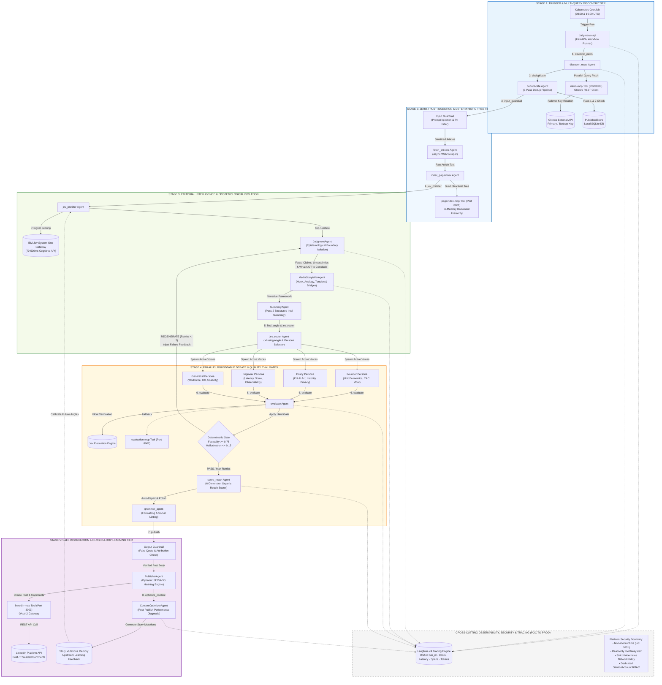

# AIFeeders — Enterprise AI Agentic Architecture & Systems Engineering Manual

> **Production Enterprise Architecture Document & High-Level Design**  
> **Target Audience:** Principal AI Architects, Enterprise Cloud Architects, SecOps & Platform Engineers  
> **Platform & Runtime:** Red Hat OpenShift `aifeeders`, Multi-Cloud Portable (AWS EKS, Azure AKS) · LangGraph State Machine · IBM Jev System One · Vectorless PageIndex Protocol · Epistemological Judgment Layer · Langfuse v4 Full-Lifecycle Observability · Zero-Trust Dual Guardrails

---

## Executive Summary & System Intent

AIFeeders is an enterprise-grade, **closed-loop agentic media intelligence and epistemological broadcast platform**. It autonomously discovers unstructured global AI announcements, validates safety against adversarial attacks, deterministically indexes evidence without vector embeddings, isolates objective facts from corporate PR claims, determines practitioner audience relevance via Jev, synthesizes a dynamic 4-persona live roundtable debate, executes deterministic quality evaluation gates, optimizes organic reach, dispatches to LinkedIn, and closes the feedback loop via post-publication learning mutations.

---

## 1. High-Level Design (HLD): End-to-End System Architecture (POC to Production)



---

## 2. Evolution from POC to Enterprise Production Architecture

```text
┌────────────────────────────────────────────────────────────────────────────────────────────────────────┐
│                                   EVOLUTION: POC TO PRODUCTION                                         │
├───────────────────┬───────────────────────────────────┬────────────────────────────────────────────────┤
│ Architectural Area│ Initial POC Implementation        │ Production Enterprise Implementation           │
├───────────────────┼───────────────────────────────────┼────────────────────────────────────────────────┤
│ Orchestration     │ Linear procedural Python scripts  │ LangGraph State Machine with conditional loops │
│ Content Indexing  │ Vector DB (Embeddings / Pinecone) │ Vectorless PageIndex (Deterministic Tree)      │
│ Article Ranking   │ Naive LLM single-prompt scoring   │ IBM Jev System One (7-dimension fast scoring)  │
│ Fact Verification │ Basic prompt instruction          │ Epistemological JudgmentAgent & Negative Bounds│
│ Narrative Style   │ Dry bulleted summary points       │ Broadcast Roundtable Debate (4 archetypes)     │
│ Quality Control   │ No evaluation gate                │ Hybrid Jev/Code Gate with Regeneration Edges   │
│ Reach Optimization│ Static hardcoded hashtags         │ 6-Dimension Reach Scorer & Dynamic SEO/AEO     │
│ Security & Safety │ Direct prompt concatenation       │ Zero-Trust Dual Guardrails & Regex Isolation   │
│ Observability     │ Local console print statements    │ Langfuse v4 Tracing (Full-lifecycle run_id)    │
│ Infrastructure    │ Single local process              │ Containerized microservices on OpenShift/K8s   │
│ Feedback Loop     │ Open-loop (publish and forget)    │ Closed-loop ContentOptimizer Story Mutations   │
└───────────────────┴───────────────────────────────────┴────────────────────────────────────────────────┤
```

---

## 3. Master Agent & Tool Directory

| Component / Node | Type | Technology / Tool Backing | Specific Responsibility & Function |
|---|---|---|---|
| `discover_news` | Agent | `news-mcp` (Port 8000), GNews API | Fires 9 concurrent queries across tech, business, chips, and models. |
| `deduplicate` | Agent | `PublishedStore` (SQLite), Jaccard Index | 3-pass dedup: canonical URL hash, historical publish check, token overlap ($\ge 0.85$). |
| `input_guardrail` | Guardrail | Python Regex, Character Filters | Blocks prompt injection payloads (`ignore previous instructions`), detects PII, sanitizes control chars. |
| `fetch_articles` | Agent | `httpx` Async Web Scraper | Extracts clean raw article text, author credits, and publication metadata. |
| `index_pageindex` | Agent | `pageindex-mcp` (Port 8001) | Builds hierarchical in-memory document tree (`Document → Sections → Headings → Paragraphs`). |
| `jev_prefilter` | Agent | Jev System One Gateway | Scores candidate articles across 7 dimensions (novelty, controversy, emotion, velocity) and picks top-1. |
| `judgment_agent` | Agent | Low-Temp LLM (`0.2`), Pydantic | Epistemological analysis: partitions `facts`, `reported_claims`, `uncertainties`, `what_not_to_conclude`. |
| `storyteller` | Agent | `MediaStorytellerAgent`, LangChain | Pass 1: Crafts narrative hook, tension model, human analogy, and panel transition bridges. |
| `summarize` | Agent | `SummaryAgent`, PageIndex Tool | Pass 2: Generates calibrated structured `NewsSummary` integrating judgment boundaries. |
| `find_angle` | Agent | Jev System One Gateway | Identifies "The Common Narrative" vs "The Missing Angle" and target audience segment. |
| `jev_router` | Agent | Jev Routing Engine | Dynamically selects 2–4 active roundtable personas based on story domain. |
| `generate_personas`| Multi-Agent | `PersonaAgentFactory` (Parallel) | Generates simulated debate between Founder, Policy Analyst, Engineer, and Generalist. |
| `evaluate` | Agent | Jev Gateway / `evaluation-mcp` (8002) | Evaluates factuality, groundedness, and hallucination scores against source evidence. |
| `route_evaluation`| Gate | Deterministic Python Logic | Enforces hard gate: `PASS` proceeds to reach scoring; `REGENERATE` loops back to `summarize` (max 2 retries). |
| `score_reach` | Agent | `ReachScoreAgent` | Evaluates 6 organic reach dimensions (0–100) and executes deterministic text auto-repair. |
| `grammar_agent` | Agent | Language Model Linter | Sanitizes spacing, punctuation, and structural formatting for social platforms. |
| `output_guardrail`| Guardrail | Quotation & Attribution Validator | Prevents fabricated direct quotes from living figures; validates simulated persona disclaimers. |
| `publish` | Agent | `PublisherAgent`, `linkedin-mcp` (8003)| Extracts dynamic SEO/AEO hashtags; dispatches post/comments to LinkedIn REST API. |
| `optimize_content`| Agent | `ContentOptimizerAgent` | Analyzes live post performance, diagnoses weak components, and writes `StoryMutations`. |
| `tracing` | Cross-Cut | Langfuse v4 SDK, OpenTelemetry | Unified distributed tracing linking `run_id`, token costs, latency, spans, and eval metrics. |

---

## 4. End-to-End Architectural Lifecycle & Cognitive Separations

```text
  [ TRIGGER ] CronJob / API Dispatch
       │
  1. DISCOVERY & FILTERING
       ├─► discover_news (9 GNews queries)
       ├─► deduplicate (Pass 1: URL Hash | Pass 2: PublishedStore | Pass 3: Jaccard Sim >= 0.85)
       └─► input_guardrail (Prompt Injection Scan + PII Redaction)
       │
  2. DETERMINISTIC TREE INGESTION
       ├─► fetch_articles (Scrape full HTML/Text)
       └─► index_pageindex (Build in-memory hierarchical Document Tree)
       │
  3. EDITORIAL INTELLIGENCE & EPISTEMOLOGICAL ISOLATION
       ├─► jev_prefilter (7-Dimension Scoring -> Select Top-1 Story)
       ├─► judgment_agent (Extract Facts, Claims, Uncertainties & "What NOT to Conclude")
       ├─► storyteller (Extract Narrative Hook, Human Analogy, Panel Bridges)
       ├─► summarize (Pass 2: Structured NewsSummary anchored by Evidence Tree)
       ├─► find_angle (Jev: Common Narrative vs Missing Angle & Target Audience)
       └─► jev_router (Active Persona Selection: e.g. ['business', 'engineer'])
       │
  4. PARALLEL ROUNDTABLE DEBATE
       ├─► Founder Persona (Unit Economics, CAC, Moat Durability)
       ├─► Policy Analyst Persona (EU AI Act, Copyright, Liability)
       ├─► Engineer Persona (Latency, Architecture, Observability)
       └─► Generalist Persona (Workplace Deskilling, UX, Ergonomics)
       │
  5. QUALITY EVALUATION & CONDITIONAL BACK-EDGE
       ├─► evaluate (Jev Float Evaluation: Factuality, Groundedness, Hallucination)
       ├─► route_evaluation (Deterministic Code Gate: Factuality >= 0.75, Hallucination <= 0.15)
       │       ├─► REGENERATE ──(Retry < 2)──► summarize (Loop back with failure feedback)
       │       └─► PASS ──► score_reach
       │
  6. REACH OPTIMIZATION & PUBLISHING
       ├─► score_reach (6-Dimension Reach Scorer + Auto-Repair)
       ├─► grammar_agent (Punctuation & Linting)
       ├─► output_guardrail (Verify Zero Fake Quotes & Enforce Simulated Disclaimers)
       ├─► publish (Dynamic SEO/AEO Tag Extraction + LinkedIn Post Dispatch)
       └─► optimize_content (Performance Diagnosis -> Story Mutations Learning Loop)
       │
  [ COMPLETE ] Status: OPTIMIZED
```

---

## 5. Deep-Dive Component Rationales: Why Each Technology Exists

### 5.1 Why Jev (System One AI Editorial Intelligence)?
- **Architectural Problem**: General-purpose LLMs are slow, expensive, and suffer from "polite compliance"—they summarize whatever text is passed to them without assessing whether the news is truly significant, overhyped, or boring.
- **Why Jev Solves It**: Jev is a high-speed cognitive gateway (70–500ms) trained on content psychology and audience tension. It delivers 4 critical architectural capabilities:
  1. *Multi-Signal Article Ranking*: Evaluates 7 core vectors (curiosity, excitement, concern, urgency, novelty, trend velocity, audience relevance) to deterministically pick the most impactful story.
  2. *The Missing Angle*: Detects the consensus narrative echoing across mainstream media and extracts the non-obvious operational or economic bottleneck.
  3. *Dynamic Persona Routing*: Prevents unnatural or forced roundtables by selecting only the archetypes relevant to the domain.
  4. *Deterministic Fast Evaluation*: Provides calibrated floats for factual consistency without hallucination.

### 5.2 Why Epistemological Judgment Analysis (`JudgmentAgent`)?
- **Architectural Problem**: Foundation models suffer from epistemic collapse. When an AI startup claims "Our architecture is 100x more efficient," naive summarizers present that statement as objective fact.
- **Why JudgmentAgent Solves It**: Operates at `temperature=0.2` to partition content into strict epistemological categories:
  - `facts`: Concrete, independently verified milestones and data.
  - `reported_claims`: Subjective statements made by company representatives.
  - `analysis_implications`: Grounded technical and economic consequences.
  - `uncertainties`: What remains unproven or pending real-world benchmarks.
  - `what_not_to_conclude`: Hard negative constraints passed to downstream agents, preventing hallucinated certainty.

### 5.3 Why Vectorless PageIndex (Deterministic Document Tree)?
- **Architectural Problem**: Vector databases (RAG) split text into arbitrary chunks, embed them via dense vectors, and perform approximate nearest-neighbor search (cosine similarity). This introduces semantic drift, missing context, chunk boundary truncation, and operational database overhead.
- **Why PageIndex Solves It**: Ingests articles into an in-memory structural tree:
  ```text
  Document ──► Sections (H1/H2) ──► Paragraphs ──► Evidence Items
  ```
- Retrieval queries like `get_relevant_sections(doc_id, "benchmark numbers")` traverse the document hierarchy deterministically. Identical source text guarantees identical evidence extraction with zero database latency.

### 5.4 Why Dual Guardrails (Zero-Trust Input & Output)?
- **Input Guardrail**: Raw news articles are external, untrusted user data. Scans for adversarial prompt injections (`ignore previous instructions`, `<system>`, `jailbreak`), redacts accidentally scraped PII, and strips invisible control characters.
- **Output Guardrail**: Validates generated posts prior to dispatch. Scans for fake direct quotes attributed to real individuals not present in the PageIndex evidence tree and ensures simulated persona disclaimers are present.

### 5.5 Why the Daily Intellectual Debate Show & The 7 Content Formats?
- **Architectural Problem**: Monolithic summaries sound like corporate press releases and fail to trigger engagement. Readers consume passively and scroll past.
- **Why the Intellectual Show Solves It**: Replaces passive reading with a **Position-Taking Loop** across 7 signature formats:
  1. *The AI Debate*: Contrarian hook + asymmetric friction (Founder vs Engineer vs Skeptic).
  2. *You Are the Investor*: $100M capital allocation dilemma on uncrowded bottlenecks.
  3. *The Uncomfortable AI Truth*: Exposing the gap between demo benchmarks and enterprise survival.
  4. *AI Architecture Battle*: Production architecture showdown (Graphs vs RAG vs MCP Tools).
  5. *The AI Postmortem*: Systemic postmortem of why a working demo failed in enterprise production.
  6. *Prediction Without Predicting*: Long-term strategic calls where commenters defend against their own pick.
  7. *One Diagram → One Question*: Architecture flow paired with a single vulnerability dilemma.

**Distinct Persona Intellectual Roles**:
- 💼 **FOUNDER**: Focuses on economic moats, CAC, unit margins, and commoditization risks.
- 🧠 **ENGINEER**: Exposes hidden integration debt, security SLAs, data pipelines, and operational latency.
- ⚖️ **SKEPTIC**: Challenges consensus assumptions, capital intensity, and hidden dependency risks.
- 🏛️ **POLICY**: Highlights legal liability, EU AI Act compliance, and regulatory enforcement thresholds.

**Comment Architecture**: Forced-choice decision matrices (**A / B / C / D / E + 1-line reason**) that lower comment friction, driving 10x higher organic replies.

### 5.6 Why Deterministic Story Quality Evaluations & Back-Edge Routing?
- **Architectural Problem**: LLMs cannot be trusted to self-police their own factual accuracy without deterministic constraints.
- **How Evaluation Works**: Jev or `evaluation-mcp` calculates numerical floats, and Python code enforces hard threshold gates:
  - `PASS`: Factuality $\ge 0.75$, Groundedness $\ge 0.70$, Hallucination $\le 0.15$.
  - `REGENERATE`: LangGraph triggers a conditional back-edge (`evaluate ──► summarize`), passing failure reasons to retry generation up to `MAX_RETRIES=2`.
  - `BLOCK`: Halts publication if unrecoverable policy violations occur.

### 5.7 Why 6-Dimension Reach Scoring & Auto-Repair?
- **Architectural Problem**: High-quality content can still underperform if it violates platform readability ergonomics or triggers algorithmic penalties.
- **The 6 Dimensions (0–100 Score)**: Hook Strength, Specificity Score, Question Quality, Length Fit (1,200–2,800 chars), Clickbait Penalty, Topic Coherence. If the score is under 70, `ReachScoreAgent` executes automated surgical repairs before dispatch.

### 5.8 Why Dynamic SEO & AEO Entity Hashtag Extraction?
- **Architectural Problem**: Static hashtag lists (`#AI #Tech`) are ignored by modern social graph and Answer Engine Optimization (AEO) indexing algorithms.
- **How Dynamic Extraction Works**: Runtime extraction directly from named entities (`#Anthropic`, `#NVIDIA`), verified source publications (`#TechCrunch`, `#Reuters`), and domain-specific topic models.

### 5.9 Why Langfuse v4 Tracing & Observability?
- **Architectural Problem**: Debugging multi-agent workflows across asynchronous tool boundaries without distributed tracing is impossible.
- **How Langfuse Integrates**: Every run is bound to a deterministic `run_id`. Captures token counts, financial cost, latency profiles, evaluation scores, and guardrail flags across every node.

### 5.10 Why Closed-Loop Content Optimization & Story Mutations?
- **Architectural Problem**: Traditional AI bots operate open-loop—they publish and forget, never improving over time.
- **How the Closed Loop Works**: Post-publication, `ContentOptimizerAgent` fetches real LinkedIn engagement signals, executes a component-level diagnosis, and writes **Story Mutations** that dynamically calibrate future Jev editorial prompts.

---

## 6. Enterprise Non-Functional Architecture

```text
┌────────────────────────────────────────────────────────────────────────────────────────────────────────┐
│                                 ENTERPRISE NON-FUNCTIONAL ARCHITECTURE                                 │
├───────────────────┬─────────────────────────────────────────────────┬──────────────────────────────────┤
│ Dimension         │ Architectural Implementation                    │ Enterprise Guarantee             │
├───────────────────┼─────────────────────────────────────────────────┼──────────────────────────────────┤
│ Security          │ Zero-trust input sanitization, non-root (1001), │ Zero prompt injection bleed,     │
│                   │ drop all Linux capabilities, read-only rootfs   │ zero unauthorized privilege      │
├───────────────────┼─────────────────────────────────────────────────┼──────────────────────────────────┤
│ Networking        │ Strict Kubernetes NetworkPolicy, ClusterIP only,│ MCP tools inaccessible from      │
│                   │ egress whitelisting for LLM/GNews/LinkedIn      │ external public ingress          │
├───────────────────┼─────────────────────────────────────────────────┼──────────────────────────────────┤
│ RBAC & IAM        │ Dedicated ServiceAccount, least-privilege role, │ Pods cannot inspect cluster or   │
│                   │ secrets mounted via env/files                   │ read unauthorized namespaces     │
├───────────────────┼─────────────────────────────────────────────────┼──────────────────────────────────┤
│ Scalability       │ Stateless MCP microservices, horizontal pod     │ Linear scaling with zero vector  │
│                   │ autoscaling (HPA), in-memory PageIndex trees    │ database locking bottlenecks     │
├───────────────────┼─────────────────────────────────────────────────┼──────────────────────────────────┤
│ Observability     │ Langfuse v4 SDK, OpenTelemetry distributed      │ End-to-end token, latency, and   │
│                   │ tracing, structured JSON logging per run_id     │ decision auditability            │
├───────────────────┼─────────────────────────────────────────────────┼──────────────────────────────────┤
│ Resiliency        │ GNews API key failover, Jev graceful fallback,  │ Zero single-point-of-failure     │
│                   │ idempotent publication keys, retry back-edges   │ pipeline outages                 │
└───────────────────┴─────────────────────────────────────────────────┴──────────────────────────────────┘
```

### 6.1 Security & Zero-Trust Hardening
- **Least Privilege Runtime**: All Docker containers execute as non-root user `uid: 1001` with `readOnlyRootFilesystem: true` and all Linux capabilities dropped (`capabilities.drop: ["ALL"]`).
- **Adversarial Input Sanitization**: Raw news is treated strictly as passive data and never concatenated directly into system instruction blocks.

### 6.2 Network Isolation & NetworkPolicy Model
- **Zero Public MCP Exposure**: Microservices (`news-mcp`, `pageindex-mcp`, `evaluation-mcp`, `linkedin-mcp`) listen on internal `ClusterIP` services with no public ingress routes.
- **Egress Boundary**: The API gateway is restricted to outbound HTTPS (`443`) communication with verified external providers (OpenAI/Watsonx, GNews, LinkedIn, Langfuse).

### 6.3 RBAC & Namespace Isolation
- Standard Kubernetes `ServiceAccount` bound to a restrictive `Role` granting only configmap reads within the `aifeeders` namespace. No cluster-wide privileges or node introspection rights.

### 6.4 High Availability & Resiliency Patterns
- **API Key Failover**: Automated rotation between primary and secondary GNews keys upon encountering HTTP 403.
- **Graceful Jev Degradation**: If the Jev gateway is unreachable or disabled, the pipeline falls back to deterministic heuristic ranking and Evaluation MCP without crashing.
- **LinkedIn Comments Fallback**: If LinkedIn Community Management permissions are missing, personas are seamlessly embedded into the post body with zero data loss.
- **Idempotency**: Posts generate an idempotent publication key (`hash(article_id + date + post_body)`), preventing accidental duplicate posts.

---

## 7. Microservices & Network Topology

```text
                                    ┌───────────────────────────────┐
                                    │      Kubernetes CronJob       │
                                    │    (08:00 UTC & 16:00 UTC)    │
                                    └───────────────┬───────────────┘
                                                    │
                                    ┌───────────────▼───────────────┐
                                    │        daily-news-api         │
                                    │   (FastAPI + LangGraph Core)  │
                                    │        Port: 8080 (HTTP)      │
                                    └───────┬───────────────┬───────┘
                                            │               │
                     ┌──────────────────────┼───────────────┼──────────────────────┐
                     ▼                      ▼               ▼                      ▼
         ┌──────────────────────┐ ┌──────────────────┐ ┌──────────────────┐ ┌──────────────────┐
         │       news-mcp       │ │  pageindex-mcp   │ │  evaluation-mcp  │ │   linkedin-mcp   │
         │   (GNews Provider)   │ │ (Document Tree)  │ │ (LLM Eval Engine)│ │  (REST API Client│
         │   Port: 8000 (HTTP)  │ │ Port: 8001 (HTTP)│ │ Port: 8002 (HTTP)│ │ Port: 8003 (HTTP)│
         └──────────────────────┘ └──────────────────┘ └──────────────────┘ └──────────────────┘
```

---

## 8. Enterprise Data Contracts & State Schemas

```python
class NewsWorkflowState(TypedDict):
    """Immutable state machine schema passed across all LangGraph nodes."""
    run_id: str                              # Unique run identifier (e.g. RUN-0C3B37F29E22)
    query: str                               # Active news search query
    articles: list[dict]                     # Raw discovered articles from news-mcp
    selected_articles: list[dict]            # Deduplicated, filtered, and sanitized articles
    summaries: list[dict]                    # Pass 1 + Pass 2 NewsSummary dictionaries
    personas: list[dict]                     # Generated roundtable persona responses
    evaluation_results: list[dict]           # Factuality & groundedness evaluations
    retry_count: int                         # Number of regeneration retries executed
    workflow_status: str                     # Pipeline lifecycle state (e.g. OPTIMIZED)
    errors: list[str]                        # Non-fatal error logs collected across nodes
    jev_prefilter_scores: dict[str, dict]    # Multi-dimensional Stage 3 Jev signals
    jev_persona_hints: list[str]             # Active personas selected by Jev routing
    reach_scores: dict[str, dict]            # 6-dimension organic reach metrics
    published_post_urn: str                  # Published LinkedIn post URN
    optimization_diagnosis: list[dict]       # Component performance diagnosis
    story_mutations: list[str]               # Learned prompt/editorial calibrations
```

---
*AIFeeders Enterprise Systems Architecture Manual.*
