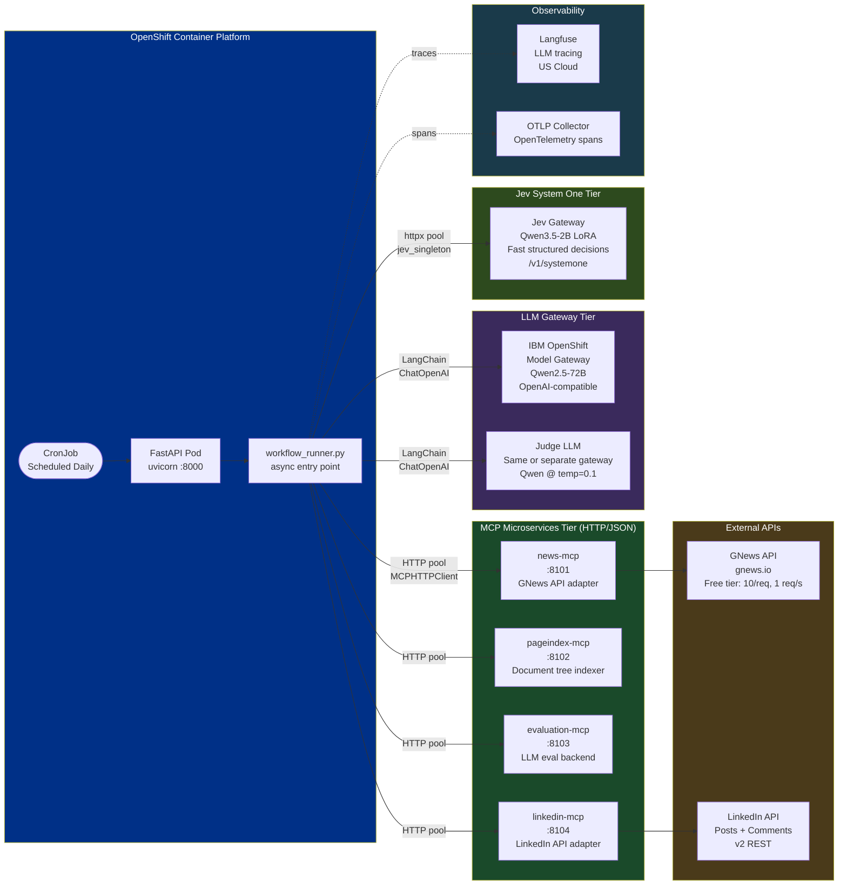
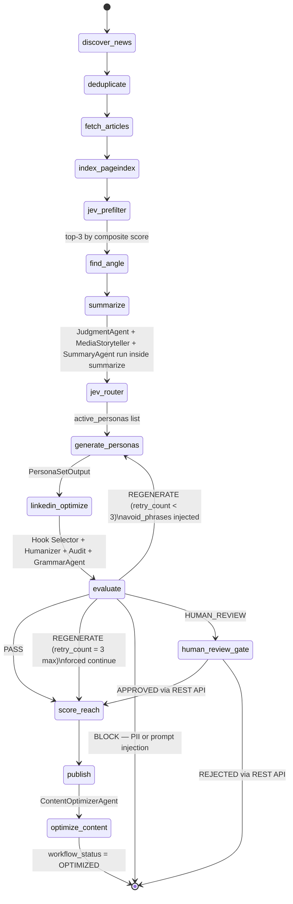
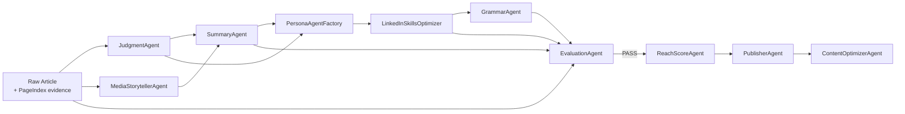
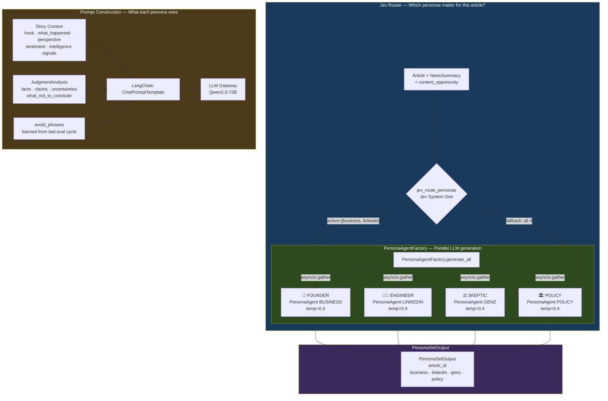
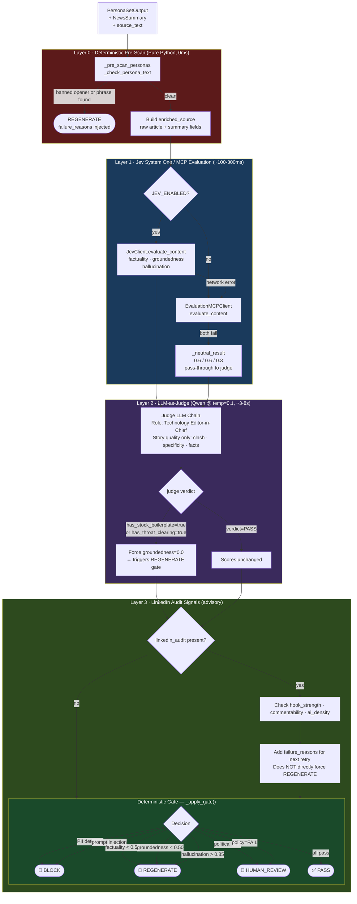
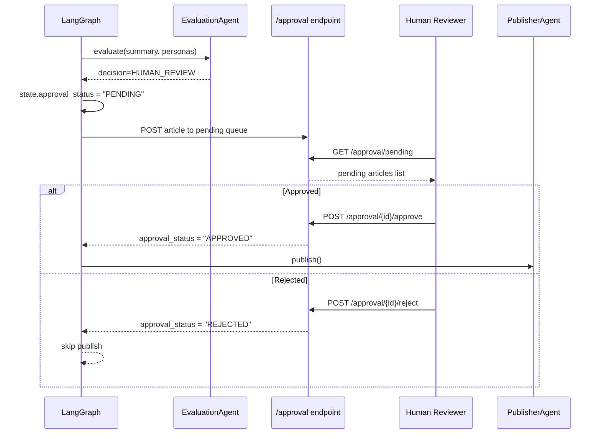
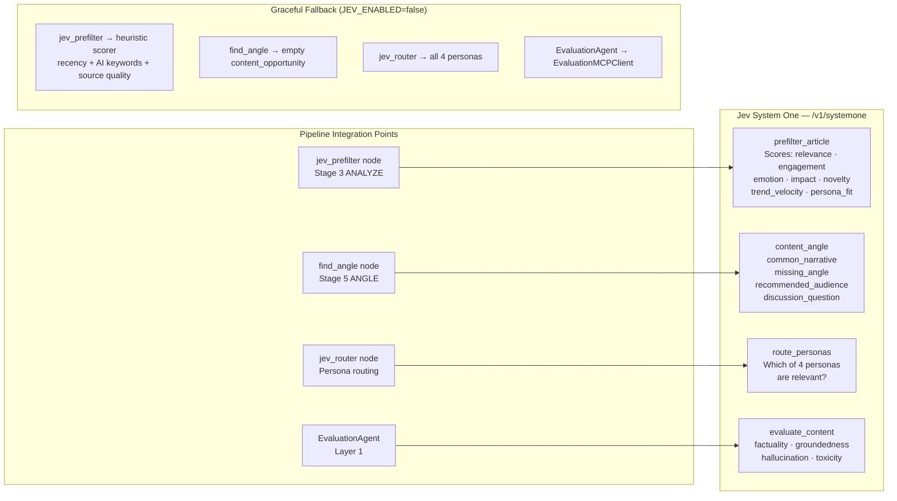
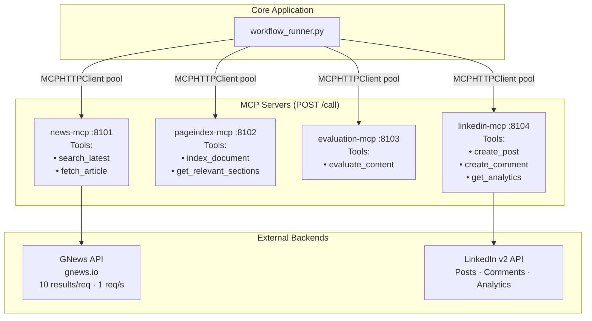
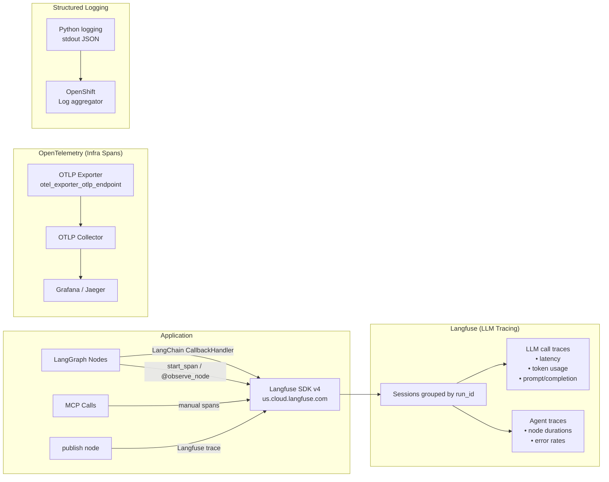
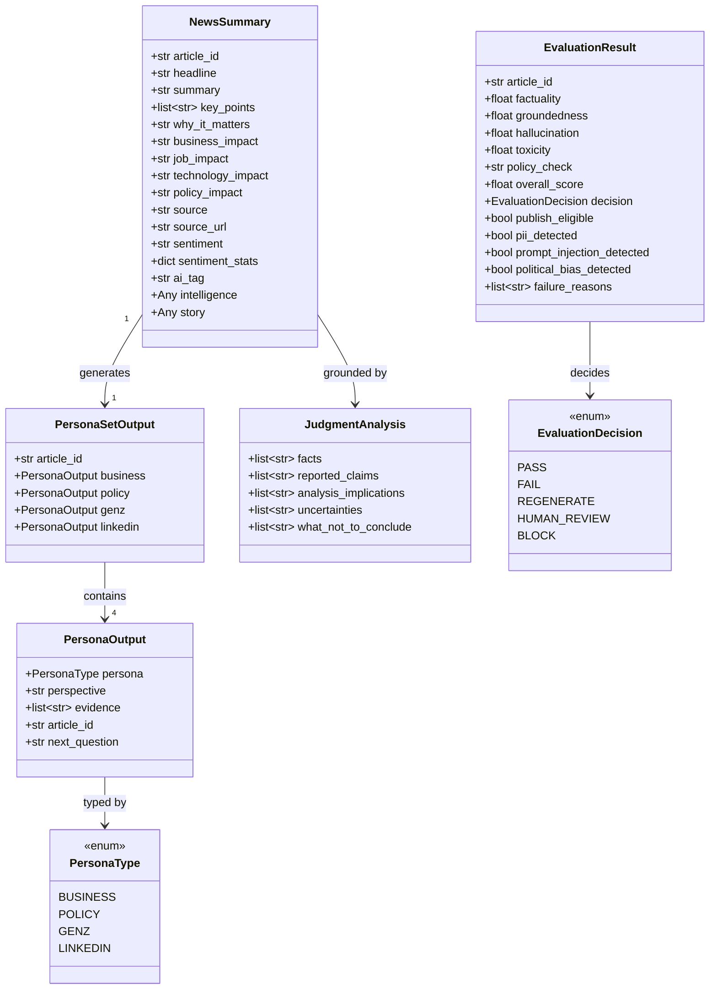

# AIFeeders — System Architecture

> **Audience:** Junior engineers through principal architects and new contributors.
> **Purpose:** Complete HLD (High-Level Design) — every component, every flow, every design decision explained with **why it exists**, **what it does**, and **what breaks if you remove it**.
> **Last updated:** Reflects current codebase — GrammarAgent, LLMFactory, ContentOptimizerAgent, JudgmentAgent, SummaryAgent (2-pass), LinkedInSkillsOptimizer (3-pass), 15-node LangGraph graph, MAX_RETRIES=3.

---

## Table of Contents

1. [System Overview — What Is This?](#1-system-overview)
2. [End-to-End Workflow Diagram](#2-end-to-end-workflow-diagram)
3. [System Infrastructure Flow](#3-system-infrastructure-flow)
4. [LangGraph State Machine — 15-Node Pipeline](#4-langgraph-state-machine)
5. [Agent Catalogue — Every Agent Explained](#5-agent-catalogue)
6. [Persona Flow — Four Voices, One Debate](#6-persona-flow)
7. [Evaluation (Evals) Flow — The Quality Gate](#7-evaluation-evals-flow)
8. [User Accessibility Flow — API & Approval](#8-user-accessibility-flow)
9. [Jev System One — Intelligence Layer](#9-jev-system-one)
10. [MCP Microservices Architecture](#10-mcp-microservices-architecture)
11. [Observability Stack](#11-observability-stack)
12. [Data Models](#12-data-models)
13. [LLM Factory — Zero-Code Provider Switching](#13-llm-factory)
14. [Configuration & Environment](#14-configuration--environment)
15. [Test Strategy](#15-test-strategy)
16. [Key Design Decisions (with Why)](#16-key-design-decisions)

---

## 1. System Overview

AIFeeders is an **autonomous, multi-agent AI platform** that runs daily as a scheduled job. Every 24 hours it:

1. **Discovers** today's most important AI news across 9 topic categories (~90 raw articles).
2. **Deduplicates** via 3-pass URL / published-store / title-similarity filtering.
3. **Scores & selects** the top-3 articles using Jev System One intelligence signals.
4. **Analyzes** each article with epistemological rigor — separates facts, claims, speculation (JudgmentAgent).
5. **Extracts the story** — hook, human analogy, turning point, second-order effects (MediaStorytellerAgent + SummaryAgent, 2 passes).
6. **Routes personas** — Jev decides which of the 4 expert voices are relevant for this article.
7. **Generates a 4-voice debate** in parallel — Founder, Engineer, Analyst (GENZ), Policy Lead.
8. **Optimizes** for LinkedIn reach — Hook Selector, Humanizer, Audit (LinkedInSkillsOptimizer, 3 passes).
9. **Grammar-checks** the composed post (GrammarAgent, temperature=0, non-blocking).
10. **Evaluates** through a 4-layer quality gate — deterministic scanner → Jev scoring → LLM judge → LinkedIn audit.
11. **Scores reach** across 5 engagement dimensions (ReachScoreAgent, deterministic).
12. **Publishes** the post + 4 persona comments to LinkedIn (LinkedInMCP).
13. **Diagnoses performance** and generates story mutations for future calibration (ContentOptimizerAgent).

**Why a fully autonomous pipeline?** Manual curation cannot sustain daily quality at volume. The multi-agent design separates *discovery*, *intelligence*, *judgment*, *generation*, *optimization*, *evaluation*, and *publishing* into isolated, independently testable units — each with its own failure recovery and observability.

### Component Count (current codebase)

| Layer | Components |
|---|---|
| LangGraph nodes | 15 (discover → deduplicate → fetch → index → jev_prefilter → find_angle → summarize → jev_router → generate_personas → linkedin_optimize → evaluate → score_reach → publish → optimize_content) |
| Agents | 11 (JudgmentAgent, MediaStorytellerAgent, SummaryAgent, PersonaAgentFactory×4, LinkedInSkillsOptimizer, EvaluationAgent, ReachScoreAgent, GrammarAgent, ContentOptimizerAgent, PublisherAgent) |
| MCP servers | 4 (news-mcp, pageindex-mcp, evaluation-mcp, linkedin-mcp) |
| LLM temperature profiles | 5 (0.0 grammar, 0.1 judge, 0.2 judgment, 0.3 optimizer, 0.4 personas, 0.7 storyteller/summary) |
| Evaluation layers | 4 (deterministic scanner, Jev/MCP scoring, LLM judge, LinkedIn audit) |

---

## 2. End-to-End Workflow Diagram


```mermaid
flowchart TD
    TRIGGER([⏰ CronJob · 08:00 + 16:00 UTC\nor POST /workflow/daily-news]) --> A

    subgraph DISCOVERY["Stage 1–2 · DISCOVER & INDEX"]
        A[discover_news\n9 GNews queries · ~90 raw articles] --> B
        B[deduplicate\n3-pass: URL · PublishedStore · title-similarity\nInputGuardrail on each article] --> C
        C[fetch_articles\nFull article content\nParallel ×30 via httpx] --> D
        D[index_pageindex\nDocument tree + evidence sections\nPageIndex MCP :8102]
    end

    subgraph INTELLIGENCE["Stage 3 · ANALYZE — Jev System One"]
        D --> E[jev_prefilter\nScore all articles\ncomposite = relevance×0.6 + engagement×0.4\nKeep top-3]
        E --> F[find_angle\nContent opportunity\nmissing_angle · recommended_audience\ndiscussion_question]
    end

    subgraph UNDERSTAND["Stage 4 · UNDERSTAND — LLM Analysis"]
        F --> G1[JudgmentAgent\ntemp=0.2\nFacts · Claims · Unknowns\nWhat NOT to conclude]
        F --> G2[MediaStorytellerAgent\ntemp=0.7\nStory pass 1: hook · analogy\nturning_point · perspective]
        G1 & G2 --> G3[SummaryAgent\ntemp=0.7\nStory pass 2: headline · key_points\nimpacts · sentiment]
    end

    subgraph ROUTE["Stage 5 · ROUTE — Persona Selection"]
        G3 --> H[jev_router\nWhich of 4 personas\nare relevant for this article?]
    end

    subgraph CREATE["Stage 6 · CREATE — Generation"]
        H --> I[generate_personas\n4 LLM agents asyncio.gather\nFounder · Engineer · Analyst · Policy\ntemp=0.4 · avoid_phrases injected on retry]
        I --> J[linkedin_optimize\nPass 1: Hook Selector LLM\nPass 2: Humanizer deterministic\nPass 3: Audit LLM → AuditResult]
        J --> GRAM[grammar_check\nGrammarAgent temp=0.0\nCorrect spelling/punctuation\nNon-blocking best-effort]
    end

    subgraph GATE["Quality Gate — 4-Layer Evaluation"]
        GRAM --> K{evaluate\nLayer 0: deterministic scanner\nLayer 1: Jev/MCP scores\nLayer 2: LLM judge @ 0.1\nLayer 3: LinkedIn audit advisory}
        K -->|PASS| L[score_reach\nReachScoreAgent\n5 dimensions · 0–100 total]
        K -->|REGENERATE retry_count lt 3| I
        K -->|REGENERATE max retries reached| L
        K -->|BLOCK — PII or injection| BLOCKED([🛑 Hard Stop\nNever Published])
        K -->|HUMAN_REVIEW — bias or policy| REVIEW([👤 Human Approval\nREST API Gate\nPOST /approval/id/approve])
    end

    subgraph PUBLISH["Stage 7 · DISTRIBUTE — LinkedIn"]
        REVIEW -->|APPROVED| L
        L --> M[publish\nOutputGuardrail · Unicode bold\nLinkedInMCP :8104\nPost + 4 persona comments]
    end

    subgraph LEARN["Stage 8 · LEARN — Closed Loop"]
        M --> N[optimize_content\nContentOptimizerAgent temp=0.3\nEngagement diagnosis\n6-dimension scoring\nstory_mutations for next run]
    end

    N --> END([✅ Run Complete\nworkflow_status=OPTIMIZED\nLangfuse traces flushed])

    style DISCOVERY fill:#1a3a5c,color:#fff
    style INTELLIGENCE fill:#2d4a1e,color:#fff
    style UNDERSTAND fill:#3a2a5c,color:#fff
    style ROUTE fill:#1a4a4a,color:#fff
    style CREATE fill:#4a2a1e,color:#fff
    style GATE fill:#5c1a1a,color:#fff
    style PUBLISH fill:#1a4a2a,color:#fff
    style LEARN fill:#4a3a1a,color:#fff
```

**Why 8 stages?** Each stage has a distinct information contract — the output of one is the validated input to the next. This isolates test scope, enables targeted retries (only persona generation retries, not re-discovery), and gives engineers clear failure attribution. Adding GrammarAgent and ContentOptimizerAgent as distinct stages means their code, tests, and failure modes are fully separable from the agents around them.

> **Node count fact:** The LangGraph graph has **15 nodes** in the current codebase — `discover_news, deduplicate, fetch_articles, index_pageindex, jev_prefilter, find_angle, summarize, jev_router, generate_personas, linkedin_optimize, evaluate, score_reach, publish, optimize_content` + the conditional routing edge. The `grammar_check` step runs *inside* the `linkedin_optimize` node (it is a method call on `PublisherAgent`, not a separate graph node).

---

## 3. System Infrastructure Flow


```mermaid
flowchart LR
    subgraph OCP["OpenShift Container Platform"]
        CRON([CronJob\nScheduled Daily]) --> API_POD[FastAPI Pod\nuvicorn :8000]
        API_POD --> RUNNER[workflow_runner.py\nasync entry point]
    end

    subgraph MCP_TIER["MCP Microservices Tier (HTTP/JSON)"]
        NEWS_MCP[news-mcp\n:8101\nGNews API adapter]
        PI_MCP[pageindex-mcp\n:8102\nDocument tree indexer]
        EVAL_MCP[evaluation-mcp\n:8103\nLLM eval backend]
        LI_MCP[linkedin-mcp\n:8104\nLinkedIn API adapter]
    end

    subgraph LLM_TIER["LLM Gateway Tier"]
        LLM_GW[IBM OpenShift\nModel Gateway\nQwen2.5-72B\nOpenAI-compatible]
        EVAL_LLM[Judge LLM\nSame or separate gateway\nQwen @ temp=0.1]
    end

    subgraph JEV_TIER["Jev System One Tier"]
        JEV[Jev Gateway\nQwen3.5-2B LoRA\nFast structured decisions\n/v1/systemone]
    end

    subgraph EXTERNAL["External APIs"]
        GNEWS[GNews API\ngnews.io\nFree tier: 10/req, 1 req/s]
        LINKEDIN_API[LinkedIn API\nPosts + Comments\nv2 REST]
    end

    subgraph OBS["Observability"]
        LANGFUSE[Langfuse\nLLM tracing\nUS Cloud]
        OTLP[OTLP Collector\nOpenTelemetry spans]
    end

    RUNNER -->|HTTP pool\nMCPHTTPClient| NEWS_MCP
    RUNNER -->|HTTP pool| PI_MCP
    RUNNER -->|HTTP pool| EVAL_MCP
    RUNNER -->|HTTP pool| LI_MCP

    NEWS_MCP --> GNEWS
    LI_MCP --> LINKEDIN_API

    RUNNER -->|LangChain\nChatOpenAI| LLM_GW
    RUNNER -->|LangChain\nChatOpenAI| EVAL_LLM
    RUNNER -->|httpx pool\njev_singleton| JEV

    RUNNER -.->|traces| LANGFUSE
    RUNNER -.->|spans| OTLP

    style OCP fill:#003087,color:#fff
    style MCP_TIER fill:#1a4a2a,color:#fff
    style LLM_TIER fill:#3a2a5c,color:#fff
    style JEV_TIER fill:#2d4a1e,color:#fff
    style EXTERNAL fill:#4a3a1a,color:#fff
    style OBS fill:#1a3a4a,color:#fff
```

**Why MCP microservices?** Each MCP server is a standalone HTTP service with its own Dockerfile and failure boundary. If GNews is down, only `news-mcp` errors — the rest of the pipeline is unaffected. This also lets each server be scaled, versioned, and replaced independently.

**Why persistent HTTP connection pools?** Early builds created a new `httpx.AsyncClient` on every tool call (50+ per run). This wasted 200–800ms per call in TCP+TLS handshakes. The factory singleton pattern (`MCPClientFactory`, `jev_singleton`) keeps pools alive for the process lifetime — ~15–40s saved per run.

---

## 4. LangGraph State Machine — 15-Node Pipeline

### Graph Topology


```mermaid
stateDiagram-v2
    [*] --> discover_news

    discover_news --> deduplicate
    deduplicate --> fetch_articles
    fetch_articles --> index_pageindex
    index_pageindex --> jev_prefilter

    jev_prefilter --> find_angle : top-3 by composite score
    find_angle --> summarize
    summarize --> jev_router : JudgmentAgent + MediaStoryteller + SummaryAgent run inside summarize
    jev_router --> generate_personas : active_personas list

    generate_personas --> linkedin_optimize : PersonaSetOutput
    linkedin_optimize --> evaluate : Hook Selector + Humanizer + Audit + GrammarAgent

    evaluate --> score_reach : PASS
    evaluate --> generate_personas : REGENERATE (retry_count < 3)\navoid_phrases injected
    evaluate --> score_reach : REGENERATE (retry_count = 3 max)\nforced continue
    evaluate --> [*] : BLOCK — PII or prompt injection
    evaluate --> human_review_gate : HUMAN_REVIEW

    human_review_gate --> score_reach : APPROVED via REST API
    human_review_gate --> [*] : REJECTED via REST API

    score_reach --> publish
    publish --> optimize_content : ContentOptimizerAgent
    optimize_content --> [*] : workflow_status = OPTIMIZED
```

### Shared State — `NewsWorkflowState`

Every LangGraph node reads from and writes to a single immutable-style TypedDict:

| Field | Type | Set by | Read by |
|---|---|---|---|
| `run_id` | `str` | `make_initial_state()` | All nodes (tracing) |
| `raw_articles` | `list[dict]` | `discover_news` | `deduplicate` |
| `deduplicated_articles` | `list[dict]` | `deduplicate` | `fetch_articles` |
| `selected_articles` | `list[dict]` | `fetch_articles` / `jev_prefilter` | `summarize`, `evaluate` |
| `pageindex_documents` | `list[dict]` | `index_pageindex` | (observability) |
| `jev_prefilter_scores` | `dict[article_id→scores]` | `jev_prefilter` + `find_angle` | `summarize`, `publish` |
| `jev_persona_hints` | `list[str]` | `jev_prefilter` | `jev_router` |
| `jev_active_personas` | `list[str]` | `jev_router` | `generate_personas` |
| `summaries` | `list[dict]` | `summarize` | `generate_personas`, `evaluate`, `publish` |
| `persona_outputs` | `list[dict]` | `generate_personas`, `linkedin_optimize` | `evaluate`, `publish` |
| `evaluation_results` | `list[dict]` | `evaluate` | `route_evaluation`, `publish` |
| `retry_count` | `int` | `evaluate` | `route_evaluation`, `generate_personas` |
| `reach_scores` | `list[dict]` | `score_reach` | (observability) |
| `linkedin_results` | `list[dict]` | `publish` | `optimize_content` |
| `workflow_status` | `str` | Every node | CronJob exit code |
| `errors` | `list[str]` | Any node | `workflow_runner.py` |

**Why TypedDict state?** LangGraph serializes state at every node boundary. TypedDict with no internal objects means state is always JSON-serializable — critical for checkpointing, debugging, and the retry loop.

### Retry Loop Architecture

```
evaluate → REGENERATE (retry_count < 3)
    ↓
generate_personas (retry N, avoid_phrases injected from failure_reasons)
    ↓
linkedin_optimize (Hook Selector + Humanizer + Audit)
    ↓
GrammarAgent (temperature=0, non-blocking)
    ↓
evaluate (retry N+1)
    ↓ (if PASS)
score_reach → publish → optimize_content
```

**Old loop (pre-v2):** `evaluate → find_angle → summarize → jev_router → generate_personas`
→ 8–15s wasted per retry re-running fully deterministic summarization that produces byte-identical output.

**Current loop:** `evaluate → generate_personas`
→ Only the LLM-creative step retries. JudgmentAnalysis, MediaStorytellerAgent story, SummaryAgent output, and Jev scores are all reused via `_STORY_CONTEXT_CACHE` keyed by `article_id`.

**Why `avoid_phrases` injection?** When evaluation fails, the exact banned phrase is extracted from `failure_reasons` (single-quoted strings are parsed out of the LLM judge critique) and injected directly into the persona generation prompt. This closes the feedback loop — the generator knows exactly what not to repeat.

**Why MAX_RETRIES = 3?** Cost/quality tradeoff. Three attempts covers >98% of banned-phrase cases empirically. Each retry costs ~10 LLM calls (4 personas + judge + scoring). After 3, PASS items proceed and remaining REGENERATE items force-continue through `score_reach` with their best-effort output.

---

## 5. Agent Catalogue — Every Agent Explained

This section explains every agent, its responsibility, its temperature setting, and **why it is a separate agent** rather than part of the agent before or after it.

### Agent Responsibility Map


```mermaid
flowchart LR
    subgraph ANALYSIS["Analysis Layer (before generation)"]
        JA[JudgmentAgent\ntemp=0.2\nEpistemological boundaries\nFacts · Claims · Unknowns\nWhat NOT to conclude]
        MSA[MediaStorytellerAgent\ntemp=0.7\nStory extraction pass 1\nhook · analogy · turning point\nperspective · second_order_effect]
        SA[SummaryAgent\ntemp=0.7\nStructured summary pass 2\nheadline · key_points\nsentiment · impacts]
    end

    subgraph GENERATION["Generation Layer"]
        PA[PersonaAgentFactory\ntemp=0.4 per persona\n4 parallel: Founder · Engineer\nAnalyst · Policy Lead\navoid_phrases on retry]
    end

    subgraph OPTIMIZATION["Optimization Layer (post-generation)"]
        LSO[LinkedInSkillsOptimizer\nPass 1: Hook Selector LLM\nPass 2: Humanizer deterministic\nPass 3: Audit LLM → AuditResult\nhook_strength · commentability\nai_density · cta_quality]
        GA[GrammarAgent\ntemp=0.0 — deterministic\nCorrects spelling + grammar\nNon-blocking: returns original if LLM fails]
    end

    subgraph EVAL_LAYER["Evaluation Layer"]
        EA[EvaluationAgent\nLayer 0: Python scanner\nLayer 1: Jev/MCP scores\nLayer 2: Judge LLM temp=0.1\nLayer 3: LinkedIn audit]
    end

    subgraph PUBLISH_LAYER["Publish Layer"]
        PUB[PublisherAgent\nOutputGuardrail\nUnicode bold conversion\nCTA + hashtag builder\nLinkedInMCP orchestration]
        RSA[ReachScoreAgent\nFully deterministic\n5 dimensions × 20 pts\nNo LLM call]
    end

    subgraph LEARN_LAYER["Learning Layer"]
        COA[ContentOptimizerAgent\ntemp=0.3\n6-dimension diagnosis\nStory mutation generation\nClosed-loop signal for Jev]
    end

    JA & MSA --> SA
    SA --> PA
    PA --> LSO --> GA
    GA --> EA
    EA -->|PASS| RSA
    RSA --> PUB
    PUB --> COA
```

### Agent Temperature Rationale

| Agent | Temp | Why this temperature? |
|---|---|---|
| `GrammarAgent` | **0.0** | Correction-only pass. Any creativity would change the author's voice. Determinism = testable. |
| `EvaluationAgent` (judge) | **0.1** | Pattern-matching critic. Low temp = high reproducibility across runs. Two identical posts should get identical verdicts. |
| `JudgmentAgent` | **0.2** | Factual boundary analysis requires near-determinism. Slightly above 0 to handle phrasing variation in source articles. |
| `ContentOptimizerAgent` | **0.3** | Diagnosis + mutation generation requires some creativity but must stay grounded in the actual engagement data. |
| `PersonaAgentFactory` | **0.4** | Debate personas need distinct voices without hallucinating. 0.4 gives controlled variation — enough for re-rolls to differ on REGENERATE. |
| `MediaStorytellerAgent` | **0.7** | Story extraction requires creative synthesis: analogies, hooks, second-order effects. High temp = richer narrative output. |
| `SummaryAgent` | **0.7** | Story calibration requires free synthesis across the JudgmentAnalysis + NewsStory fields. |

### Agent Dependency Graph (data flow)


```mermaid
flowchart LR
    RAW[Raw Article\n+ PageIndex evidence] --> JA[JudgmentAgent]
    RAW --> MSA[MediaStorytellerAgent]
    JA --> SA[SummaryAgent]
    MSA --> SA
    SA --> PAF[PersonaAgentFactory]
    JA --> PAF
    PAF --> LSO[LinkedInSkillsOptimizer]
    LSO --> GA[GrammarAgent]
    GA --> EA[EvaluationAgent]
    SA --> EA
    RAW --> EA
    EA -->|PASS| RSA[ReachScoreAgent]
    RSA --> PUB[PublisherAgent]
    PUB --> COA[ContentOptimizerAgent]
    LSO --> EA
```

**Why are JudgmentAgent and MediaStorytellerAgent separate?**
JudgmentAgent runs at `temperature=0.2` doing purely factual boundary analysis — it must never produce creative output. MediaStorytellerAgent runs at `temperature=0.7` extracting the narrative arc. Merging them into one LLM call at a single temperature would compromise both: a high-temp call contaminates fact separation; a low-temp call kills story richness. The two outputs are then fed *together* to SummaryAgent, which uses both for calibrated structured output.

**Why is GrammarAgent non-blocking?**
Grammar correction is a best-effort quality improvement — not a correctness requirement. If the LLM call fails (gateway timeout, quota exhaustion), the original post text is returned unchanged and the pipeline continues. A blocking grammar check would turn a non-critical LLM outage into a pipeline failure. Making it non-blocking means the quality bar never drops below what persona generation produced.

**Why is LinkedInSkillsOptimizer positioned before EvaluationAgent?**
The LLM judge (Layer 2) needs to see the *optimized* post, not the raw persona output. If optimization happened after evaluation, the judge would approve a post that then gets its hook replaced — the judge verdict would be stale. The LinkedIn audit scores (from Pass 3) also feed directly into the evaluation gate as `failure_reasons` for the next retry cycle — this is only possible if optimization precedes evaluation.

---

## 6. Persona Flow

### The Four Voices


```mermaid
flowchart TD
    subgraph ROUTER["Jev Router — Which personas matter for this article?"]
        ARTICLE[Article + NewsSummary\n+ content_opportunity] --> JEV_ROUTE{jev_route_personas\nJev System One}
        JEV_ROUTE -->|"active=[business, linkedin]"| FACTORY
        JEV_ROUTE -->|fallback: all 4| FACTORY
    end

    subgraph FACTORY["PersonaAgentFactory — Parallel LLM generation"]
        FACTORY_NODE[PersonaAgentFactory.generate_all]
        FACTORY_NODE -->|asyncio.gather| B1[💼 FOUNDER\nPersonaAgent BUSINESS\ntemp=0.4]
        FACTORY_NODE -->|asyncio.gather| B2[🧑‍💻 ENGINEER\nPersonaAgent LINKEDIN\ntemp=0.4]
        FACTORY_NODE -->|asyncio.gather| B3[⚖️ SKEPTIC\nPersonaAgent GENZ\ntemp=0.4]
        FACTORY_NODE -->|asyncio.gather| B4[🏛️ POLICY\nPersonaAgent POLICY\ntemp=0.4]
    end

    subgraph OUTPUT["PersonaSetOutput"]
        B1 & B2 & B3 & B4 --> SET[PersonaSetOutput\narticle_id\nbusiness · linkedin · genz · policy]
    end

    subgraph PROMPT["Prompt Construction — What each persona sees"]
        CONTEXT[Story Context\nhook · what_happened · perspective\nsentiment · intelligence signals] --> PROMPT_BUILD[LangChain ChatPromptTemplate]
        JUDGMENT[JudgmentAnalysis\nfacts · claims · uncertainties\nwhat_not_to_conclude] --> PROMPT_BUILD
        AVOID[avoid_phrases\nbanned from last eval cycle] --> PROMPT_BUILD
        PROMPT_BUILD --> LLM[LLM Gateway\nQwen2.5-72B]
    end

    style ROUTER fill:#1a3a5c,color:#fff
    style FACTORY fill:#2d4a1e,color:#fff
    style OUTPUT fill:#3a2a5c,color:#fff
    style PROMPT fill:#4a3a1a,color:#fff
```

### Persona Identity Contract

| Persona | Role | Voice Register | Incentive |
|---|---|---|---|
| `BUSINESS` | AI Infrastructure Founder | OPPORTUNITY VOICE | Cost reduction, market timing, competitive position |
| `LINKEDIN` | ML Platform Engineer | OPERATIONAL REALITY VOICE | Architecture, reliability, operational debt |
| `GENZ` | AI Industry Analyst | MARKET DYNAMICS VOICE | Who wins at platform scale, second-order displacement |
| `POLICY` | AI Policy Lead | GOVERNANCE VOICE | Accountability, concentration risk, audit |

**Why four personas?** A genuine debate requires structural tension. Three voices can create two-against-one dynamics. Four creates a 2×2 tension matrix: Opportunity vs Reality, and Scale vs Governance. Each persona is required to directly challenge the previous speaker's argument — creating genuine intellectual conflict rather than parallel opinions.

**Why `avoid_phrases` injection?** When the deterministic scanner rejects a persona's output (e.g. "the real challenge lies in"), the exact rejected phrase is extracted and injected into the next generation's prompt. This closes the loop between evaluation failure and generation correction without any human intervention.

### Prefix-Cache Architecture

```
First generation of article X:
    compute story context → cache in _STORY_CONTEXT_CACHE[article_id]
    LLM call → result

Retry generation of article X (after REGENERATE):
    cache hit → skip re-computation
    LLM call with fresh avoid_phrases → new result
```

**Why cache the story context?** The 60-field story/intelligence context block is 100% deterministic from the `NewsSummary` object and never changes between retries. Computing it once saves ~2ms of Python serialization and — more importantly — gives the LLM provider's KV cache the same identical prefix tokens, increasing cache hit rate from 0% to ~90% on retries.

---

## 7. Evaluation (Evals) Flow


```mermaid
flowchart TD
    INPUT[PersonaSetOutput\n+ NewsSummary\n+ source_text] --> SCAN

    subgraph LAYER0["Layer 0 · Deterministic Pre-Scan (Pure Python, 0ms)"]
        SCAN[_pre_scan_personas\n_check_persona_text] -->|banned opener or phrase found| REGEN0([REGENERATE\nfailure_reasons injected])
        SCAN -->|clean| LAYER1_START
    end

    subgraph LAYER1["Layer 1 · Jev System One / MCP Evaluation (~100-300ms)"]
        LAYER1_START[Build enriched_source\nraw article + summary fields] --> JEV_EVAL{JEV_ENABLED?}
        JEV_EVAL -->|yes| JEV_CALL[JevClient.evaluate_content\nfactuality · groundedness\nhallucination]
        JEV_EVAL -->|no| MCP_EVAL[EvaluationMCPClient\nevaluate_content]
        JEV_CALL -->|network error| MCP_EVAL
        MCP_EVAL -->|both fail| NEUTRAL[_neutral_result\n0.6 / 0.6 / 0.3\npass-through to judge]
    end

    subgraph LAYER2["Layer 2 · LLM-as-Judge (Qwen @ temp=0.1, ~3-8s)"]
        JEV_CALL & NEUTRAL --> JUDGE[Judge LLM Chain\nRole: Technology Editor-in-Chief\nStory quality only: clash · specificity · facts]
        JUDGE --> JUDGE_OUT{judge verdict}
        JUDGE_OUT -->|has_stock_boilerplate=true\nor has_throat_clearing=true| FORCE_REGEN[Force groundedness=0.0\n→ triggers REGENERATE gate]
        JUDGE_OUT -->|verdict=PASS| SCORES_PASS[Scores unchanged]
    end

    subgraph LAYER3["Layer 3 · LinkedIn Audit Signals (advisory)"]
        FORCE_REGEN & SCORES_PASS --> LI_AUDIT{linkedin_audit present?}
        LI_AUDIT -->|yes| AUDIT_CHECK[Check hook_strength · commentability · ai_density]
        AUDIT_CHECK --> FAIL_REASONS[Add failure_reasons for next retry\nDoes NOT directly force REGENERATE]
        LI_AUDIT -->|no| GATE
        FAIL_REASONS --> GATE
    end

    subgraph GATE["Deterministic Gate — _apply_gate()"]
        GATE[Apply thresholds\nfactuality > 0.50\ngroundedness > 0.50\nhallucination < 0.85] --> DECISION{Decision}
        DECISION -->|PII detected| BLOCK([🛑 BLOCK])
        DECISION -->|prompt injection| BLOCK
        DECISION -->|factuality < 0.50| REGEN([🔄 REGENERATE])
        DECISION -->|groundedness < 0.50| REGEN
        DECISION -->|hallucination > 0.85| REGEN
        DECISION -->|political bias| REVIEW([👤 HUMAN_REVIEW])
        DECISION -->|policy=FAIL| REVIEW
        DECISION -->|all pass| PASS([✅ PASS])
    end

    style LAYER0 fill:#5c1a1a,color:#fff
    style LAYER1 fill:#1a3a5c,color:#fff
    style LAYER2 fill:#3a2a5c,color:#fff
    style LAYER3 fill:#2d4a1e,color:#fff
    style GATE fill:#1a4a2a,color:#fff
```

### Why Four Evaluation Layers?

| Layer | Technology | Why Separate? |
|---|---|---|
| 0 — Deterministic Scanner | Pure Python regex | Zero latency. 100% reliable. Catches the most common LLM failure modes before any API call. |
| 1 — Jev/MCP Scoring | Jev System One (LoRA) or MCP LLM | Fast structured factuality/groundedness numbers. Separates scoring from judgment. |
| 2 — LLM Judge | Qwen @ temp=0.1 (different invocation from generator) | The generator runs at temp=0.7. Using the same model at temp=0.1 in a separate invocation ensures the judge never evaluates its own generation. |
| 3 — LinkedIn Audit | Deterministic heuristics + LLM audit | Advisory only. Provides improvement signals (failure_reasons) for the next retry cycle without hard-blocking a post that passed factual checks. |

**Why `EvaluationDecision.BLOCK` exists?** PII (SSN, credit card) and prompt injection in the generated output are never publishable under any retry. BLOCK is a hard stop — not a retry trigger.

**Why `HUMAN_REVIEW`?** Political bias and policy failures require human judgment that cannot be automated. The approval REST API (`/approval`) gates publication until a human accepts or rejects the post.

---

## 8. User Accessibility Flow

### API Surface

```mermaid
flowchart LR
    subgraph API["FastAPI — :8000"]
        HEALTH[GET /health\nGET /ready]
        NEWS_API[GET /news/latest\nGET /news/search]
        WORKFLOW_API[POST /workflow/run\nGET /workflow/status/{run_id}]
        APPROVAL_API[GET /approval/pending\nPOST /approval/{article_id}/approve\nPOST /approval/{article_id}/reject]
    end

    subgraph USERS["Consumers"]
        CRON([OpenShift CronJob\nautomated daily trigger])
        OPS([Platform Operator\nmanual trigger / status check])
        REVIEWER([Human Reviewer\napproval gate for bias/policy])
        MONITOR([Monitoring\nPrometheus / Grafana])
    end

    CRON --> WORKFLOW_API
    OPS --> WORKFLOW_API
    OPS --> NEWS_API
    REVIEWER --> APPROVAL_API
    MONITOR --> HEALTH

    subgraph WORKFLOW_FLOW["Workflow Execution"]
        WORKFLOW_API --> RUNNER[workflow_runner.py\ndaily_news_graph.ainvoke]
    end

    APPROVAL_API -->|approval_status=APPROVED| PUBLISH_GATE[PublisherAgent\nresumes publication]
```

### Human Review / Approval Flow


```mermaid
sequenceDiagram
    participant Graph as LangGraph
    participant EvalAgent as EvaluationAgent
    participant ApprovalAPI as /approval endpoint
    participant Reviewer as Human Reviewer
    participant Publisher as PublisherAgent

    Graph->>EvalAgent: evaluate(summary, personas)
    EvalAgent-->>Graph: decision=HUMAN_REVIEW

    Graph->>Graph: state.approval_status = "PENDING"
    Graph->>ApprovalAPI: POST article to pending queue

    Reviewer->>ApprovalAPI: GET /approval/pending
    ApprovalAPI-->>Reviewer: pending articles list

    alt Approved
        Reviewer->>ApprovalAPI: POST /approval/{id}/approve
        ApprovalAPI-->>Graph: approval_status = "APPROVED"
        Graph->>Publisher: publish()
    else Rejected
        Reviewer->>ApprovalAPI: POST /approval/{id}/reject
        ApprovalAPI-->>Graph: approval_status = "REJECTED"
        Graph-->>Graph: skip publish
    end
```

**Why a REST approval gate?** `HUMAN_REVIEW` articles contain politically sensitive or policy-ambiguous content that the automated gate cannot safely pass. The REST API provides a lightweight human-in-the-loop mechanism without requiring any code changes or manual access to the pipeline.

---

## 9. Jev System One

Jev is the **intelligence backbone** — a fine-tuned Qwen3.5-2B with LoRA decision heads that replaces LLM inference for structured scoring decisions.


```mermaid
flowchart LR
    subgraph JEV["Jev System One — /v1/systemone"]
        PREFILTER[prefilter_article\nScores: relevance · engagement\nemotion · impact · novelty\ntrend_velocity · persona_fit]
        CONTENT_ANGLE[content_angle\ncommon_narrative\nmissing_angle\nrecommended_audience\ndiscussion_question]
        ROUTE[route_personas\nWhich of 4 personas\nare relevant?]
        EVAL[evaluate_content\nfactuality · groundedness\nhallucination · toxicity]
    end

    subgraph PIPELINE["Pipeline Integration Points"]
        PREFILTER_NODE[jev_prefilter node\nStage 3 ANALYZE] --> PREFILTER
        ANGLE_NODE[find_angle node\nStage 5 ANGLE] --> CONTENT_ANGLE
        ROUTER_NODE[jev_router node\nPersona routing] --> ROUTE
        EVAL_NODE[EvaluationAgent\nLayer 1] --> EVAL
    end

    subgraph FALLBACK["Graceful Fallback (JEV_ENABLED=false)"]
        FB1[jev_prefilter → heuristic scorer\nrecency + AI keywords + source quality]
        FB2[find_angle → empty content_opportunity]
        FB3[jev_router → all 4 personas]
        FB4[EvaluationAgent → EvaluationMCPClient]
    end
```

### Jev Scoring Signals

| Signal | Range | Used By |
|---|---|---|
| `relevance_score` | 0–1 | Article selection composite |
| `estimated_engagement` | 0–1 | Article selection composite |
| `emotion.curiosity/excitement/concern/urgency` | 0–1 | Persona prompt intelligence block |
| `impact.enterprise/developers/business/policy` | 0–1 | Persona prompt intelligence block |
| `novelty` | 0–1 | Publisher intelligence line, persona prompts |
| `trend_velocity` | 0–1 | Publisher sentiment signal line |
| `content_opportunity.missing_angle` | text | CTA builder, persona angle |
| `content_opportunity.recommended_audience` | text | Publisher context line |

**Composite article score formula:**
```
composite = relevance_score × 0.6 + estimated_engagement × 0.4
```
Top-3 articles by composite are kept. This gives the retry loop 2 fallback articles if the best article keeps triggering banned phrases — eliminating the single-article deadlock.

**Prefix cache for Jev calls:**
```python
_JEV_PREFILTER_CACHE: dict[str, JevPrefilterResult] = {}
# Key = SHA-256(title + description + published_at)
# On REGENERATE retry: 10 articles × 3 retries = 30 calls → 0 calls (cache hit)
```

---

## 10. MCP Microservices Architecture

### Service Map


```mermaid
flowchart TB
    subgraph CORE["Core Application"]
        RUNNER[workflow_runner.py]
    end

    subgraph MCP_SERVERS["MCP Servers (POST /call)"]
        NEWS[news-mcp :8101\nTools:\n• search_latest\n• fetch_article]
        PI[pageindex-mcp :8102\nTools:\n• index_document\n• get_relevant_sections]
        EVAL[evaluation-mcp :8103\nTools:\n• evaluate_content]
        LI[linkedin-mcp :8104\nTools:\n• create_post\n• create_comment\n• get_analytics]
    end

    subgraph EXTERNAL_BACKENDS["External Backends"]
        GNEWS_API[GNews API\ngnews.io\n10 results/req · 1 req/s]
        LI_API[LinkedIn v2 API\nPosts · Comments · Analytics]
    end

    RUNNER -->|MCPHTTPClient pool| NEWS
    RUNNER -->|MCPHTTPClient pool| PI
    RUNNER -->|MCPHTTPClient pool| EVAL
    RUNNER -->|MCPHTTPClient pool| LI

    NEWS --> GNEWS_API
    LI --> LI_API
```

### MCP Protocol Contract

Every MCP server exposes a single endpoint:
```
POST /call
Body:    {"tool": "<name>", "arguments": {...}}
Returns: {"result": <tool output>}
Error:   {"error": "<message>"}
```

**Why a custom REST protocol instead of SSE/WebSocket?** The MCP servers are stateless request/response services. A simple `POST /call` is the most reliable, observable, and firewall-friendly choice for an OpenShift internal network. There is no need for streaming or bidirectional communication.

### GNews Rate Limiting Architecture

```
9 queries × asyncio.Semaphore(1) × 1.2s delay = ~11s serial
```

**Why serialize GNews calls?** GNews free tier enforces 1 req/s per API key. Firing all 9 in parallel caused HTTP 429s because each MCP pod applies its own internal delay — but all pods receive requests simultaneously so the delay is useless against burst traffic. The `asyncio.Semaphore(1)` with 1.2s sleep ensures safe serialization.

---

## 11. Observability Stack


```mermaid
flowchart LR
    subgraph APP["Application"]
        NODES[LangGraph Nodes] -->|LangChain CallbackHandler| LANGFUSE
        NODES -->|start_span / @observe_node| LANGFUSE
        MCP_CALLS[MCP Calls] -->|manual spans| LANGFUSE
        PUBLISH_NODE[publish node] -->|Langfuse trace| LANGFUSE
    end

    subgraph LANGFUSE_CLOUD["Langfuse (LLM Tracing)"]
        LANGFUSE[Langfuse SDK v4\nus.cloud.langfuse.com] --> SESSIONS[Sessions grouped by run_id]
        SESSIONS --> LLM_TRACES[LLM call traces\n• latency\n• token usage\n• prompt/completion]
        SESSIONS --> AGENT_TRACES[Agent traces\n• node durations\n• error rates]
    end

    subgraph OTLP_STACK["OpenTelemetry (Infra Spans)"]
        OTEL[OTLP Exporter\notel_exporter_otlp_endpoint] --> COLLECTOR[OTLP Collector]
        COLLECTOR --> GRAFANA[Grafana / Jaeger]
    end

    subgraph LOGGING["Structured Logging"]
        LOGS[Python logging\nstdout JSON] --> OCP_LOG[OpenShift\nLog aggregator]
    end
```

### Trace Correlation

All Langfuse traces within a single pipeline run share the same `trace_id`:
```python
trace_id = client.create_trace_id(seed=run_id)
# run_id = "RUN-20250120-abc123"
# All 4 persona traces, evaluation trace, publish trace → same session
```

**Why Langfuse v4 SDK?** v4 dropped the legacy imperative `client.trace()` API in favour of the `CallbackHandler` (LangChain-native) and `start_observation()` pattern. Every LLM call is automatically traced via the callback — no manual instrumentation required per agent.

---

## 12. Data Models


```mermaid
classDiagram
    class NewsSummary {
        +str article_id
        +str headline
        +str summary
        +list~str~ key_points
        +str why_it_matters
        +str business_impact
        +str job_impact
        +str technology_impact
        +str policy_impact
        +str source
        +str source_url
        +str sentiment
        +dict sentiment_stats
        +str ai_tag
        +Any intelligence
        +Any story
    }

    class PersonaType {
        <<enum>>
        BUSINESS
        POLICY
        GENZ
        LINKEDIN
    }

    class PersonaOutput {
        +PersonaType persona
        +str perspective
        +list~str~ evidence
        +str article_id
        +str next_question
    }

    class PersonaSetOutput {
        +str article_id
        +PersonaOutput business
        +PersonaOutput policy
        +PersonaOutput genz
        +PersonaOutput linkedin
    }

    class EvaluationDecision {
        <<enum>>
        PASS
        FAIL
        REGENERATE
        HUMAN_REVIEW
        BLOCK
    }

    class EvaluationResult {
        +str article_id
        +float factuality
        +float groundedness
        +float hallucination
        +float toxicity
        +str policy_check
        +float overall_score
        +EvaluationDecision decision
        +bool publish_eligible
        +bool pii_detected
        +bool prompt_injection_detected
        +bool political_bias_detected
        +list~str~ failure_reasons
    }

    class JudgmentAnalysis {
        +list~str~ facts
        +list~str~ reported_claims
        +list~str~ analysis_implications
        +list~str~ uncertainties
        +list~str~ what_not_to_conclude
    }

    NewsSummary "1" --> "1" PersonaSetOutput : generates
    PersonaSetOutput --> "4" PersonaOutput : contains
    PersonaOutput --> PersonaType : typed by
    EvaluationResult --> EvaluationDecision : decides
    NewsSummary --> JudgmentAnalysis : grounded by
```

---

## 13. LLM Factory — Zero-Code Provider Switching

The [`llm_factory.py`](src/daily_news/config/llm_factory.py) module is the **single place** that constructs every `ChatOpenAI` instance in the pipeline. No agent creates its own `httpx.Client` or `ChatOpenAI` directly.

### Why a central factory?

Without a factory, every agent would need to know about `ssl_verify`, `timeout`, `connection pool size`, `model name`, and `API key`. If the LLM provider changes, you'd update 11 files. With the factory, you update one `.env` file and all agents pick it up at startup.

### Factory Architecture

```mermaid
flowchart TD
    ENV[.env / Kubernetes Secret\nLLM_BASE_URL · LLM_API_KEY · LLM_MODEL\nLLM_SSL_VERIFY · LLM_TIMEOUT\nEVAL_LLM_BASE_URL · EVAL_LLM_MODEL] --> SETTINGS[Settings\nPydantic BaseSettings\nget_settings() cached lru_cache]

    SETTINGS --> MAKE_LLM[make_llm(temperature)\nPrimary gateway\nAll generation agents]
    SETTINGS --> MAKE_EVAL_LLM[make_eval_llm(temperature)\nJudge gateway\nEvaluationAgent only\nFalls back to primary if EVAL_LLM_* not set]

    MAKE_LLM --> HTTP1[httpx.Client + AsyncClient\nssl_verify from LLM_SSL_VERIFY\npool from LLM_MAX_CONNECTIONS]
    MAKE_EVAL_LLM --> HTTP2[httpx.Client + AsyncClient\nsmaller pool max_connections=10\nkeepalive=4]

    HTTP1 --> OPENAI1[ChatOpenAI\nmodel + api_key + base_url\nhttp_client + http_async_client]
    HTTP2 --> OPENAI2[ChatOpenAI\njudge model + api_key\nhttp_client + http_async_client]

    OPENAI1 --> AGENTS[JudgmentAgent temp=0.2\nMediaStorytellerAgent temp=0.7\nSummaryAgent temp=0.7\nPersonaAgentFactory temp=0.4\nLinkedInSkillsOptimizer temp varies\nGrammarAgent temp=0.0\nContentOptimizerAgent temp=0.3]
    OPENAI2 --> EVAL_AGENT[EvaluationAgent judge\ntemp=0.1]
```

### Temperature → Agent Mapping

Every agent calls `make_llm(temperature=X)`. The `temperature` parameter is the **only** caller-supplied argument — everything else comes from `Settings`:

```python
# JudgmentAgent — strict factual analysis
self._llm = make_llm(temperature=0.2, settings=s)

# PersonaAgentFactory — four voices, controlled creativity
self._llm = make_llm(temperature=0.4, settings=s)

# EvaluationAgent judge — separate gateway, deterministic critic
self._judge_llm = make_eval_llm(temperature=0.1, settings=s, max_connections=10, max_keepalive=4)

# GrammarAgent — pure correction, no creativity
self._llm = make_llm(temperature=0.0, settings=s)
```

### SSL Verify Architecture

`LLM_SSL_VERIFY=false` is required **only** for IBM internal gateways that serve self-signed TLS certificates. Any public provider (Anthropic, OpenAI, Azure, Groq) must use `LLM_SSL_VERIFY=true`. The factory passes `verify=ssl_verify` to `httpx.Limits` — this is the only place SSL verification is configured.

### Independent Judge Gateway

```
# Single gateway (default — IBM OpenShift)
LLM_BASE_URL=https://model-gateway.apps.cluster/v1
EVAL_LLM_BASE_URL=                          ← empty = falls back to LLM_BASE_URL

# Independent judge (production recommendation)
LLM_BASE_URL=https://model-gateway.apps.cluster/v1       ← generator
EVAL_LLM_BASE_URL=https://api.anthropic.com/v1            ← judge on different provider
EVAL_LLM_MODEL=claude-3-haiku-20240307
EVAL_LLM_API_KEY=sk-ant-...
```

**Why separate judge gateway?** When the generator and judge use the same model invocation, the judge has implicit familiarity bias — it tends to approve outputs that mirror its own generation style. Using a different provider or a different temperature invocation breaks this correlation. The generator at `0.7` and the judge at `0.1` already provide partial separation; a fully independent gateway provides complete separation.

---

## 14. Configuration & Environment

### LLM Gateway — Zero Code Change to Switch Provider

```
# IBM OpenShift Gateway (current)
LLM_BASE_URL=https://model-gateway.apps.cluster/v1
LLM_API_KEY=<bearer-token>
LLM_MODEL=qwen2-5-72b-instruct
LLM_SSL_VERIFY=false          ← self-signed cert on IBM internal gateway

# To switch to Anthropic (no code change)
LLM_BASE_URL=https://api.anthropic.com/v1
LLM_API_KEY=sk-ant-...
LLM_MODEL=claude-3-5-sonnet-20241022
LLM_SSL_VERIFY=true

# Independent judge (generator ≠ evaluator for maximum eval independence)
EVAL_LLM_BASE_URL=https://api.anthropic.com/v1
EVAL_LLM_MODEL=claude-3-haiku-20240307
```

**Why configuration-driven?** All agent logic, prompts, and graph topology are provider-agnostic. The model, URL, API key, SSL behaviour, timeout, and connection pool size all come from `Settings` (Pydantic BaseSettings). Switching LLM provider requires only `.env` changes — zero code changes.

### Key Environment Variables

| Variable | Default | Purpose |
|---|---|---|
| `LLM_BASE_URL` | (required) | OpenAI-compatible LLM endpoint |
| `LLM_MODEL` | `qwen2-5-72b-instruct` | Generator model |
| `JEV_BASE_URL` | (optional) | Jev gateway — set empty to use heuristic fallback |
| `JEV_ENABLED` | `true` | Feature flag for Jev System One |
| `EVAL_FACTUALITY_THRESHOLD` | `0.50` | Below this → REGENERATE |
| `EVAL_GROUNDEDNESS_THRESHOLD` | `0.50` | Below this → REGENERATE |
| `EVAL_HALLUCINATION_THRESHOLD` | `0.85` | Above this → REGENERATE |
| `PUBLISHING_ENABLED` | `true` | Set `false` during smoke tests |
| `LANGFUSE_PUBLIC_KEY` | (optional) | LLM trace observability |
| `NEWS_MCP_URL` | `http://localhost:8101/mcp` | GNews adapter |
| `LINKEDIN_MCP_URL` | `http://localhost:8104/mcp` | LinkedIn API adapter |

---

## 15. Test Strategy

```
tests/
├── unit/                 Pure function tests — no I/O, no LLM calls
│   ├── test_grammar_agent.py
│   ├── test_judgment_agent.py
│   ├── test_persona_agent.py
│   ├── test_content_optimizer.py
│   ├── test_evaluation_gate.py       ← threshold logic
│   ├── test_banned_phrase_scanner.py ← deterministic scanner
│   ├── test_deduplication.py         ← URL norm + title similarity
│   ├── test_publisher_idempotency.py ← published_store
│   ├── test_reach_score.py           ← ReachScoreAgent
│   ├── test_sentiment_resolver.py
│   ├── test_guardrails_judgment.py
│   ├── test_llm_factory.py           ← NEW: factory construction
│   ├── test_models.py
│   └── test_published_store.py
│
├── evaluation/           Threshold calibration tests
│   └── test_evaluation_thresholds.py ← validates 0.50/0.50/0.85 defaults
│
├── mcp/                  MCP client integration (requires running MCP servers)
│   ├── test_news_mcp.py
│   ├── test_linkedin_mcp.py
│   ├── test_evaluation_mcp.py
│   └── test_pageindex_mcp.py
│
├── integration/          FastAPI endpoint tests
│   └── test_api.py
│
├── workflow/             LangGraph routing logic tests
│   └── test_langgraph_routing.py
│
└── test_e2e_linkedin_post.py         Full end-to-end (requires all env vars)
```

**Test philosophy:**
- Unit tests are the primary safety net — they test every agent's deterministic logic without LLM calls.
- The `test_banned_phrase_scanner.py` and `test_evaluation_gate.py` tests guard the quality gate thresholds from accidental drift.
- `test_llm_factory.py` (new) validates that factory construction works for all provider configurations.

---

## 16. Key Design Decisions

### D1 — LangGraph over a raw async loop

**Decision:** Use LangGraph `StateGraph` as the orchestration layer.
**Why:** The retry loop (`evaluate → generate_personas → evaluate`) and the human review gate (`evaluate → human_review_gate → publish`) would require complex state threading in a raw coroutine. LangGraph's `add_conditional_edges` makes the branching logic explicit, testable, and visualizable. State is automatically serialized at every node boundary — enabling checkpointing and debugging. New nodes can be inserted (e.g. `linkedin_optimize`, `grammar_check`) without touching routing logic.

---

### D2 — Jev System One for structured intelligence, LLM for creative generation

**Decision:** Jev (Qwen3.5-2B LoRA) scores articles and routes personas; the full Qwen2.5-72B generates creative debate content.  
**Why:** Structured scoring (0–1 floats, enum decisions) does not require a 72B parameter model. Jev returns structured JSON decisions in ~100ms vs ~3s for a full LLM call. The 72B is reserved for the creative tasks where it genuinely adds value: perspective generation, story extraction, judgment analysis.

---

### D3 — Four evaluation layers with hard vs soft gates

**Decision:** Deterministic scanner (Layer 0) → Jev scoring (Layer 1) → LLM judge (Layer 2) → LinkedIn audit (Layer 3).  
**Why:** Each layer has a different cost/reliability tradeoff:
- Layer 0 is free, instant, and 100% reliable — catches the majority of LLM failure modes.
- Layer 1 is fast (100–300ms) and structured — catches factuality/groundedness failures.
- Layer 2 is slow (3–8s) but catches story-level quality failures that no regex can detect.
- Layer 3 is advisory — provides improvement signals without hard-blocking factual content.

Separating these layers also means Layer 2 never interferes with Layer 0's decisions (a known failure mode when you ask one LLM to enforce what another LLM generated).

---

### D4 — Narrow retry loop (personas only)

**Decision:** REGENERATE loops back to `generate_personas`, not to `summarize` or `find_angle`.  
**Why:** Summaries and Jev intelligence signals are fully deterministic for a given article. Re-running them produces byte-identical output and wastes 8–15s of LLM budget per retry. Only persona generation produces stochastic output that benefits from a retry. The `avoid_phrases` injection (exact banned phrases from the last cycle) makes each retry more targeted than a naive re-run.

---

### D5 — Persistent HTTP connection pools

**Decision:** One `httpx.AsyncClient` per MCP server and one per LLM gateway, shared for the process lifetime.  
**Why:** Early builds created a fresh `AsyncClient` on every tool call (50+ per run). The TCP+TLS handshake added 200–800ms per call — 15–40 seconds per run wasted on connection overhead. The singleton pattern (`mcp_factory()`, `jev_singleton()`, `make_llm()`) eliminates this entirely.

---

### D6 — Deterministic CTA and hashtag generation

**Decision:** CTAs and hashtags are generated from article signals (event_type, controversy, headline entity extraction), not from LLM calls.  
**Why:** LLM-generated CTAs drifted toward generic engagement bait ("What do you think? Drop a comment!"). The `_build_cta()` and `_extract_dynamic_tags()` functions use the Jev intelligence signals (event type, controversy level, missing angle) to produce article-specific questions. Zero LLM cost, 100% deterministic, fully testable.

---

### D7 — Unicode Bold for LinkedIn formatting

**Decision:** `_to_unicode_bold()` converts Markdown `**text**` to Unicode Mathematical Bold characters.  
**Why:** LinkedIn's Post API does not parse Markdown. Literal `**text**` renders as asterisks in the feed. Unicode Mathematical Bold characters (U+1D400+) render as native bold across mobile and desktop LinkedIn without any Markdown parsing dependency.

---

### D8 — Published store for idempotency

**Decision:** `published_store.py` tracks all article hashes published in the last 24 hours.  
**Why:** The pipeline runs daily but GNews articles can persist in search results for several days. Without the store, the same article would be published multiple times across consecutive runs. The store is checked in `deduplicate` (Pass 2) to filter out already-published articles before any LLM or Jev call is made.

---

### D9 — Input and Output guardrails as separate classes

**Decision:** `InputGuardrail.inspect_article()` runs in `deduplicate`. `OutputGuardrail.inspect_output()` runs in `publish`.  
**Why:** Input threats (prompt injection in a news article's content, PII in article text) must be caught before any LLM processes the content — they could otherwise poison the generation. Output threats (PII leakage into the generated post, hallucinated CEO quotes) must be caught before publishing. Separating them into two distinct classes with clear contracts makes the security boundary explicit and independently testable.

---

### D10 — Content optimizer position (post-generate, pre-evaluate)

**Decision:** `linkedin_optimize` runs between `generate_personas` and `evaluate`.  
**Why:** The optimizer's three passes (Hook Selector, Humanizer, Audit) work on the assembled post text. Running it before evaluation means:
1. The LLM judge sees the optimized (potentially hook-replaced, AI-vocab-reduced) text — not the raw generation.
2. The `linkedin_audit` scores are available as failure_reasons for the evaluation gate.
3. On retry, the optimizer has fresh persona output to work with (not stale pre-retry text).

---

### D11 — Central LLM Factory (`llm_factory.py`)

**Decision:** All `ChatOpenAI` instances across all 11 agents are constructed through two functions: `make_llm(temperature)` and `make_eval_llm(temperature)`.
**Why:** Without a factory, switching the LLM provider requires editing 11 agent files. With the factory, a provider switch is a 3-line `.env` change. The factory also enforces the `httpx` connection pool size, keepalive settings, SSL verification, and timeout consistently across the entire pipeline. These are operational parameters — they should never be scattered across agent business logic.

---

### D12 — GrammarAgent as a non-blocking best-effort pass

**Decision:** `GrammarAgent` runs at `temperature=0.0` between `linkedin_optimize` and `evaluate`. It returns the original text unchanged if the LLM call fails.
**Why:** Grammar correction improves post quality but cannot be a hard blocker — a grammar LLM outage should never prevent a factually correct, high-reach post from publishing. Making it non-blocking means the pipeline's availability is not coupled to an optional quality signal. Temperature=0 ensures the correction is deterministic and testable: the same input always produces the same corrected output.

---

### D13 — ContentOptimizerAgent as a closed-loop learning signal

**Decision:** `ContentOptimizerAgent` runs *after* publish, reads engagement analytics from `LinkedInMCP`, and generates structured `story_mutations` — alternative narrative approaches calibrated from what underperformed.
**Why:** Without a feedback loop, the pipeline would repeat the same story angles indefinitely regardless of engagement outcomes. The `story_mutations` output provides Jev `find_angle` calibration signals for future runs — a concrete mechanism for the system to improve over time without human editorial intervention. Running it post-publish means it never blocks the publish path; its outputs are advisory, not gating.

**Six diagnosis dimensions:**
- `hook_score` — scroll-stopping ability of the opening line
- `storytelling_score` — narrative structure quality
- `audience_relevance_score` — topic fit for target decision-makers
- `perspective_score` — non-obvious vs generic take
- `dialogue_score` — distinctiveness of persona mental models
- `question_score` — CTA specificity and comment incentive

---

### D14 — Two-pass story extraction (MediaStoryteller → SummaryAgent)

**Decision:** Story extraction uses two sequential LLM passes at `temperature=0.7` each:
- Pass 1 (MediaStorytellerAgent): analyst pass — extract narrative structure (hook, analogy, turning point, second_order_effect, perspective)
- Pass 2 (SummaryAgent): structured output pass — produce `NewsSummary` (headline, key_points, impacts, sentiment) calibrated by the story from Pass 1
**Why:** A single pass trying to produce both narrative understanding and structured summary simultaneously degrades at both. The analyst pass at Pass 1 creates a rich story interpretation that Pass 2 uses as calibration context — the summary is grounded in the story, not extracted directly from the raw article. This produces richer `why_it_matters`, `business_impact`, and `policy_impact` fields that are used by all four personas.

---

*This document reflects the codebase as of the latest commit. Update when adding nodes, agents, evaluation layers, or MCP services.*

### Quick Reference — Component Map

| When you change... | What to update |
|---|---|
| A new LangGraph node | §4 State Machine + §2 E2E Workflow |
| A new agent | §5 Agent Catalogue + §14 Config |
| LLM temperature changes | §5 Temperature Rationale + §13 LLM Factory |
| Eval threshold changes | §7 Evals Flow + RUNBOOK §14 FAQ |
| New MCP server | §10 MCP Architecture + §3 Infra Flow |
| New env var | §14 Config table + `.env.example` |
| New design decision | §16 Key Design Decisions |
