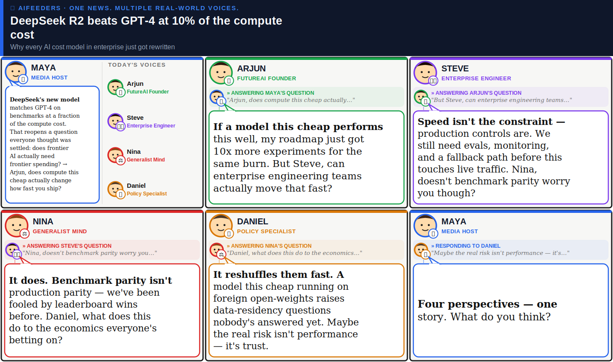
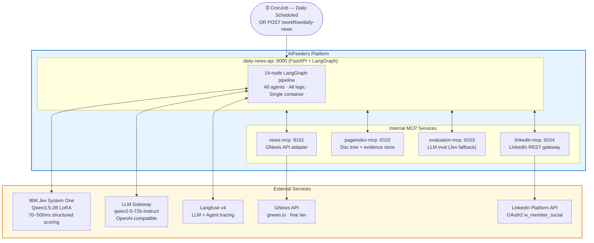
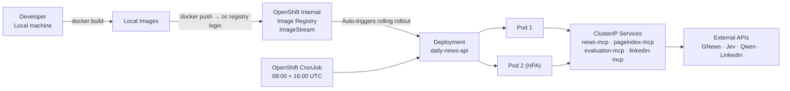
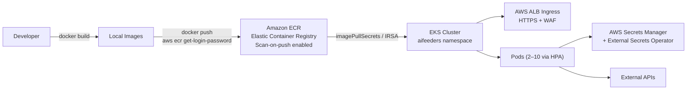
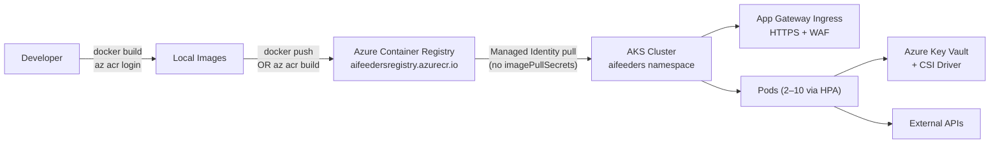

# AIFeeders — AI Media Intelligence & Round-Table Publishing Platform

> **Autonomous · Closed-Loop · Multi-Cloud** · LangGraph State Machine · IBM Jev System One · `qwen2-5-72b-instruct` · Docker / Podman / OpenShift / EKS / AKS · 5 MCP Microservices · Dynamic 4-Voice Debate · Multi-Layer Quality Gate

---

## What It Produces

Every day AIFeeders autonomously publishes a LinkedIn post — **no human writes a word of it**. Here are two real examples:

### Example 1 — Microsoft Copilot Super App

> **🧠 AI NEWS | Microsoft Launches New Copilot 'Super App' Integrating AI Chat, Coding, and Agents**
>
> Microsoft just turned Copilot into something much bigger than a chatbot.
>
> 👇 See image — four voices, one story.
>
> 💼 **David** → With Microsoft's new Copilot 'super app' integrating…
> 🧑‍💻 **Marcus** → While the integration of multiple AI capabilities…
> 📊 **Taylor** → The competition was never about who had…
> 🏛️ **Wei** → Governance cannot be bolted on after a…
>
> Their answers don't completely agree. That's exactly the point.
>
> 🎙️ **Tara — THE AIFEEDERS QUESTION:**
> Pick one:
> A. AI super-apps reduce enterprise complexity.
> B. AI super-apps move the complexity underneath the platform.
> And the uncomfortable question: What happens when your AI workspace becomes as difficult to leave as your operating system?
>
> 🗞️ Source: The Verge · 🔗 https://lnkd.in/gVmEJ8uc
>
> ⚠️ Perspectives are AI-simulated for discussion — not professional advice.
> 🤖 AIFeeders · Daily AI Intelligence · Powered by Jev
>
> **#MicrosoftCopilot #AISuperApp #EnterpriseAI #ProductivityTools**

The post ships with a 6-panel comic strip image generated entirely in Python (SVG → PNG, no external image service):



---

### Example 2 — Smaller Funding Rounds Signal Shift in Startup Investment

> **🧠 AI NEWS | Smaller Funding Rounds Signal Shift in Startup Investment Landscape**
>
> The billion-dollar funding rounds that once dominated venture capital are giving way to a new era of smaller, more targeted investments — but what does this mean for AI startups?
>
> 💼 **Sarah** → The shift to smaller, more targeted funding rounds in sectors like SME credit, compliance automation, and AI-agent risk…
> 🧑‍💻 **Steve** → For instance, integrating these specialized solutions into existing enterprise architectures…
> 📊 **Sam** → The shift to smaller, more targeted funding rounds is not just a change in investment size…
> 🏛️ **James** → Governance cannot be an afterthought in the new funding landscape…
>
> Their answers don't completely agree. That's exactly the point.
>
> 🎙️ **Chloe — THE AIFEEDERS QUESTION:**
> A. Smaller, more targeted investments will lead to more widespread innovation.
> B. The shift to smaller investments will fragment the market and make it harder for startups to scale.
>
> 🗞️ Source: TechStartups.com · 🔗 https://lnkd.in/eZqXPuhf
>
> **#VentureCapitalShift #StartupFunding2026 #InnovationLandscape #SmallInvestmentsBigImpact**

---

## Table of Contents

1. [System Architecture Overview](#1-system-architecture-overview)
2. [The 8 Cognitive Separations — Why This Design](#2-the-8-cognitive-separations--why-this-design)
3. [End-to-End Pipeline Flow](#3-end-to-end-pipeline-flow)
4. [Build — Docker Images (All 5 Services)](#4-build--docker-images-all-5-services)
5. [Push — Container Registries](#5-push--container-registries)
6. [Deploy — OpenShift (IBM / On-Prem)](#6-deploy--openshift-ibm--on-prem)
7. [Deploy — AWS EKS](#7-deploy--aws-eks)
8. [Deploy — Azure AKS](#8-deploy--azure-aks)
9. [Multi-Cloud Comparison & Migration Guide](#9-multi-cloud-comparison--migration-guide)
10. [Environment Variables Reference](#10-environment-variables-reference)
11. [Security, Scalability & Robustness Architecture](#11-security-scalability--robustness-architecture)
12. [Local Development](#12-local-development)

---

## 1. System Architecture Overview


```mermaid
flowchart TB
    TRIGGER(["⏰ CronJob — Daily Scheduled\nOR POST /workflow/daily-news"])

    subgraph PLATFORM["AIFeeders Platform"]
        subgraph API["daily-news-api :8000  (FastAPI + LangGraph)"]
            PIPELINE["14-node LangGraph pipeline\nAll agents · All logic · Single container"]
        end
        subgraph MCP["Internal MCP Services"]
            N["news-mcp :8101\nGNews API adapter"]
            P["pageindex-mcp :8102\nDoc tree + evidence store"]
            E["evaluation-mcp :8103\nLLM eval (Jev fallback)"]
            L["linkedin-mcp :8104\nLinkedIn REST gateway"]
        end
    end

    subgraph EXT["External Services"]
        GNEWS["GNews API\ngnews.io · free tier"]
        JEV["IBM Jev System One\nQwen3.5-2B LoRA\n70–500ms structured scoring"]
        QWEN["LLM Gateway\nqwen2-5-72b-instruct\nOpenAI-compatible"]
        LI["LinkedIn Platform API\nOAuth2 w_member_social"]
        LF["Langfuse v4\nLLM + Agent tracing"]
    end

    TRIGGER --> API
    API <--> N & P & E & L
    N --> GNEWS
    PIPELINE <--> JEV & QWEN & LF
    L --> LI

    style PLATFORM fill:#e8f4fd,stroke:#0066cc,stroke-width:2px
    style EXT fill:#fff8e1,stroke:#f57c00,stroke-width:2px
```

**What runs where:**
- `daily-news-api` — the entire LangGraph pipeline, all agents, all business logic
- Four **MCP servers** — thin HTTP wrappers around external services; independently scalable
- All containers share a private bridge network; only `daily-news-api` is externally reachable

---

## 2. The 8 Cognitive Separations — Why This Design

Naive pipelines collapse everything into one LLM prompt. AIFeeders enforces 8 strict stages so each concern is isolated, testable, and independently replaceable:

| Stage | Agent | What It Does | Failure It Prevents |
|---|---|---|---|
| 1 · Discovery | `discover_news` + `deduplicate` | 9 GNews queries, 3-pass dedup | Duplicate posts, stale articles |
| 2 · Safety Ingestion | `InputGuardrail` | Prompt injection + PII scan | LLM manipulation via article content |
| 3 · Evidence Indexing | `index_pageindex` | Builds deterministic document tree | Chunk-boundary truncation of RAG |
| 4 · Signal Scoring | `jev_prefilter` | Jev questions → top-3 story selection | Publishing low-signal articles |
| 5 · Epistemological Boundary | `JudgmentAgent` temp=0.2 | Separates facts / claims / unknowns | PR claims presented as objective fact |
| 6 · Narrative Construction | `MediaStorytellerAgent` + `SummaryAgent` | Hook, tension, bridges, structured summary | Dry bullet-point summaries |
| 7 · Parallel Debate | `generate_personas` temp=0.4 | 4 independent voices in genuine conflict | Single-perspective bias |
| 8 · Quality Gate + Publish | `EvaluationAgent` + `PublisherAgent` | Jev floats + Judge temp=0.1 + reach score | Boilerplate, hallucination, no-clash |

---

## 3. End-to-End Pipeline Flow


```mermaid
flowchart TD
    A(["START"]) --> B["discover_news\n9 GNews queries · ~90 raw articles"]
    B --> C["deduplicate\nURL hash · PublishedStore · Jaccard ≥ 0.55\n+ InputGuardrail: injection · PII scan"]
    C --> D["fetch_articles\nhttpx async · parallel ×30"]
    D --> E["index_pageindex\nDoc → Sections → Paragraphs"]
    E --> F["jev_prefilter\nScore all articles · composite=relevance×0.6+engagement×0.4\nPick top-3 · full Stage 3 intelligence signals"]
    F --> G["find_angle\nJev: missing_angle · recommended_audience\ncontent_opportunity written into state"]
    G --> H["summarize\n① JudgmentAgent temp=0.2  facts/claims/unknowns\n② MediaStorytellerAgent  hook/perspective/analogy\n③ SummaryAgent temp=0.2  structured NewsSummary"]
    H --> I["jev_router\nWhich personas are relevant?\nbusiness · policy · genz · linkedin"]
    I --> J["generate_personas\nasyncio.gather() · Qwen temp=0.4\nactive voices only + avoid_phrases on retry"]
    J --> K["linkedin_optimize\nHook Selector · Humanizer · Audit\nhook_strength · commentability · ai_density"]
    K --> L["evaluate\nLayer 0: Deterministic banned-phrase scanner\nLayer 1: Jev/MCP factuality·groundedness·hallucination\nLayer 2: Judge Qwen temp=0.1\nLayer 3: LinkedIn audit signals"]
    L --> M{"route_evaluation"}
    M -->|"PASS"| N["score_reach\n6 dimensions · auto-repair if < 55"]
    M -->|"REGENERATE\nretry < 3"| J
    M -->|"max retries / BLOCK"| N
    N --> O["publish\nGrammarAgent · OutputGuardrail\nUnicode bold · post + 4 persona comments"]
    O --> P["optimize_content\nengagement diagnosis · story mutations"]
    P --> Z(["END · workflow_status=OPTIMIZED"])

    style M fill:#ffccbc,stroke:#e64a19
    style L fill:#fff8e1,stroke:#f57c00
```

**The one conditional back-edge:** `evaluate → generate_personas` on `REGENERATE` (max 3 retries, personas only — summaries and Jev scores are reused). Every other edge is linear.

---

## 4. Build — Docker Images (All 5 Services)

### Image Inventory

| Image | Dockerfile | Base | Purpose |
|---|---|---|---|
| `daily-news-api` | `./Dockerfile` | `python:3.11` | LangGraph engine, all agents, FastAPI, CairoSVG comic |
| `news-mcp` | `mcp_servers/news_mcp/Dockerfile` | `python:3.11-slim` | GNews API adapter |
| `pageindex-mcp` | `mcp_servers/pageindex_mcp/Dockerfile` | `python:3.11-slim` | Document tree + evidence store |
| `evaluation-mcp` | `mcp_servers/evaluation_mcp/Dockerfile` | `python:3.11-slim` | LLM evaluation backend |
| `linkedin-mcp` | `mcp_servers/linkedin_mcp/Dockerfile` | `python:3.11-slim` | LinkedIn API gateway |

> **Docker or Podman?** All commands use `docker`. Swap every `docker` for `podman` for rootless builds. Podman is required for OpenShift local builds.

### 4.1 Prerequisites

```bash
# Verify required tooling
docker --version          # Docker 24+ recommended (or Podman 4+)
python --version          # 3.11+

# Set a version tag — use git SHA in CI for full traceability
export IMAGE_TAG=$(git rev-parse --short HEAD)   # e.g. a1b2c3d
# Or use a semantic version:
# export IMAGE_TAG=1.2.0

# Copy and populate your secrets before building
cp .env.example .env      # Edit with your actual API keys
```

### 4.2 Build All 5 Images

```bash
# ── Main API ──────────────────────────────────────────────────────────────────
# Uses python:3.11 (full Debian) — ships libcairo2 for SVG→PNG comic rendering
# No apt-get needed: CairoSVG works out of the box with this base image
docker build \
  --build-arg APP_VERSION=${IMAGE_TAG} \
  -t ainewsfeederlinkedin/daily-news-api:${IMAGE_TAG} \
  -t ainewsfeederlinkedin/daily-news-api:latest \
  .

# ── MCP microservices (all use python:3.11-slim) ──────────────────────────────
docker build \
  --build-arg APP_VERSION=${IMAGE_TAG} \
  -t ainewsfeederlinkedin/news-mcp:${IMAGE_TAG} \
  -t ainewsfeederlinkedin/news-mcp:latest \
  -f mcp_servers/news_mcp/Dockerfile \
  .

docker build \
  --build-arg APP_VERSION=${IMAGE_TAG} \
  -t ainewsfeederlinkedin/pageindex-mcp:${IMAGE_TAG} \
  -t ainewsfeederlinkedin/pageindex-mcp:latest \
  -f mcp_servers/pageindex_mcp/Dockerfile \
  .

docker build \
  --build-arg APP_VERSION=${IMAGE_TAG} \
  -t ainewsfeederlinkedin/evaluation-mcp:${IMAGE_TAG} \
  -t ainewsfeederlinkedin/evaluation-mcp:latest \
  -f mcp_servers/evaluation_mcp/Dockerfile \
  .

docker build \
  --build-arg APP_VERSION=${IMAGE_TAG} \
  -t ainewsfeederlinkedin/linkedin-mcp:${IMAGE_TAG} \
  -t ainewsfeederlinkedin/linkedin-mcp:latest \
  -f mcp_servers/linkedin_mcp/Dockerfile \
  .

# ── Verify all 5 images are present locally ───────────────────────────────────
docker images | grep ainewsfeederlinkedin
```

> **Why separate images?** Each MCP service scales independently. A GNews quota spike doesn't restart the LinkedIn service. Independent failure domains — if evaluation-mcp is down, the pipeline falls back to neutral scores rather than crashing.

### 4.3 Multi-Platform Builds (CI/CD — linux/amd64 + linux/arm64)

```bash
# One-time: create a multi-platform builder
docker buildx create --use --name aifeeders-builder --platform linux/amd64,linux/arm64

# Build + push main API for both architectures in one command
docker buildx build \
  --platform linux/amd64,linux/arm64 \
  --build-arg APP_VERSION=${IMAGE_TAG} \
  -t <REGISTRY>/aifeeders/daily-news-api:${IMAGE_TAG} \
  --push .

# Repeat for each MCP service (swap context + dockerfile)
docker buildx build \
  --platform linux/amd64,linux/arm64 \
  --build-arg APP_VERSION=${IMAGE_TAG} \
  -t <REGISTRY>/aifeeders/news-mcp:${IMAGE_TAG} \
  -f mcp_servers/news_mcp/Dockerfile \
  --push .
```

### 4.4 Run Locally with Docker Compose

```bash
# Shortest path — docker-compose.yaml wires all 5 services + network
cp .env.example .env           # fill in your API keys first

docker compose up -d           # build + start all 5 services
docker compose logs -f         # tail logs from all services

# Verify all 5 health endpoints
for port in 8101 8102 8103 8104 8000; do
  echo -n "Port $port: "
  curl -s http://localhost:$port/health | python3 -c \
    "import sys,json; d=json.load(sys.stdin); print(d.get('status','?'))"
done

docker compose down            # stop and remove all containers
```

### 4.5 Run Manually (without Compose)

```bash
# Create a shared bridge network — MCP services resolve each other by container name
docker network create ainews-net

# Start MCP services first (API depends on them at startup)
docker run -d --name news-mcp       --network ainews-net -p 8101:8000 \
    --env-file .env ainewsfeederlinkedin/news-mcp:latest

docker run -d --name pageindex-mcp  --network ainews-net -p 8102:8000 \
    --env-file .env ainewsfeederlinkedin/pageindex-mcp:latest

docker run -d --name evaluation-mcp --network ainews-net -p 8103:8000 \
    --env-file .env ainewsfeederlinkedin/evaluation-mcp:latest

docker run -d --name linkedin-mcp   --network ainews-net -p 8104:8000 \
    --env-file .env ainewsfeederlinkedin/linkedin-mcp:latest

# Wait for MCP health, then start API
sleep 5
docker run -d --name daily-news-api --network ainews-net -p 8000:8000 \
    -e NEWS_MCP_URL=http://news-mcp:8000/mcp \
    -e PAGEINDEX_MCP_URL=http://pageindex-mcp:8000/mcp \
    -e EVALUATION_MCP_URL=http://evaluation-mcp:8000/mcp \
    -e LINKEDIN_MCP_URL=http://linkedin-mcp:8000/mcp \
    --env-file .env ainewsfeederlinkedin/daily-news-api:latest
```

### 4.6 Dockerfile Reference — Key Decisions

```dockerfile
# Main API — python:3.11 (full Debian trixie)
# ─────────────────────────────────────────────────────────────────────────────
FROM python:3.11

# Ships libcairo2t64 in the base layer — cairosvg SVG→PNG works out of the box
# No apt-get required; CairoSVG renders the 6-panel comic strip

ENV PYTHONDONTWRITEBYTECODE=1 \
    PYTHONUNBUFFERED=1 \
    PIP_NO_CACHE_DIR=off \
    PYTHONPATH=/app/src \
    FONTCONFIG_PATH=/etc/fonts \
    FC_CACHEDIR=/tmp/fontconfig-cache   # silences cairosvg fontconfig noise

WORKDIR /app

# Layer ordering: deps layer cached separately from src changes
COPY pyproject.toml README.md ./   # rebuild deps only when pyproject.toml changes
COPY src/ ./src/
COPY prompts/ ./prompts/           # prompts baked at build time — immutable per release

# BuildKit cache mount: reuse pip cache across CI builds
RUN --mount=type=cache,target=/root/.cache/pip \
    pip install fastapi uvicorn langchain langgraph langchain-openai \
                langfuse pydantic pydantic-settings httpx "cairosvg>=2.7" ...

EXPOSE 8000
HEALTHCHECK --interval=30s --timeout=5s --start-period=20s --retries=3 \
    CMD curl -f http://localhost:8000/health || exit 1

# Note: no USER 1001 here — OpenShift SCC handles non-root enforcement
# For standard K8s add: USER 1001

CMD ["uvicorn", "daily_news.api.main:app", "--host", "0.0.0.0", "--port", "8000"]

# ─────────────────────────────────────────────────────────────────────────────
# MCP services — python:3.11-slim (minimal: no cairo, no PIL needed)
# ─────────────────────────────────────────────────────────────────────────────
FROM python:3.11-slim
ENV PYTHONDONTWRITEBYTECODE=1 PYTHONUNBUFFERED=1 PIP_NO_CACHE_DIR=1 PYTHONPATH=/app
WORKDIR /app
COPY mcp_servers/__init__.py ./mcp_servers/__init__.py
COPY mcp_servers/news_mcp/ ./mcp_servers/news_mcp/
RUN pip install fastapi uvicorn pydantic httpx tenacity langfuse python-dotenv anyio
EXPOSE 8000
CMD ["python", "-m", "mcp_servers.news_mcp.server"]
```

> **OpenShift UBI9 base:** For OpenShift deployment, swap the `FROM` to:
> `FROM image-registry.openshift-image-registry.svc:5000/openshift/python:3.11-ubi9`
> Red Hat UBI9 satisfies OpenShift SCC out of the box. You will need `RUN microdnf install -y cairo` to restore CairoSVG support for the main API image.

---

## 5. Push — Container Registries

Set `REGISTRY` to your target environment, then run one loop for all 5 services:

```bash
export IMAGE_TAG=$(git rev-parse --short HEAD)

# ── OpenShift Internal Registry ───────────────────────────────────────────────
export REGISTRY="$(oc get route default-route -n openshift-image-registry \
  --template='{{ .spec.host }}')/aifeeders"
# e.g. default-route-openshift-image-registry.apps.cluster.example.com/aifeeders

# ── AWS ECR ───────────────────────────────────────────────────────────────────
# export REGISTRY="${AWS_ACCOUNT_ID}.dkr.ecr.${AWS_REGION}.amazonaws.com/aifeeders"

# ── Azure ACR ─────────────────────────────────────────────────────────────────
# export REGISTRY="${ACR_NAME}.azurecr.io/aifeeders"

# ── Tag + push all 5 services ─────────────────────────────────────────────────
for svc in daily-news-api news-mcp pageindex-mcp evaluation-mcp linkedin-mcp; do
  docker tag ainewsfeederlinkedin/${svc}:${IMAGE_TAG} ${REGISTRY}/${svc}:${IMAGE_TAG}
  docker tag ainewsfeederlinkedin/${svc}:${IMAGE_TAG} ${REGISTRY}/${svc}:latest
  docker push ${REGISTRY}/${svc}:${IMAGE_TAG}
  docker push ${REGISTRY}/${svc}:latest
  echo "✓ ${svc} pushed"
done
```

---

## 6. Deploy — OpenShift (IBM / On-Prem)


```mermaid
flowchart LR
    DEV["Developer\nLocal machine"] -->|"docker build"| LOCAL["Local Images"]
    LOCAL -->|"docker push → oc registry login"| IS["OpenShift Internal\nImage Registry\nImageStream"]
    IS -->|"Auto-triggers rolling rollout"| DEP["Deployment\ndaily-news-api"]
    DEP --> POD1["Pod 1"]
    DEP --> POD2["Pod 2 (HPA)"]
    POD1 & POD2 --> MCP_SVC["ClusterIP Services\nnews-mcp · pageindex-mcp\nevaluation-mcp · linkedin-mcp"]
    MCP_SVC --> EXT_API["External APIs\nGNews · Jev · Qwen · LinkedIn"]
    CRON["OpenShift CronJob\n08:00 + 16:00 UTC"] --> DEP
```

### Step-by-Step OpenShift Deployment

```bash
# ── Step 1: Login and set namespace ───────────────────────────────────────────
oc login --server=https://api.your-cluster.example.com:6443 --token=<your-token>
oc new-project aifeeders 2>/dev/null || oc project aifeeders

# ── Step 2: Build all 5 Docker images locally ─────────────────────────────────
export IMAGE_TAG=$(git rev-parse --short HEAD)

docker build \
  --build-arg APP_VERSION=${IMAGE_TAG} \
  -t ainewsfeederlinkedin/daily-news-api:${IMAGE_TAG} .

for svc_path in news_mcp pageindex_mcp evaluation_mcp linkedin_mcp; do
  svc=$(echo $svc_path | tr '_' '-')
  docker build \
    --build-arg APP_VERSION=${IMAGE_TAG} \
    -t ainewsfeederlinkedin/${svc}:${IMAGE_TAG} \
    -f mcp_servers/${svc_path}/Dockerfile .
done

# ── Step 3: Authenticate with the OpenShift internal registry ─────────────────
oc registry login
INTERNAL_REGISTRY=$(oc get route default-route \
  -n openshift-image-registry \
  --template='{{ .spec.host }}')

# ── Step 4: Push all 5 images to OpenShift ImageStream ────────────────────────
for svc in daily-news-api news-mcp pageindex-mcp evaluation-mcp linkedin-mcp; do
  docker tag ainewsfeederlinkedin/${svc}:${IMAGE_TAG} \
    ${INTERNAL_REGISTRY}/aifeeders/${svc}:${IMAGE_TAG}
  docker tag ainewsfeederlinkedin/${svc}:${IMAGE_TAG} \
    ${INTERNAL_REGISTRY}/aifeeders/${svc}:latest
  docker push ${INTERNAL_REGISTRY}/aifeeders/${svc}:${IMAGE_TAG}
  docker push ${INTERNAL_REGISTRY}/aifeeders/${svc}:latest
  echo "✓ pushed ${svc}"
done
# ImageStream auto-triggers a rolling rollout on each push

# ── Step 5: Create secrets (never commit to git) ───────────────────────────────
oc create secret generic daily-news-secrets \
  --from-literal=LLM_API_KEY="your-key" \
  --from-literal=LLM_BASE_URL="https://your-gateway/v1" \
  --from-literal=LLM_MODEL="qwen2-5-72b-instruct" \
  --from-literal=EVAL_LLM_MODEL="qwen2-5-72b-instruct" \
  --from-literal=GNEWS_API_KEY="your-primary-gnews-key" \
  --from-literal=JEV_BASE_URL="https://your-jev-gateway" \
  --from-literal=JEV_API_KEY="your-jev-key" \
  --from-literal=LINKEDIN_ACCESS_TOKEN="your-token" \
  --from-literal=LANGFUSE_PUBLIC_KEY="pk-lf-..." \
  --from-literal=LANGFUSE_SECRET_KEY="sk-lf-..." \
  -n aifeeders

# ── Step 6: Apply Kubernetes / OpenShift manifests ────────────────────────────
oc apply -f openshift/namespace.yaml        # namespace labels
oc apply -f openshift/rbac.yaml             # ServiceAccount + Role
oc apply -f openshift/configmap.yaml        # Non-secret env vars (MCP_URLS, APP_ENV)
oc apply -f openshift/networkpolicy.yaml    # Zero-trust: default-deny-all
oc apply -f openshift/news-mcp/             # GNews service Deployment + Service
oc apply -f openshift/pageindex-mcp/        # Document tree Deployment + Service
oc apply -f openshift/evaluation-mcp/       # Eval MCP Deployment + Service
oc apply -f openshift/linkedin-mcp/         # LinkedIn Deployment + Service
oc apply -f openshift/api/                  # Main API Deployment + Service + Route
oc apply -f openshift/hpa.yaml              # HPA: 2–10 replicas, CPU 70%
oc apply -f openshift/pdb.yaml              # PodDisruptionBudget: min 1 available
oc apply -f openshift/cronjob.yaml          # CronJob: 08:00 + 16:00 UTC

# ── Step 7: Verify deployment ─────────────────────────────────────────────────
oc rollout status deployment/daily-news-api -n aifeeders
oc get pods -n aifeeders -o wide
oc logs deployment/daily-news-api -n aifeeders --tail=50

# ── Step 8: Smoke test ────────────────────────────────────────────────────────
oc exec deployment/daily-news-api -n aifeeders -- curl -s http://localhost:8000/health
# Expected: {"status":"healthy"}

# ── Rolling update after a code change ───────────────────────────────────────
export IMAGE_TAG=$(git rev-parse --short HEAD)
docker build --build-arg APP_VERSION=${IMAGE_TAG} \
  -t ainewsfeederlinkedin/daily-news-api:${IMAGE_TAG} . && \
docker tag ainewsfeederlinkedin/daily-news-api:${IMAGE_TAG} \
  ${INTERNAL_REGISTRY}/aifeeders/daily-news-api:${IMAGE_TAG} && \
docker push ${INTERNAL_REGISTRY}/aifeeders/daily-news-api:${IMAGE_TAG} && \
oc rollout status deployment/daily-news-api -n aifeeders
# ImageStream triggers rollout automatically on new image tag
```

**Alternative: S2I Binary Build (no local Docker needed)**
```bash
# Build entirely inside OpenShift — no local Docker daemon required
oc apply -f openshift/buildconfigs.yaml
oc start-build daily-news-api --from-dir=. --follow
oc start-build news-mcp       --from-dir=mcp_servers/news_mcp/ --follow
oc start-build pageindex-mcp  --from-dir=mcp_servers/pageindex_mcp/ --follow
oc start-build evaluation-mcp --from-dir=mcp_servers/evaluation_mcp/ --follow
oc start-build linkedin-mcp   --from-dir=mcp_servers/linkedin_mcp/ --follow
```

**Why OpenShift?**
- Built-in ImageStream + auto-rollout triggers on push — no GitOps plumbing needed
- SCC (Security Context Constraints) enforce non-root containers automatically
- OpenShift Routes provide HTTPS termination without a separate Ingress controller
- Native CronJob support for scheduled pipeline runs

---

## 7. Deploy — AWS EKS


```mermaid
flowchart LR
    DEV["Developer"] -->|"docker build"| LOCAL["Local Images"]
    LOCAL -->|"docker push\naws ecr get-login-password"| ECR["Amazon ECR\nElastic Container Registry\nScan-on-push enabled"]
    ECR -->|"imagePullSecrets / IRSA"| EKS["EKS Cluster\naifeeders namespace"]
    EKS --> ALB["AWS ALB Ingress\nHTTPS + WAF"]
    EKS --> PODS["Pods (2–10 via HPA)"]
    PODS --> SM["AWS Secrets Manager\n+ External Secrets Operator"]
    PODS --> EXT["External APIs"]
```

### Step-by-Step EKS Deployment

```bash
# ── Prerequisites ─────────────────────────────────────────────────────────────
# aws cli v2 configured (aws configure), kubectl connected to cluster

# ── Step 1: Set environment variables ────────────────────────────────────────
export AWS_ACCOUNT_ID=$(aws sts get-caller-identity --query Account --output text)
export AWS_REGION=us-east-1
export ECR_REGISTRY="${AWS_ACCOUNT_ID}.dkr.ecr.${AWS_REGION}.amazonaws.com"
export CLUSTER_NAME=aifeeders-cluster
export IMAGE_TAG=$(git rev-parse --short HEAD)

# ── Step 2: Authenticate Docker with ECR ──────────────────────────────────────
aws ecr get-login-password --region ${AWS_REGION} \
  | docker login --username AWS --password-stdin ${ECR_REGISTRY}

# ── Step 3: Create ECR repositories (idempotent) ──────────────────────────────
for svc in daily-news-api news-mcp pageindex-mcp evaluation-mcp linkedin-mcp; do
  aws ecr create-repository \
    --repository-name aifeeders/${svc} \
    --image-scanning-configuration scanOnPush=true \
    --region ${AWS_REGION} 2>/dev/null \
    && echo "✓ created repo aifeeders/${svc}" \
    || echo "  aifeeders/${svc}: repo already exists"
done

# ── Step 4: Build all 5 images ────────────────────────────────────────────────
docker build \
  --build-arg APP_VERSION=${IMAGE_TAG} \
  -t ${ECR_REGISTRY}/aifeeders/daily-news-api:${IMAGE_TAG} \
  -t ${ECR_REGISTRY}/aifeeders/daily-news-api:latest \
  .

for svc_path in news_mcp pageindex_mcp evaluation_mcp linkedin_mcp; do
  svc=$(echo $svc_path | tr '_' '-')
  docker build \
    --build-arg APP_VERSION=${IMAGE_TAG} \
    -t ${ECR_REGISTRY}/aifeeders/${svc}:${IMAGE_TAG} \
    -t ${ECR_REGISTRY}/aifeeders/${svc}:latest \
    -f mcp_servers/${svc_path}/Dockerfile .
done

# ── Step 5: Push all 5 images to ECR ─────────────────────────────────────────
for svc in daily-news-api news-mcp pageindex-mcp evaluation-mcp linkedin-mcp; do
  docker push ${ECR_REGISTRY}/aifeeders/${svc}:${IMAGE_TAG}
  docker push ${ECR_REGISTRY}/aifeeders/${svc}:latest
  echo "✓ pushed ${svc}"
done

# ── Step 6: Connect kubectl to EKS ───────────────────────────────────────────
aws eks update-kubeconfig --region ${AWS_REGION} --name ${CLUSTER_NAME}
kubectl cluster-info   # confirm connected

# ── Step 7: Create namespace + RBAC ──────────────────────────────────────────
kubectl create namespace aifeeders --dry-run=client -o yaml | kubectl apply -f -

# ── Step 8: Secrets (Option A: K8s secret — dev/staging) ─────────────────────
kubectl create secret generic daily-news-secrets \
  --from-literal=LLM_API_KEY="your-key" \
  --from-literal=LLM_BASE_URL="https://your-gateway/v1" \
  --from-literal=LLM_MODEL="qwen2-5-72b-instruct" \
  --from-literal=GNEWS_API_KEY="your-key" \
  --from-literal=LINKEDIN_ACCESS_TOKEN="your-token" \
  --from-literal=LANGFUSE_PUBLIC_KEY="pk-lf-..." \
  --from-literal=LANGFUSE_SECRET_KEY="sk-lf-..." \
  --namespace aifeeders --dry-run=client -o yaml | kubectl apply -f -

# Option B (production): AWS Secrets Manager + External Secrets Operator
# kubectl apply -f eks/external-secret.yaml  ← reads ARN from AWS Secrets Manager

# ── Step 9: Deploy all services (inject ECR registry into manifests) ──────────
for f in openshift/{news-mcp,pageindex-mcp,evaluation-mcp,linkedin-mcp,api}/*.yaml; do
  sed "s|ainewsfeederlinkedin/|${ECR_REGISTRY}/aifeeders/|g" "$f" \
  | kubectl apply -n aifeeders -f -
done

kubectl apply -n aifeeders -f openshift/configmap.yaml
kubectl apply -n aifeeders -f openshift/networkpolicy.yaml
kubectl apply -n aifeeders -f openshift/hpa.yaml
kubectl apply -n aifeeders -f openshift/cronjob.yaml

# ── Step 10: Verify ───────────────────────────────────────────────────────────
kubectl rollout status deployment/daily-news-api -n aifeeders
kubectl get pods -n aifeeders -o wide
kubectl exec deploy/daily-news-api -n aifeeders -- curl -s http://localhost:8000/health

# ── Rolling update after a code change ───────────────────────────────────────
export IMAGE_TAG=$(git rev-parse --short HEAD)
docker build --build-arg APP_VERSION=${IMAGE_TAG} \
  -t ${ECR_REGISTRY}/aifeeders/daily-news-api:${IMAGE_TAG} \
  -t ${ECR_REGISTRY}/aifeeders/daily-news-api:latest . && \
docker push ${ECR_REGISTRY}/aifeeders/daily-news-api:${IMAGE_TAG} && \
docker push ${ECR_REGISTRY}/aifeeders/daily-news-api:latest && \
kubectl rollout restart deployment/daily-news-api -n aifeeders && \
kubectl rollout status  deployment/daily-news-api -n aifeeders
```

**EKS-specific additions:**
- **ALB Ingress Controller** — HTTPS + WAF: `kubectl apply -f https://raw.githubusercontent.com/kubernetes-sigs/aws-load-balancer-controller/main/docs/install/v2_6_0_full.yaml`
- **External Secrets Operator** — sync secrets from AWS Secrets Manager: `kubectl apply -f eks/external-secret.yaml`
- **CloudWatch Container Insights** — `kubectl apply -f eks/cloudwatch-agent.yaml`
- **ECR lifecycle policy** — expire untagged images to control storage costs

---

## 8. Deploy — Azure AKS


```mermaid
flowchart LR
    DEV["Developer"] -->|"docker build\naz acr login"| LOCAL["Local Images"]
    LOCAL -->|"docker push\nOR az acr build"| ACR["Azure Container Registry\naifeedersregistry.azurecr.io"]
    ACR -->|"Managed Identity pull\n(no imagePullSecrets)"| AKS["AKS Cluster\naifeeders namespace"]
    AKS --> AGIC["App Gateway Ingress\nHTTPS + WAF"]
    AKS --> PODS["Pods (2–10 via HPA)"]
    PODS --> KV["Azure Key Vault\n+ CSI Driver"]
    PODS --> EXT["External APIs"]
```

### Step-by-Step AKS Deployment

```bash
# ── Prerequisites ─────────────────────────────────────────────────────────────
# az cli logged in (az login), AKS cluster and ACR already provisioned

# ── Step 1: Set environment variables ────────────────────────────────────────
export RESOURCE_GROUP=aifeeders-rg
export ACR_NAME=aifeedersregistry
export AKS_NAME=aifeeders-aks
export ACR_REGISTRY="${ACR_NAME}.azurecr.io"
export IMAGE_TAG=$(git rev-parse --short HEAD)

# ── Step 2: Attach ACR to AKS (one-time — enables pull via Managed Identity) ──
# No imagePullSecrets needed after this step
az aks update \
  --resource-group ${RESOURCE_GROUP} \
  --name ${AKS_NAME} \
  --attach-acr ${ACR_NAME}

# ── Step 3: Authenticate Docker with ACR ─────────────────────────────────────
az acr login --name ${ACR_NAME}

# ── Step 4: Build all 5 images ────────────────────────────────────────────────
docker build \
  --build-arg APP_VERSION=${IMAGE_TAG} \
  -t ${ACR_REGISTRY}/aifeeders/daily-news-api:${IMAGE_TAG} \
  -t ${ACR_REGISTRY}/aifeeders/daily-news-api:latest \
  .

for svc_path in news_mcp pageindex_mcp evaluation_mcp linkedin_mcp; do
  svc=$(echo $svc_path | tr '_' '-')
  docker build \
    --build-arg APP_VERSION=${IMAGE_TAG} \
    -t ${ACR_REGISTRY}/aifeeders/${svc}:${IMAGE_TAG} \
    -t ${ACR_REGISTRY}/aifeeders/${svc}:latest \
    -f mcp_servers/${svc_path}/Dockerfile .
done

# ── Step 5: Push all 5 images to ACR ─────────────────────────────────────────
for svc in daily-news-api news-mcp pageindex-mcp evaluation-mcp linkedin-mcp; do
  docker push ${ACR_REGISTRY}/aifeeders/${svc}:${IMAGE_TAG}
  docker push ${ACR_REGISTRY}/aifeeders/${svc}:latest
  echo "✓ pushed ${svc}"
done

# Alternative: cloud-side build via ACR Tasks (no local Docker daemon needed)
# az acr build \
#   --registry ${ACR_NAME} \
#   --image aifeeders/daily-news-api:${IMAGE_TAG} \
#   --build-arg APP_VERSION=${IMAGE_TAG} .

# ── Step 6: Connect kubectl to AKS ───────────────────────────────────────────
az aks get-credentials \
  --resource-group ${RESOURCE_GROUP} \
  --name ${AKS_NAME}
kubectl cluster-info   # confirm connected

# ── Step 7: Create namespace ──────────────────────────────────────────────────
kubectl create namespace aifeeders --dry-run=client -o yaml | kubectl apply -f -

# ── Step 8: Secrets (Option A: K8s secret — dev/staging) ─────────────────────
kubectl create secret generic daily-news-secrets \
  --from-literal=LLM_API_KEY="your-key" \
  --from-literal=LLM_BASE_URL="https://your-gateway/v1" \
  --from-literal=LLM_MODEL="qwen2-5-72b-instruct" \
  --from-literal=GNEWS_API_KEY="your-key" \
  --from-literal=LINKEDIN_ACCESS_TOKEN="your-token" \
  --from-literal=LANGFUSE_PUBLIC_KEY="pk-lf-..." \
  --from-literal=LANGFUSE_SECRET_KEY="sk-lf-..." \
  --namespace aifeeders --dry-run=client -o yaml | kubectl apply -f -

# Option B (production): Azure Key Vault CSI Driver — auto-rotated, no restart needed
# kubectl apply -f aks/keyvault-secret-provider.yaml

# ── Step 9: Deploy all services (inject ACR registry into manifests) ──────────
for f in openshift/{news-mcp,pageindex-mcp,evaluation-mcp,linkedin-mcp,api}/*.yaml; do
  sed "s|ainewsfeederlinkedin/|${ACR_REGISTRY}/aifeeders/|g" "$f" \
  | kubectl apply -n aifeeders -f -
done

kubectl apply -n aifeeders -f openshift/configmap.yaml
kubectl apply -n aifeeders -f openshift/networkpolicy.yaml
kubectl apply -n aifeeders -f openshift/hpa.yaml
kubectl apply -n aifeeders -f openshift/cronjob.yaml

# ── Step 10: Verify ───────────────────────────────────────────────────────────
kubectl rollout status deployment/daily-news-api -n aifeeders
kubectl get pods -n aifeeders
kubectl exec deploy/daily-news-api -n aifeeders -- curl -s http://localhost:8000/health

# ── Rolling update after a code change ───────────────────────────────────────
export IMAGE_TAG=$(git rev-parse --short HEAD)
az acr login --name ${ACR_NAME} && \
docker build --build-arg APP_VERSION=${IMAGE_TAG} \
  -t ${ACR_REGISTRY}/aifeeders/daily-news-api:${IMAGE_TAG} \
  -t ${ACR_REGISTRY}/aifeeders/daily-news-api:latest . && \
docker push ${ACR_REGISTRY}/aifeeders/daily-news-api:${IMAGE_TAG} && \
docker push ${ACR_REGISTRY}/aifeeders/daily-news-api:latest && \
kubectl rollout restart deployment/daily-news-api -n aifeeders && \
kubectl rollout status  deployment/daily-news-api -n aifeeders
```

**AKS-specific additions:**
- **Application Gateway Ingress Controller (AGIC)** — HTTPS termination + WAF
- **Azure Key Vault CSI Driver** — secrets mounted as files, auto-rotated without pod restart
- **Azure Monitor Container Insights** — `az aks enable-addons --addons monitoring --resource-group ${RESOURCE_GROUP} --name ${AKS_NAME}`
- **ACR Tasks** — cloud-side builds triggered on `git push` without a local Docker daemon

---

## 9. Multi-Cloud Comparison & Migration Guide

| Concern | OpenShift (IBM) | AWS EKS | Azure AKS |
|---|---|---|---|
| Container Registry | Built-in ImageStream | Amazon ECR | Azure ACR |
| Registry Auth | `oc registry login` | `aws ecr get-login-password` | `az acr login` |
| Image Pull | Auto via ImageStream | imagePullSecrets / IRSA | Managed Identity (no secrets) |
| Secret Management | `oc create secret` / Vault | AWS Secrets Manager + ESO | Azure Key Vault + CSI Driver |
| HTTPS Termination | OpenShift Route | AWS ALB Ingress Controller | App Gateway Ingress (AGIC) |
| Auto-Scaling | HPA (built-in) | HPA + KEDA | HPA + KEDA |
| Network Policy | OpenShift NetworkPolicy | Calico / VPC CNI | Azure CNI / Calico |
| Log Aggregation | OpenShift Logging | CloudWatch Container Insights | Azure Monitor |
| Scheduled Jobs | OpenShift CronJob | Kubernetes CronJob | Kubernetes CronJob |
| Security Baseline | SCC (enforces non-root) | Pod Security Standards | Azure Policy + PSP |
| IBM Jev / Qwen Gateway | Native (same cluster) | Egress to IBM endpoint | Egress to IBM endpoint |
| Build in-cloud | S2I BuildConfig | CodeBuild / `buildx` | ACR Tasks |

### Moving from OpenShift → EKS

```bash
# 1. Export current manifests
oc get deployment,service,configmap,cronjob -n aifeeders -o yaml > openshift-export.yaml

# 2. Remove OpenShift-specific fields
#    Replace: image-registry.openshift-image-registry.svc.../aifeeders/
#    With:    <AWS_ACCOUNT_ID>.dkr.ecr.<REGION>.amazonaws.com/aifeeders/

# 3. Push images to ECR (see Section 7, Steps 2–5)

# 4. Apply to EKS with updated image refs
kubectl apply -n aifeeders -f eks-manifests/

# What stays identical across all clouds:
#   NetworkPolicy YAML  (standard Kubernetes)
#   HPA YAML            (standard Kubernetes)
#   CronJob YAML        (standard Kubernetes)
#   All application code, agents, prompts  (zero changes)
```

### Moving from EKS → AKS (or vice-versa)

```bash
# Only change: image registry URL in deployment specs
# EKS: <account>.dkr.ecr.<region>.amazonaws.com/aifeeders/<svc>:latest
# AKS: aifeedersregistry.azurecr.io/aifeeders/<svc>:latest

# Retag and push locally
for svc in daily-news-api news-mcp pageindex-mcp evaluation-mcp linkedin-mcp; do
  docker pull <ecr-registry>/aifeeders/${svc}:latest
  docker tag  <ecr-registry>/aifeeders/${svc}:latest \
    aifeedersregistry.azurecr.io/aifeeders/${svc}:latest
  docker push aifeedersregistry.azurecr.io/aifeeders/${svc}:latest
done
```

---

## 10. Environment Variables Reference

```bash
# ── LLM Gateway (OpenAI-compatible — works with IBM, OpenAI, Anthropic, Ollama)
LLM_BASE_URL=https://your-openshift-ai-gateway/v1
LLM_API_KEY=your-api-key
LLM_MODEL=qwen2-5-72b-instruct
LLM_SSL_VERIFY=false         # false for IBM internal self-signed cert; true for public providers
LLM_TIMEOUT=120              # seconds
LLM_MAX_CONNECTIONS=20
LLM_MAX_KEEPALIVE=10

# ── Evaluator / Judge (independent model — defaults to LLM_* when not set) ────
EVAL_LLM_BASE_URL=           # leave empty to use same gateway as generator
EVAL_LLM_API_KEY=
EVAL_LLM_MODEL=              # e.g. claude-3-haiku-20240307 for full independence

# ── Jev System One (leave EMPTY for local dev — all Jev nodes skip gracefully) ─
JEV_BASE_URL=https://your-jev-gateway
JEV_API_KEY=your-jev-key
JEV_ENABLED=true             # false = heuristic fallback, no Jev calls

# ── GNews (free tier: 100 req/day, resets 00:00 UTC) ─────────────────────────
GNEWS_API_KEY=your-primary-key
GNEWS_MAX_PER_REQUEST=10
GNEWS_REQUEST_DELAY_MS=1100  # 1.1s between calls — stays safely under 1 req/s limit

# ── LinkedIn (OAuth2 · requires w_member_social scope) ────────────────────────
LINKEDIN_ACCESS_TOKEN=your-token
LINKEDIN_CLIENT_ID=your-client-id
LINKEDIN_CLIENT_SECRET=your-client-secret

# ── MCP server URLs (defaults: localhost ports for docker compose) ─────────────
NEWS_MCP_URL=http://localhost:8101/mcp
PAGEINDEX_MCP_URL=http://localhost:8102/mcp
EVALUATION_MCP_URL=http://localhost:8103/mcp
LINKEDIN_MCP_URL=http://localhost:8104/mcp
MCP_AUTH_TOKEN=              # Bearer token for MCP inter-service auth

# ── Observability (leave EMPTY to disable in local dev) ──────────────────────
LANGFUSE_PUBLIC_KEY=pk-lf-...
LANGFUSE_SECRET_KEY=sk-lf-...
LANGFUSE_BASE_URL=https://us.cloud.langfuse.com
OTEL_EXPORTER_OTLP_ENDPOINT= # e.g. http://otel-collector:4318/v1/traces

# ── Evaluation thresholds ─────────────────────────────────────────────────────
EVAL_FACTUALITY_THRESHOLD=0.50     # below → REGENERATE
EVAL_GROUNDEDNESS_THRESHOLD=0.50   # below → REGENERATE
EVAL_HALLUCINATION_THRESHOLD=0.85  # above → REGENERATE

# ── Runtime gates ─────────────────────────────────────────────────────────────
PUBLISHING_ENABLED=true      # false = dry-run, post composed but NOT sent to LinkedIn
APP_ENV=production           # development | staging | production
LOG_LEVEL=INFO
```

> **Security:** Never commit `.env`. It is in `.gitignore`. Use Kubernetes Secrets, AWS Secrets Manager, or Azure Key Vault in production.

---

## 11. Security, Scalability & Robustness Architecture

### Security Layers

```
External Request
      │
      ▼
┌─────────────────────────────────────────────────────┐
│  Layer 1 · Network                                  │
│  NetworkPolicy: default-deny-all → allowlist only   │
│  MCP services: ClusterIP only (no public ingress)   │
└─────────────────────────────────────────────────────┘
      │
      ▼
┌─────────────────────────────────────────────────────┐
│  Layer 2 · Container Runtime                        │
│  runAsUser: 1001 (non-root)                         │
│  readOnlyRootFilesystem: true                       │
│  allowPrivilegeEscalation: false                    │
│  capabilities.drop: [ALL]                           │
└─────────────────────────────────────────────────────┘
      │
      ▼
┌─────────────────────────────────────────────────────┐
│  Layer 3 · Application (Input Guardrail)            │
│  Blocks: prompt injection, PII, control characters  │
│  Raw articles treated as untrusted — NEVER          │
│  concatenated into system instruction blocks        │
└─────────────────────────────────────────────────────┘
      │
      ▼
┌─────────────────────────────────────────────────────┐
│  Layer 4 · Application (Output Guardrail)           │
│  Blocks: fake quotes, PII leak, BANNED_CONTENT      │
│  Runs AFTER all LLM generation, BEFORE LinkedIn     │
└─────────────────────────────────────────────────────┘
      │
      ▼
  LinkedIn API
```

### Scalability

| Component | Scaling Strategy | Why |
|---|---|---|
| `daily-news-api` | HPA 2–10 pods (CPU 70% / mem 80%) | Stateless — any replica handles any request |
| MCP services | Independent HPA per service | GNews quota ≠ LinkedIn quota; scale separately |
| PageIndex | In-memory per pod, no shared state | Eliminates vector DB locking bottlenecks |
| LLM calls | Async (`httpx.AsyncClient`, `asyncio.gather`) | All persona LLM calls run in parallel |
| Jev calls | Semaphore(5) per prefilter run | Parallelism bounded to respect Jev rate limits |
| CronJob | Kubernetes-native scheduling | No external cron server required |

### Robustness & Fault Tolerance

| Failure | Behaviour |
|---|---|
| Jev gateway unreachable | Falls back to heuristic scorer (recency + AI keywords + source quality) |
| GNews 429 rate limit | Serialized with `asyncio.Semaphore(1)` + 1.2s delay — prevents burst |
| LLM judge returns non-JSON | Exception caught, judge step skipped (non-blocking, pipeline continues) |
| Persona generation fails | Error logged to `state["errors"]`, other articles proceed |
| LinkedIn 401 Unauthorized | Classified + logged in full audit record, not a crash |
| Duplicate article | `PublishedStore.is_published()` gate — idempotent, never double-posts |
| Regeneration loop | `MAX_RETRIES=3` hard cap — force-publishes PASS items after cap |
| OTLP endpoint missing | No-op TracerProvider installed — zero connection-refused spam |
| Banned opener in persona | `_check_persona_text()` triggers `[BANNED_CONTENT:]` sentinel → `OutputGuardrail` blocks → REGENERATE |
| Both Jev + MCP eval fail | Neutral scores (0.6/0.6/0.3) applied — above all thresholds — LLM judge is sole arbiter |
| HTTP connection overhead | Persistent `httpx.AsyncClient` pools per service — 50+ TCP handshakes eliminated per run |

---

## 12. Local Development

```bash
# ── 1. Python environment ─────────────────────────────────────────────────────
python -m venv .venv && source .venv/bin/activate
pip install uv
uv sync --all-extras

# ── 2. Environment configuration ──────────────────────────────────────────────
cp .env.example .env
# Minimum for local dev (JEV_BASE_URL can stay empty — skips gracefully):
#   LLM_BASE_URL, LLM_API_KEY, GNEWS_API_KEY

# ── 3. Run all tests ───────────────────────────────────────────────────────────
uv run pytest tests/ -v
# Fast unit tests only (no LLM, no MCP):
uv run pytest tests/unit/ -v

# ── 4. Start all services (Docker Compose) ────────────────────────────────────
docker compose up -d
# OR run the API directly without containers (MCP calls will fail gracefully):
uv run uvicorn daily_news.api.main:app --reload --port 8000

# ── 5. Trigger a pipeline run ─────────────────────────────────────────────────
curl -X POST http://localhost:8000/workflow/daily-news \
  -H "Content-Type: application/json" \
  -d '{"query": "AI agents enterprise"}'

# ── 6. Check run status ───────────────────────────────────────────────────────
curl http://localhost:8000/workflow/<run_id>

# ── 7. Check health ───────────────────────────────────────────────────────────
curl http://localhost:8000/health
# {"status": "healthy"}
```

**Ruff linting:**
```bash
uv run ruff check src/ tests/
uv run ruff format src/ tests/
```

---

*AIFeeders — Autonomous AI Media Intelligence Platform · OpenShift · EKS · AKS*
