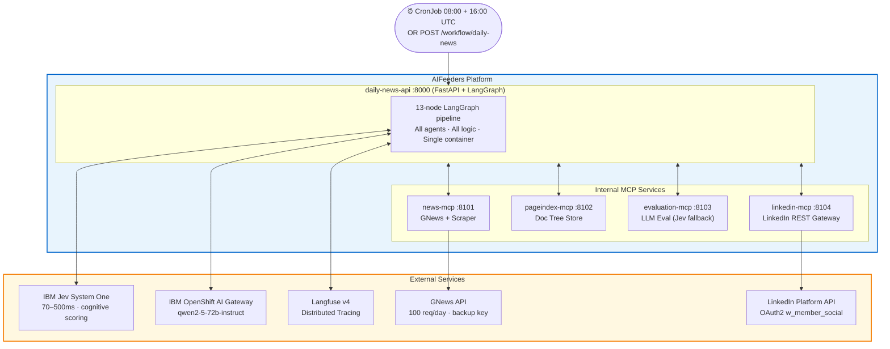
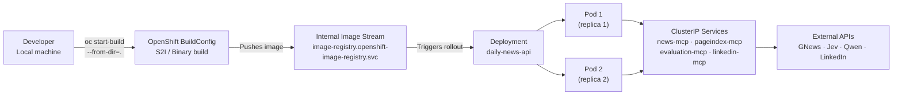
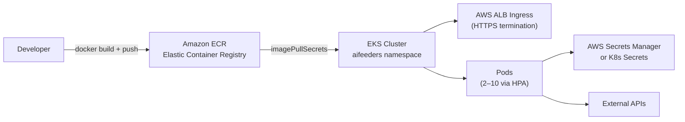
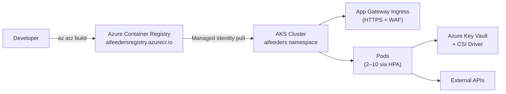

# AIFeeders — AI Media Intelligence & Round-Table Publishing Platform

> **Autonomous · Closed-Loop · Multi-Cloud** · LangGraph State Machine · IBM Jev System One · `qwen2-5-72b-instruct` · Podman / OpenShift / EKS / AKS · 5 MCP Microservices · Dynamic 3–4 Voice Debate · Two-Stage Quality Gate

---

## What It Produces

Every day AIFeeders autonomously publishes a LinkedIn post like this — **no human writes a word of it**:

```
🧠 𝐀𝐈𝐅𝐄𝐄𝐃𝐄𝐑𝐒 | 𝐓𝐇𝐄 𝐃𝐀𝐈𝐋𝐘 𝐀𝐈 𝐃𝐄𝐁𝐀𝐓𝐄

🚨 Microsoft just moved Copilot from "answering" toward "acting."
Persistent background agents. AI-generated micro-apps. Managed runtime.
The question isn't whether developers can build faster — it's what happens
when AI keeps modifying your codebase after you log off.

---

💼 𝐅𝐎𝐔𝐍𝐃𝐄𝐑
Productivity isn't business value. If an agent generates 50 micro-apps your
team can't maintain, you didn't accelerate innovation — you accelerated burn.

---

🧑‍💻 𝐄𝐍𝐆𝐈𝐍𝐄𝐄𝐑
An agent that "acts" needs access to enterprise APIs, identity providers, and
data lakes. What happens when it burns through rate limits at 3 AM or silently
violates latency SLAs?

---

⚖️ 𝐒𝐊𝐄𝐏𝐓𝐈𝐂
When you make building 10× easier, you don't get less friction — you get 10×
more software to monitor, debug, and shut down.

---

🎙️ 𝐓𝐇𝐄 𝐀𝐈𝐅𝐄𝐄𝐃𝐄𝐑𝐒 𝐐𝐔𝐄𝐒𝐓𝐈𝐎𝐍
Generating software is becoming easier. Operating software isn't.

---

💬 𝐘𝐎𝐔𝐑 𝐓𝐔𝐑𝐍
If your org enabled persistent autonomous agents tomorrow:
1️⃣ Fast Adoption: eliminates 80% of deployment churn
2️⃣ Shadow IT Disaster: 10× ungoverned micro-apps security can't trace
3️⃣ Vendor Lock-in: managed runtime owns your stack forever
4️⃣ Fragile Illusion: dies on first legacy auth pipeline

Source → https://venturebeat.com/...
#Microsoft #AIAgents #EnterpriseAI #AIProductLaunch

🤖 AIFeeders · Daily AI Intelligence · Powered by Jev
*AI-simulated perspectives for discussion — not professional advice.*
```

---

## Table of Contents

1. [System Architecture Overview](#1-system-architecture-overview)
2. [The 8 Cognitive Separations — Why This Design](#2-the-8-cognitive-separations--why-this-design)
3. [End-to-End Pipeline Flow](#3-end-to-end-pipeline-flow)
4. [Build — Docker / Podman Images](#4-build--docker--podman-images)
5. [Deploy — OpenShift (IBM / On-Prem)](#5-deploy--openshift-ibm--on-prem)
6. [Deploy — AWS EKS](#6-deploy--aws-eks)
7. [Deploy — Azure AKS](#7-deploy--azure-aks)
8. [Multi-Cloud Comparison & Migration Guide](#8-multi-cloud-comparison--migration-guide)
9. [Environment Variables Reference](#9-environment-variables-reference)
10. [Security, Scalability & Robustness Architecture](#10-security-scalability--robustness-architecture)
11. [Local Development](#11-local-development)

---

## 1. System Architecture Overview


```mermaid
flowchart TB
    TRIGGER(["⏰ CronJob 08:00 + 16:00 UTC\nOR POST /workflow/daily-news"])

    subgraph PLATFORM["AIFeeders Platform"]
        subgraph API["daily-news-api :8000  (FastAPI + LangGraph)"]
            PIPELINE["13-node LangGraph pipeline\nAll agents · All logic · Single container"]
        end
        subgraph MCP["Internal MCP Services"]
            N["news-mcp :8101\nGNews + Scraper"]
            P["pageindex-mcp :8102\nDoc Tree Store"]
            E["evaluation-mcp :8103\nLLM Eval (Jev fallback)"]
            L["linkedin-mcp :8104\nLinkedIn REST Gateway"]
        end
    end

    subgraph EXT["External Services"]
        GNEWS["GNews API\n100 req/day · backup key"]
        JEV["IBM Jev System One\n70–500ms · cognitive scoring"]
        QWEN["IBM OpenShift AI Gateway\nqwen2-5-72b-instruct"]
        LI["LinkedIn Platform API\nOAuth2 w_member_social"]
        LF["Langfuse v4\nDistributed Tracing"]
    end

    TRIGGER --> API
    API <--> N & P & E & L
    N --> GNEWS
    PIPELINE <--> JEV & QWEN & LF
    L --> LI

    style PLATFORM fill:#e8f4fd,stroke:#0066cc,stroke-width:2px
    style EXT fill:#fff8e1,stroke:#f57c00,stroke-width:2px
```

**What runs where:**
- `daily-news-api` — the entire LangGraph pipeline, all 13 agents, all business logic
- Four **MCP servers** — thin HTTP wrappers around external services; stateless and independently scalable
- All containers share a private bridge network (`ainews-net`); only `daily-news-api` is externally reachable

---

## 2. The 8 Cognitive Separations — Why This Design

Naive pipelines collapse everything into one LLM prompt (`URL → summary`). That produces unverified corporate press-release summaries with zero engagement. AIFeeders enforces 8 strict stages so each concern is isolated:

| Stage | Agent | What It Does | Failure It Prevents |
|---|---|---|---|
| 1 · Discovery | `discover_news` + `deduplicate` | 9 GNews queries, 3-pass dedup | Duplicate posts, stale articles |
| 2 · Safety Ingestion | `InputGuardrail` | Prompt injection + PII scan | LLM manipulation via article content |
| 3 · Evidence Indexing | `index_pageindex` | Builds deterministic document tree | Chunk-boundary truncation of RAG |
| 4 · Signal Scoring | `jev_prefilter` | 26 Jev questions → top-1 story | Publishing low-signal articles |
| 5 · Epistemological Boundary | `JudgmentAgent` temp=0.2 | Separates facts / claims / unknowns | PR claims presented as objective fact |
| 6 · Narrative Construction | `MediaStorytellerAgent` + `SummaryAgent` | Hook, tension, bridges, structured summary | Dry bullet-point summaries |
| 7 · Parallel Debate | `generate_personas` temp=0.7 | 3–4 independent voices in genuine conflict | Single-perspective bias |
| 8 · Quality Gate + Publish | `EvaluationAgent` + `PublisherAgent` | Jev floats + Judge temp=0.1 + reach score | Boilerplate, hallucination, no-clash |

---

## 3. End-to-End Pipeline Flow


```mermaid
flowchart TD
    A(["START"]) --> B["discover_news\n9 GNews queries · ~90 articles"]
    B --> C["deduplicate\nURL hash · SQLite store · Jaccard ≥ 0.55"]
    C --> D["InputGuardrail\nprompt injection · PII scan"]
    D --> E["fetch_articles\nhttpx async scraper"]
    E --> F["index_pageindex\nDoc → Sections → Paragraphs"]
    F --> G["jev_prefilter\n26 questions → top-1 story\nevent_type · controversy · emotion"]
    G --> H["find_angle\nJev: missing_angle · audience"]
    H --> I["summarize\n① JudgmentAgent temp=0.2\n② MediaStorytellerAgent temp=0.7\n③ SummaryAgent temp=0.5"]
    I --> J["jev_router\nneeds_business · needs_policy\nneeds_genz · needs_linkedin"]
    J --> K["generate_personas\nasyncio.gather() · Qwen temp=0.7\n3 or 4 active voices only"]
    K --> L["evaluate\nStep 1: Jev/MCP floats\nStep 2: Judge Qwen temp=0.1\nStep 3: _apply_gate()"]
    L --> M{"route_evaluation"}
    M -->|"PASS"| N["score_reach\n6 dimensions · auto-repair if < 55"]
    M -->|"REGENERATE\nretry < 2"| H
    M -->|"max retries / BLOCK"| N
    N --> O["publish\nGrammarAgent · OutputGuardrail\nUnicode bold · LinkedIn MCP"]
    O --> P["optimize_content\nengagement diagnosis\nstory mutations"]
    P --> Z(["END · workflow_status=OPTIMIZED"])

    style M fill:#ffccbc,stroke:#e64a19
    style L fill:#fff8e1,stroke:#f57c00
```

**The one conditional back-edge:** `evaluate → find_angle` on `REGENERATE` (max 2 retries). Every other edge is linear. This is why LangGraph is used — the back-edge is one config line, not scattered while-loops.

---

## 4. Build — Docker / Podman Images

There are **5 images** to build — one per service. All use the same `python:3.11-slim` base.

> **Docker or Podman?** All commands use `docker`. If you prefer `podman`, swap every `docker` for `podman` — the CLI is API-compatible. Podman is required for OpenShift local builds (rootless default).

### 4.1 Prerequisites

```bash
# Verify required tools
docker --version          # Docker 24+ recommended (or Podman 4+)
python --version          # 3.11+

# Set an image version tag — use git SHA in CI for traceability
export IMAGE_TAG=$(git rev-parse --short HEAD)   # e.g. a1b2c3d
# Or use a semantic version: export IMAGE_TAG=1.0.0

# Copy and fill in env before building
cp .env.example .env      # Edit with your actual keys
```

### 4.2 Build All Images

```bash
# ── Build with versioned + latest tags ────────────────────────────────────────
# Main API (LangGraph engine + all agents + prompts baked in)
docker build \
  --build-arg APP_VERSION=${IMAGE_TAG} \
  -t ainewsfeederlinkedin/daily-news-api:${IMAGE_TAG} \
  -t ainewsfeederlinkedin/daily-news-api:latest \
  .

# MCP microservices
docker build \
  --build-arg APP_VERSION=${IMAGE_TAG} \
  -t ainewsfeederlinkedin/news-mcp:${IMAGE_TAG} \
  -t ainewsfeederlinkedin/news-mcp:latest \
  mcp_servers/news_mcp/

docker build \
  --build-arg APP_VERSION=${IMAGE_TAG} \
  -t ainewsfeederlinkedin/pageindex-mcp:${IMAGE_TAG} \
  -t ainewsfeederlinkedin/pageindex-mcp:latest \
  mcp_servers/pageindex_mcp/

docker build \
  --build-arg APP_VERSION=${IMAGE_TAG} \
  -t ainewsfeederlinkedin/evaluation-mcp:${IMAGE_TAG} \
  -t ainewsfeederlinkedin/evaluation-mcp:latest \
  mcp_servers/evaluation_mcp/

docker build \
  --build-arg APP_VERSION=${IMAGE_TAG} \
  -t ainewsfeederlinkedin/linkedin-mcp:${IMAGE_TAG} \
  -t ainewsfeederlinkedin/linkedin-mcp:latest \
  mcp_servers/linkedin_mcp/
```

> **Why separate images?** Each MCP service scales independently. A GNews quota spike doesn't restart the LinkedIn service. Independent failure domains.

> **Multi-platform builds (CI/CD):** To produce `linux/amd64` + `linux/arm64` images in one push:
> ```bash
> docker buildx create --use --name aifeeders-builder
> docker buildx build --platform linux/amd64,linux/arm64 \
>   -t <REGISTRY>/aifeeders/daily-news-api:${IMAGE_TAG} --push .
> ```
> Run the same `buildx` command for each MCP service, substituting its context path.

### 4.3 Run Locally (Development)

```bash
# Shared bridge network (MCP services must resolve each other by container name)
docker network create ainews-net

# Start MCP services first — API depends on them at startup
docker run -d --name news-mcp       --network ainews-net -p 8101:8101 \
    --env-file .env ainewsfeederlinkedin/news-mcp:latest

docker run -d --name pageindex-mcp  --network ainews-net -p 8102:8102 \
    --env-file .env ainewsfeederlinkedin/pageindex-mcp:latest

docker run -d --name evaluation-mcp --network ainews-net -p 8103:8103 \
    --env-file .env ainewsfeederlinkedin/evaluation-mcp:latest

docker run -d --name linkedin-mcp   --network ainews-net -p 8104:8104 \
    --env-file .env ainewsfeederlinkedin/linkedin-mcp:latest

# Wait for MCP health, then start API
sleep 5
docker run -d --name daily-news-api --network ainews-net -p 8000:8000 \
    --env-file .env ainewsfeederlinkedin/daily-news-api:latest

# Verify all 5 services are healthy
for port in 8101 8102 8103 8104 8000; do
  echo -n "Port $port: "
  curl -s http://localhost:$port/health \
    | python3 -c "import sys,json; d=json.load(sys.stdin); print(d.get('status','?'))"
done
```

> **Docker Compose shortcut:** A `docker-compose.yml` at the repo root wires the same network, port mapping, and `--env-file` automatically:
> ```bash
> docker compose up -d          # start all 5 services
> docker compose logs -f        # tail logs for all services
> docker compose down           # stop and remove containers
> ```

### 4.4 Dockerfile Key Decisions

```dockerfile
FROM python:3.11-slim                   # Minimal attack surface vs full python image
ARG APP_VERSION=dev                     # Injected at build time via --build-arg
ENV PYTHONPATH=/app/src \
    APP_VERSION=${APP_VERSION}          # Exposed in /health response for version tracking
WORKDIR /app
COPY pyproject.toml README.md ./        # Layer cache: deps rebuild only if pyproject changes
COPY src/ ./src/
COPY prompts/ ./prompts/                # Prompts baked at build time — immutable per release
RUN pip install ...                     # --mount=type=cache,target=/root/.cache/pip (CI cache)
EXPOSE 8000
HEALTHCHECK --interval=30s \
  --timeout=5s --retries=3 \
  CMD curl -f http://localhost:8000/health || exit 1   # K8s liveness + readiness probe
USER 1001                               # Non-root — required by OpenShift SCC
CMD ["uvicorn", "daily_news.api.main:app", "--host", "0.0.0.0", "--port", "8000"]
```

> **OpenShift note:** For OpenShift deployment, swap the `FROM` line to:
> `FROM image-registry.openshift-image-registry.svc:5000/openshift/python:3.11-ubi9`
> This uses Red Hat's UBI9 base which satisfies OpenShift SCC (Security Context Constraints) out of the box and does not require a separate `USER 1001` directive.

---

## 5. Deploy — OpenShift (IBM / On-Prem)


```mermaid
flowchart LR
    DEV["Developer\nLocal machine"] -->|"oc start-build\n--from-dir=."| BC["OpenShift BuildConfig\nS2I / Binary build"]
    BC -->|"Pushes image"| IS["Internal Image Stream\nimage-registry.openshift-image-registry.svc"]
    IS -->|"Triggers rollout"| DEP["Deployment\ndaily-news-api"]
    DEP --> POD1["Pod 1\n(replica 1)"]
    DEP --> POD2["Pod 2\n(replica 2)"]
    POD1 & POD2 --> MCP_SVC["ClusterIP Services\nnews-mcp · pageindex-mcp\nevaluation-mcp · linkedin-mcp"]
    MCP_SVC --> EXT_API["External APIs\nGNews · Jev · Qwen · LinkedIn"]
```

### Step-by-Step OpenShift Deployment

```bash
# ── Step 1: Login & target namespace ──────────────────────────────────────────
oc login --server=https://api.your-cluster.ibm.com:6443 --token=<your-token>
oc new-project aifeeders 2>/dev/null || oc project aifeeders

# ── Step 2: Create secrets (never commit these to git) ────────────────────────
oc create secret generic daily-news-secrets \
  --from-literal=LLM_API_KEY="your-key" \
  --from-literal=LLM_BASE_URL="https://your-gateway/v1" \
  --from-literal=LLM_MODEL="qwen2-5-72b-instruct" \
  --from-literal=EVAL_LLM_MODEL="qwen2-5-72b-instruct" \
  --from-literal=GNEWS_API_KEY="your-primary-gnews-key" \
  --from-literal=GNEWS_BACKUP_API_KEY="your-backup-gnews-key" \
  --from-literal=JEV_BASE_URL="https://your-jev-gateway" \
  --from-literal=JEV_API_KEY="your-jev-key" \
  --from-literal=LINKEDIN_ACCESS_TOKEN="your-token" \
  --from-literal=LINKEDIN_PERSON_URN="urn:li:person:XXXXX" \
  --from-literal=LANGFUSE_PUBLIC_KEY="pk-lf-..." \
  --from-literal=LANGFUSE_SECRET_KEY="sk-lf-..." \
  -n aifeeders

# ── Step 3: Apply Kubernetes / OpenShift manifests ────────────────────────────
oc apply -f openshift/namespace.yaml        # namespace labels
oc apply -f openshift/rbac.yaml             # ServiceAccount + Role
oc apply -f openshift/configmap.yaml        # Non-secret env vars
oc apply -f openshift/networkpolicy.yaml    # Zero-trust network rules
oc apply -f openshift/news-mcp/             # GNews service
oc apply -f openshift/pageindex-mcp/        # Document tree service
oc apply -f openshift/evaluation-mcp/       # Eval MCP service
oc apply -f openshift/linkedin-mcp/         # LinkedIn service
oc apply -f openshift/api/                  # Main API deployment + service
oc apply -f openshift/hpa.yaml              # Horizontal Pod Autoscaler (2–10 replicas)
oc apply -f openshift/pdb.yaml              # PodDisruptionBudget (min 1 available)
oc apply -f openshift/cronjob.yaml          # Scheduled runs 08:00 + 16:00 UTC

# ── Step 4: Build images inside OpenShift (S2I binary build — no external registry needed)
# Option A: Binary build from local source (standard workflow)
oc apply -f openshift/buildconfigs.yaml
oc start-build daily-news-api --from-dir=. --follow
oc start-build news-mcp       --from-dir=mcp_servers/news_mcp/ --follow
oc start-build pageindex-mcp  --from-dir=mcp_servers/pageindex_mcp/ --follow
oc start-build evaluation-mcp --from-dir=mcp_servers/evaluation_mcp/ --follow
oc start-build linkedin-mcp   --from-dir=mcp_servers/linkedin_mcp/ --follow

# Option B: Push a locally built Docker image into the OpenShift internal registry
# (use this if you already built with docker build in Step 4.2)
oc registry login
INTERNAL_REGISTRY=$(oc get route default-route -n openshift-image-registry \
  --template='{{ .spec.host }}')

export IMAGE_TAG=$(git rev-parse --short HEAD)
for svc in daily-news-api news-mcp pageindex-mcp evaluation-mcp linkedin-mcp; do
  docker tag ainewsfeederlinkedin/${svc}:${IMAGE_TAG} \
    ${INTERNAL_REGISTRY}/aifeeders/${svc}:${IMAGE_TAG}
  docker push ${INTERNAL_REGISTRY}/aifeeders/${svc}:${IMAGE_TAG}
done
# OpenShift ImageStream triggers a rolling rollout automatically on new push

# ── Step 5: Verify deployment ─────────────────────────────────────────────────
oc rollout status deployment/daily-news-api -n aifeeders
oc get pods -n aifeeders -o wide
oc logs deployment/daily-news-api -n aifeeders --tail=50

# ── Step 6: Smoke test ────────────────────────────────────────────────────────
oc exec deployment/daily-news-api -n aifeeders -- curl -s http://localhost:8000/health

# ── Step 7: Rolling update (code change) ─────────────────────────────────────
export IMAGE_TAG=$(git rev-parse --short HEAD)
docker build -t ainewsfeederlinkedin/daily-news-api:${IMAGE_TAG} .
docker tag ainewsfeederlinkedin/daily-news-api:${IMAGE_TAG} \
  ${INTERNAL_REGISTRY}/aifeeders/daily-news-api:${IMAGE_TAG}
docker push ${INTERNAL_REGISTRY}/aifeeders/daily-news-api:${IMAGE_TAG}
oc rollout status deployment/daily-news-api -n aifeeders
```

**Why OpenShift?**
- Built-in image streams + BuildConfig → no external registry required (Option A)
- `oc registry login` + `docker push` works as a standard registry (Option B)
- SCC (Security Context Constraints) enforce non-root automatically
- OpenShift Routes provide HTTPS termination without extra Ingress config
- Integrated Prometheus metrics scraping from `/metrics`

---

## 6. Deploy — AWS EKS


```mermaid
flowchart LR
    DEV["Developer"] -->|"docker build + push"| ECR["Amazon ECR\nElastic Container Registry"]
    ECR -->|"imagePullSecrets"| EKS["EKS Cluster\naifeeders namespace"]
    EKS --> ALB["AWS ALB Ingress\n(HTTPS termination)"]
    EKS --> PODS["Pods\n(2–10 via HPA)"]
    PODS --> SM["AWS Secrets Manager\nor K8s Secrets"]
    PODS --> EXT["External APIs"]
```

### Step-by-Step EKS Deployment

```bash
# ── Prerequisites ─────────────────────────────────────────────────────────────
# aws cli v2 configured (aws configure), eksctl or existing cluster, kubectl connected

# ── Step 1: Set variables ─────────────────────────────────────────────────────
export AWS_ACCOUNT_ID=$(aws sts get-caller-identity --query Account --output text)
export AWS_REGION=us-east-1
export ECR_REGISTRY="${AWS_ACCOUNT_ID}.dkr.ecr.${AWS_REGION}.amazonaws.com"
export CLUSTER_NAME=aifeeders-cluster
export IMAGE_TAG=$(git rev-parse --short HEAD)

# ── Step 2: Authenticate Docker with ECR ──────────────────────────────────────
aws ecr get-login-password --region $AWS_REGION \
  | docker login --username AWS --password-stdin $ECR_REGISTRY

# ── Step 3: Create ECR repositories (idempotent) ──────────────────────────────
for svc in daily-news-api news-mcp pageindex-mcp evaluation-mcp linkedin-mcp; do
  aws ecr create-repository \
    --repository-name aifeeders/$svc \
    --image-scanning-configuration scanOnPush=true \
    --region $AWS_REGION 2>/dev/null || echo "  $svc: repo already exists"
done

# ── Step 4: Build all images and push to ECR ──────────────────────────────────
# Build with versioned + latest tags so rollbacks are traceable
docker build \
  --build-arg APP_VERSION=${IMAGE_TAG} \
  -t $ECR_REGISTRY/aifeeders/daily-news-api:${IMAGE_TAG} \
  -t $ECR_REGISTRY/aifeeders/daily-news-api:latest .

docker build \
  --build-arg APP_VERSION=${IMAGE_TAG} \
  -t $ECR_REGISTRY/aifeeders/news-mcp:${IMAGE_TAG} \
  -t $ECR_REGISTRY/aifeeders/news-mcp:latest \
  mcp_servers/news_mcp/

docker build \
  --build-arg APP_VERSION=${IMAGE_TAG} \
  -t $ECR_REGISTRY/aifeeders/pageindex-mcp:${IMAGE_TAG} \
  -t $ECR_REGISTRY/aifeeders/pageindex-mcp:latest \
  mcp_servers/pageindex_mcp/

docker build \
  --build-arg APP_VERSION=${IMAGE_TAG} \
  -t $ECR_REGISTRY/aifeeders/evaluation-mcp:${IMAGE_TAG} \
  -t $ECR_REGISTRY/aifeeders/evaluation-mcp:latest \
  mcp_servers/evaluation_mcp/

docker build \
  --build-arg APP_VERSION=${IMAGE_TAG} \
  -t $ECR_REGISTRY/aifeeders/linkedin-mcp:${IMAGE_TAG} \
  -t $ECR_REGISTRY/aifeeders/linkedin-mcp:latest \
  mcp_servers/linkedin_mcp/

# Push all images (both versioned and latest tags)
for svc in daily-news-api news-mcp pageindex-mcp evaluation-mcp linkedin-mcp; do
  docker push $ECR_REGISTRY/aifeeders/$svc:${IMAGE_TAG}
  docker push $ECR_REGISTRY/aifeeders/$svc:latest
done

# ── Step 5: Connect kubectl to EKS ───────────────────────────────────────────
aws eks update-kubeconfig --region $AWS_REGION --name $CLUSTER_NAME

# ── Step 6: Create namespace + RBAC ─────────────────────────────────────────
kubectl create namespace aifeeders --dry-run=client -o yaml | kubectl apply -f -
kubectl apply -n aifeeders -f openshift/rbac.yaml 2>/dev/null \
  || echo "  RBAC: apply manually if OpenShift CRDs are missing"

# ── Step 7: Secrets ───────────────────────────────────────────────────────────
# Option A: Plain K8s secrets (dev / staging only — not for production)
kubectl create secret generic daily-news-secrets \
  --from-literal=LLM_API_KEY="your-key" \
  --from-literal=LLM_BASE_URL="https://your-gateway/v1" \
  --from-literal=LLM_MODEL="qwen2-5-72b-instruct" \
  --from-literal=GNEWS_API_KEY="your-key" \
  --from-literal=GNEWS_BACKUP_API_KEY="your-backup-key" \
  --from-literal=LINKEDIN_ACCESS_TOKEN="your-token" \
  --from-literal=LINKEDIN_PERSON_URN="urn:li:person:XXXXX" \
  --from-literal=LANGFUSE_PUBLIC_KEY="pk-lf-..." \
  --from-literal=LANGFUSE_SECRET_KEY="sk-lf-..." \
  --namespace aifeeders --dry-run=client -o yaml | kubectl apply -f -

# Option B: AWS Secrets Manager + External Secrets Operator (production recommended)
# See Section 6 for full ESO setup. Quick reference:
# kubectl apply -f eks/external-secret.yaml   ← reads ARN from AWS Secrets Manager

# ── Step 8: Deploy all services (swap image refs to ECR) ──────────────────────
for f in openshift/{news-mcp,pageindex-mcp,evaluation-mcp,linkedin-mcp,api}/*.yaml; do
  sed "s|ainewsfeederlinkedin/|${ECR_REGISTRY}/aifeeders/|g" "$f" \
  | kubectl apply -n aifeeders -f -
done

kubectl apply -n aifeeders -f openshift/configmap.yaml
kubectl apply -n aifeeders -f openshift/networkpolicy.yaml
kubectl apply -n aifeeders -f openshift/hpa.yaml
kubectl apply -n aifeeders -f openshift/cronjob.yaml

# ── Step 9: Verify ────────────────────────────────────────────────────────────
kubectl rollout status deployment/daily-news-api -n aifeeders
kubectl get pods -n aifeeders -o wide
kubectl exec deploy/daily-news-api -n aifeeders -- curl -s http://localhost:8000/health

# ── Rolling update (code change) ─────────────────────────────────────────────
export IMAGE_TAG=$(git rev-parse --short HEAD)
docker build --build-arg APP_VERSION=${IMAGE_TAG} \
  -t $ECR_REGISTRY/aifeeders/daily-news-api:${IMAGE_TAG} \
  -t $ECR_REGISTRY/aifeeders/daily-news-api:latest . && \
docker push $ECR_REGISTRY/aifeeders/daily-news-api:${IMAGE_TAG} && \
docker push $ECR_REGISTRY/aifeeders/daily-news-api:latest && \
kubectl rollout restart deployment/daily-news-api -n aifeeders && \
kubectl rollout status  deployment/daily-news-api -n aifeeders
```

**AWS-specific additions worth adding:**
- **ALB Ingress Controller** — `kubectl apply -f https://raw.githubusercontent.com/kubernetes-sigs/aws-load-balancer-controller/...` for HTTPS + WAF
- **External Secrets Operator** — sync from AWS Secrets Manager; zero plaintext secrets in cluster (see Section 6)
- **CloudWatch Container Insights** — `kubectl apply -f eks/cloudwatch-agent.yaml` for unified log aggregation
- **ECR lifecycle policy** — set an expiry on untagged images to control storage costs

---

## 7. Deploy — Azure AKS


```mermaid
flowchart LR
    DEV["Developer"] -->|"az acr build"| ACR["Azure Container Registry\naifeedersregistry.azurecr.io"]
    ACR -->|"Managed Identity pull"| AKS["AKS Cluster\naifeeders namespace"]
    AKS --> AGIC["App Gateway Ingress\n(HTTPS + WAF)"]
    AKS --> PODS["Pods\n(2–10 via HPA)"]
    PODS --> KV["Azure Key Vault\n+ CSI Driver"]
    PODS --> EXT["External APIs"]
```

### Step-by-Step AKS Deployment

```bash
# ── Prerequisites ─────────────────────────────────────────────────────────────
# az cli logged in (az login), AKS cluster and ACR already provisioned

export RESOURCE_GROUP=aifeeders-rg
export ACR_NAME=aifeedersregistry
export AKS_NAME=aifeeders-aks
export ACR_REGISTRY="${ACR_NAME}.azurecr.io"
export IMAGE_TAG=$(git rev-parse --short HEAD)

# ── Step 1: Attach ACR to AKS (one-time — enables pull via Managed Identity) ──
az aks update --resource-group $RESOURCE_GROUP --name $AKS_NAME \
  --attach-acr $ACR_NAME

# ── Step 2: Authenticate Docker with ACR and build + push all images ──────────
az acr login --name $ACR_NAME

docker build \
  --build-arg APP_VERSION=${IMAGE_TAG} \
  -t $ACR_REGISTRY/aifeeders/daily-news-api:${IMAGE_TAG} \
  -t $ACR_REGISTRY/aifeeders/daily-news-api:latest .

docker build \
  --build-arg APP_VERSION=${IMAGE_TAG} \
  -t $ACR_REGISTRY/aifeeders/news-mcp:${IMAGE_TAG} \
  -t $ACR_REGISTRY/aifeeders/news-mcp:latest \
  mcp_servers/news_mcp/

docker build \
  --build-arg APP_VERSION=${IMAGE_TAG} \
  -t $ACR_REGISTRY/aifeeders/pageindex-mcp:${IMAGE_TAG} \
  -t $ACR_REGISTRY/aifeeders/pageindex-mcp:latest \
  mcp_servers/pageindex_mcp/

docker build \
  --build-arg APP_VERSION=${IMAGE_TAG} \
  -t $ACR_REGISTRY/aifeeders/evaluation-mcp:${IMAGE_TAG} \
  -t $ACR_REGISTRY/aifeeders/evaluation-mcp:latest \
  mcp_servers/evaluation_mcp/

docker build \
  --build-arg APP_VERSION=${IMAGE_TAG} \
  -t $ACR_REGISTRY/aifeeders/linkedin-mcp:${IMAGE_TAG} \
  -t $ACR_REGISTRY/aifeeders/linkedin-mcp:latest \
  mcp_servers/linkedin_mcp/

# Push all images (versioned + latest)
for svc in daily-news-api news-mcp pageindex-mcp evaluation-mcp linkedin-mcp; do
  docker push $ACR_REGISTRY/aifeeders/$svc:${IMAGE_TAG}
  docker push $ACR_REGISTRY/aifeeders/$svc:latest
done

# Alternative: use ACR Tasks to build in-cloud (no local Docker required)
# az acr build --registry $ACR_NAME \
#   --image aifeeders/daily-news-api:${IMAGE_TAG} \
#   --build-arg APP_VERSION=${IMAGE_TAG} .

# ── Step 3: Connect kubectl to AKS ───────────────────────────────────────────
az aks get-credentials --resource-group $RESOURCE_GROUP --name $AKS_NAME

# ── Step 4: Create namespace + RBAC ──────────────────────────────────────────
kubectl create namespace aifeeders --dry-run=client -o yaml | kubectl apply -f -

# ── Step 5: Secrets ───────────────────────────────────────────────────────────
# Option A: Plain K8s secrets (dev / staging only — not for production)
kubectl create secret generic daily-news-secrets \
  --from-literal=LLM_API_KEY="your-key" \
  --from-literal=LLM_BASE_URL="https://your-gateway/v1" \
  --from-literal=LLM_MODEL="qwen2-5-72b-instruct" \
  --from-literal=GNEWS_API_KEY="your-key" \
  --from-literal=GNEWS_BACKUP_API_KEY="your-backup-key" \
  --from-literal=LINKEDIN_ACCESS_TOKEN="your-token" \
  --from-literal=LINKEDIN_PERSON_URN="urn:li:person:XXXXX" \
  --from-literal=LANGFUSE_PUBLIC_KEY="pk-lf-..." \
  --from-literal=LANGFUSE_SECRET_KEY="sk-lf-..." \
  --namespace aifeeders --dry-run=client -o yaml | kubectl apply -f -

# Option B: Azure Key Vault + CSI Driver (production recommended — see Section 6)
# kubectl apply -f aks/keyvault-secret-provider.yaml   ← mounts secrets as files

# ── Step 6: Deploy all services (swap image refs to ACR) ──────────────────────
for f in openshift/{news-mcp,pageindex-mcp,evaluation-mcp,linkedin-mcp,api}/*.yaml; do
  sed "s|ainewsfeederlinkedin/|${ACR_REGISTRY}/aifeeders/|g" "$f" \
  | kubectl apply -n aifeeders -f -
done

kubectl apply -n aifeeders -f openshift/configmap.yaml
kubectl apply -n aifeeders -f openshift/networkpolicy.yaml
kubectl apply -n aifeeders -f openshift/hpa.yaml
kubectl apply -n aifeeders -f openshift/cronjob.yaml

# ── Step 7: Verify ────────────────────────────────────────────────────────────
kubectl rollout status deployment/daily-news-api -n aifeeders
kubectl get pods -n aifeeders
kubectl exec deploy/daily-news-api -n aifeeders -- curl -s http://localhost:8000/health

# ── Rolling update (code change) ─────────────────────────────────────────────
export IMAGE_TAG=$(git rev-parse --short HEAD)
az acr login --name $ACR_NAME && \
docker build --build-arg APP_VERSION=${IMAGE_TAG} \
  -t $ACR_REGISTRY/aifeeders/daily-news-api:${IMAGE_TAG} \
  -t $ACR_REGISTRY/aifeeders/daily-news-api:latest . && \
docker push $ACR_REGISTRY/aifeeders/daily-news-api:${IMAGE_TAG} && \
docker push $ACR_REGISTRY/aifeeders/daily-news-api:latest && \
kubectl rollout restart deployment/daily-news-api -n aifeeders && \
kubectl rollout status  deployment/daily-news-api -n aifeeders
```

**Azure-specific additions worth adding:**
- **Application Gateway Ingress Controller (AGIC)** — HTTPS termination + WAF policy
- **Azure Key Vault CSI Driver** — secrets mounted as files, auto-rotated without pod restart (see Section 6)
- **Azure Monitor + Container Insights** — `az aks enable-addons --addons monitoring --resource-group $RESOURCE_GROUP --name $AKS_NAME`
- **ACR Tasks** — cloud-side builds triggered on `git push` without a local Docker daemon

---

## 8. Multi-Cloud Comparison & Migration Guide

```
┌─────────────────────────┬──────────────────────────┬─────────────────────────────┬────────────────────────────┐
│ Concern                 │ OpenShift (IBM)           │ AWS EKS                     │ Azure AKS                  │
├─────────────────────────┼──────────────────────────┼─────────────────────────────┼────────────────────────────┤
│ Container Registry      │ Built-in ImageStream      │ Amazon ECR                  │ Azure ACR                  │
│ Registry Auth           │ Internal push (oc cli)    │ aws ecr get-login-password  │ az acr login               │
│ Secret Management       │ oc secrets / Vault        │ AWS Secrets Manager + ESO   │ Azure Key Vault + CSI      │
│ HTTPS Termination       │ OpenShift Route           │ AWS ALB Ingress Controller  │ App Gateway Ingress (AGIC) │
│ Auto-Scaling            │ HPA + OpenShift HPA       │ HPA + KEDA (event-driven)   │ HPA + KEDA                 │
│ Network Policy          │ OpenShift NetworkPolicy   │ Calico / VPC CNI            │ Azure CNI / Calico         │
│ Log Aggregation         │ OpenShift Logging (ES)    │ CloudWatch Container Insights│ Azure Monitor              │
│ Distributed Tracing     │ Langfuse (self-hosted)    │ Langfuse + X-Ray optional   │ Langfuse + App Insights    │
│ Scheduled Jobs          │ OpenShift CronJob         │ Kubernetes CronJob          │ Kubernetes CronJob         │
│ Security Baseline       │ SCC (enforces non-root)   │ Pod Security Standards      │ Azure Policy + PSP         │
│ IBM Jev / Qwen Gateway  │ Native (same cluster)     │ Egress to IBM endpoint      │ Egress to IBM endpoint     │
└─────────────────────────┴──────────────────────────┴─────────────────────────────┴────────────────────────────┘
```

### Moving from OpenShift → EKS

```bash
# 1. Export current manifests
oc get deployment,service,configmap,cronjob -n aifeeders -o yaml > openshift-export.yaml

# 2. Remove OpenShift-specific fields (imagestream refs, routes, SCCs)
#    Replace: image-registry.openshift-image-registry.svc.../...
#    With:    <AWS_ACCOUNT_ID>.dkr.ecr.<REGION>.amazonaws.com/aifeeders/...

# 3. Push images to ECR (see Section 6)

# 4. Apply to EKS with updated image refs
kubectl apply -n aifeeders -f eks-manifests/

# What stays identical across clouds:
# - NetworkPolicy YAML (standard K8s)
# - HPA YAML (standard K8s)
# - CronJob YAML (standard K8s)
# - All application code (zero changes needed)
# - All prompts and agents
```

### Moving from EKS → AKS (or vice-versa)

```bash
# Only change: image registry URL in deployment specs
# EKS:  <account>.dkr.ecr.<region>.amazonaws.com/aifeeders/<service>:latest
# AKS:  aifeedersregistry.azurecr.io/aifeeders/<service>:latest

# Run once to retag locally and push to the new registry
for svc in daily-news-api news-mcp pageindex-mcp evaluation-mcp linkedin-mcp; do
  docker pull <ecr-registry>/aifeeders/$svc:latest
  docker tag  <ecr-registry>/aifeeders/$svc:latest aifeedersregistry.azurecr.io/aifeeders/$svc:latest
  docker push aifeedersregistry.azurecr.io/aifeeders/$svc:latest
done
```

---

## 9. Environment Variables Reference

```bash
# ── LLM Gateway (IBM OpenShift AI — only qwen2-5-72b-instruct available) ─────
LLM_BASE_URL=https://your-openshift-ai-gateway/v1
LLM_API_KEY=your-api-key
LLM_MODEL=qwen2-5-72b-instruct

# ── Evaluator (same model, separate chain at temp=0.1) ────────────────────────
EVAL_LLM_BASE_URL=https://your-openshift-ai-gateway/v1
EVAL_LLM_API_KEY=your-api-key
EVAL_LLM_MODEL=qwen2-5-72b-instruct

# ── GNews (free tier: 100 req/day, resets 00:00 UTC = 05:30 IST) ─────────────
GNEWS_API_KEY=your-primary-key
GNEWS_BACKUP_API_KEY=your-backup-key

# ── LinkedIn (3-legged OAuth · requires w_member_social scope) ────────────────
LINKEDIN_ACCESS_TOKEN=your-token
LINKEDIN_PERSON_URN=urn:li:person:XXXXXXXX

# ── IBM Jev System One (leave EMPTY for local dev — all Jev nodes skip cleanly)
JEV_BASE_URL=https://your-jev-gateway
JEV_API_KEY=your-jev-key

# ── Observability (leave EMPTY to silence OTLP in local dev) ─────────────────
LANGFUSE_PUBLIC_KEY=pk-lf-...
LANGFUSE_SECRET_KEY=sk-lf-...
OTEL_EXPORTER_OTLP_ENDPOINT=

# ── Runtime gates ─────────────────────────────────────────────────────────────
PUBLISHING_ENABLED=true     # false = dry-run (post is composed but NOT sent to LinkedIn)
APP_ENV=production          # development | staging | production
```

> **Security:** Never commit `.env`. It is in `.gitignore`. Use Kubernetes Secrets, AWS Secrets Manager, or Azure Key Vault in production.

---

## 10. Security, Scalability & Robustness Architecture

### Security Layers

```
External Request
      │
      ▼
┌─────────────────────────────────────────────────────┐
│  Layer 1 · Network                                  │
│  NetworkPolicy: default-deny-all → allowlist only   │
│  MCP services: ClusterIP (no public ingress ever)   │
└─────────────────────────────────────────────────────┘
      │
      ▼
┌─────────────────────────────────────────────────────┐
│  Layer 2 · Container Runtime                        │
│  runAsUser: 1001 (non-root)                         │
│  readOnlyRootFilesystem: true                       │
│  allowPrivilegeEscalation: false                    │
│  capabilities.drop: [ALL]                           │
└─────────────────────────────────────────────────────┘
      │
      ▼
┌─────────────────────────────────────────────────────┐
│  Layer 3 · Application (Input Guardrail)            │
│  Blocks: prompt injection, PII, control characters  │
│  Raw articles treated as untrusted data — NEVER     │
│  concatenated into system instruction blocks        │
└─────────────────────────────────────────────────────┘
      │
      ▼
┌─────────────────────────────────────────────────────┐
│  Layer 4 · Application (Output Guardrail)           │
│  Blocks: fake quotes, missing disclaimer, toxicity  │
│  Runs AFTER all LLM generation, BEFORE LinkedIn     │
└─────────────────────────────────────────────────────┘
      │
      ▼
  LinkedIn API
```

### Scalability

| Component | Scaling Strategy | Why |
|---|---|---|
| `daily-news-api` | HPA 2–10 pods (CPU 70% / mem 80%) | Stateless — any replica handles any request |
| MCP services | Independent HPA per service | GNews quota ≠ LinkedIn quota; scale separately |
| PageIndex | In-memory per pod, no shared state | Eliminates vector DB locking bottlenecks |
| LLM calls | Async (httpx.AsyncClient) | All persona calls run via asyncio.gather() |
| CronJob | Kubernetes-native scheduling | No external cron server required |

### Robustness & Fault Tolerance

| Failure | Behaviour |
|---|---|
| Jev gateway unreachable | INFO log, node returns state unchanged, pipeline continues |
| GNews primary key 403 | Auto-rotates to `GNEWS_BACKUP_API_KEY` |
| LLM judge returns non-JSON | `json.loads` exception caught, judge step skipped (non-blocking) |
| Persona generation fails | Error logged to `state["errors"]`, other articles proceed |
| LinkedIn 401 Unauthorized | Error classified, logged in full audit record, not a crash |
| Duplicate article | `PublishedStore.is_published()` gate — idempotent, never double-posts |
| Regeneration loop | `MAX_RETRIES=2` hard cap — force-publishes PASS items after cap |
| OTLP endpoint missing | No-op TracerProvider installed — zero connection-refused spam |
| Banned opener in persona output | `_check_persona_text()` injects `[BANNED_CONTENT:]` sentinel → `OutputGuardrail` blocks → REGENERATE |
| `_PERSONA_ORDER` missing | Class attribute now defined — prevents `AttributeError` in Comments API sequential loop |

---

## 11. Local Development

```bash
# 1. Python environment
python -m venv .venv && source .venv/bin/activate
pip install uv
uv sync --all-extras

# 2. Copy and edit env (JEV_BASE_URL can be left blank — skips gracefully)
cp .env.example .env

# 3. Run tests
uv run pytest tests/ -v

# 4. Start all services via podman (see Section 4.3)
#    OR run the API directly (without containers):
uv run uvicorn daily_news.api.main:app --reload --port 8000

# 5. Trigger a pipeline run
curl -X POST http://localhost:8000/workflow/daily-news \
  -H "Content-Type: application/json" \
  -d '{"query": "AI agents enterprise"}'

# 6. Check status
curl http://localhost:8000/workflow/<run_id>
```

---

*AIFeeders — Autonomous AI Media Intelligence Platform · OpenShift · EKS · AKS*
